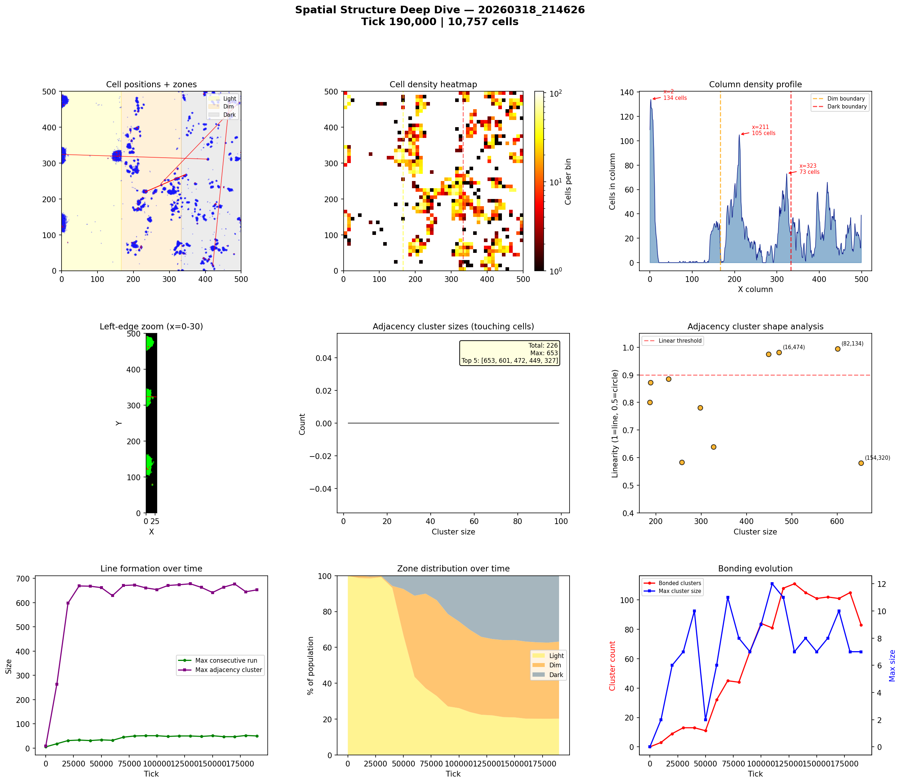
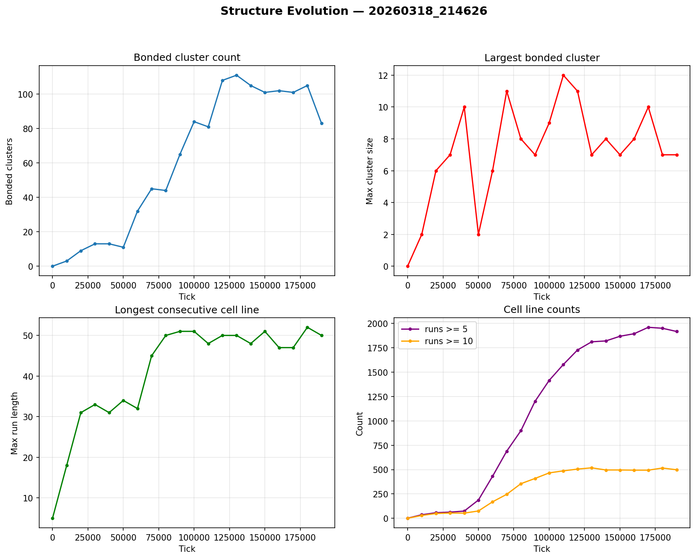

# Spatial Structure Analysis

**Run:** `20260318_214626`  
**Snapshot:** tick 190,000  
**Spatial snapshots analyzed:** 20  

## Population Distribution

| Zone | Cells | % |
|------|-------|---|
| Light (x < 166) | 2,182 | 20.3% |
| Dim (166-333) | 4,618 | 42.9% |
| Dark (x >= 333) | 3,957 | 36.8% |

Zone distribution evolved from 100% / 0% / 0% (light/dim/dark) at tick 0 to 20% / 43% / 37% by tick 190,000.

## Density Hotspots

- Densest column: x=2 (134 cells)
- Densest row: y=223 (69 cells)
- Top 5 columns by cell count: x=2 (134), x=211 (105), x=323 (73), x=419 (66), x=201 (65)

## Adjacency Clusters (touching cells)

Total clusters (2+ cells): 226  
Largest cluster: 653 cells  

| Rank | Size | Linearity | Shape | Center (x,y) |
|------|------|-----------|-------|--------------|
| 1 | 653 | 0.581 | blob | (154, 320) |
| 2 | 601 | 0.995 | LINE | (82, 134) |
| 3 | 472 | 0.982 | LINE | (16, 474) |
| 4 | 449 | 0.974 | LINE | (17, 322) |
| 5 | 327 | 0.640 | blob | (307, 222) |
| 6 | 298 | 0.781 | elongated | (203, 284) |
| 7 | 257 | 0.584 | blob | (203, 73) |
| 8 | 228 | 0.886 | elongated | (322, 71) |
| 9 | 188 | 0.872 | elongated | (217, 194) |
| 10 | 187 | 0.801 | elongated | (313, 173) |

## Consecutive Cell Runs (axis-aligned lines)

| Threshold | Count |
|-----------|-------|
| >= 3 cells | 2768 |
| >= 5 cells | 1918 |
| >= 10 cells | 498 |
| Max length | 50 |

Top 10 longest runs:

| Rank | Length | Direction | Location |
|------|--------|-----------|----------|
| 1 | 50 | vertical | col x=4, y=109 |
| 2 | 49 | vertical | col x=2, y=109 |
| 3 | 48 | vertical | col x=3, y=109 |
| 4 | 44 | vertical | col x=4, y=300 |
| 5 | 44 | vertical | col x=5, y=301 |
| 6 | 43 | vertical | col x=2, y=298 |
| 7 | 40 | vertical | col x=7, y=109 |
| 8 | 36 | vertical | col x=2, y=455 |
| 9 | 36 | vertical | col x=8, y=116 |
| 10 | 35 | vertical | col x=5, y=108 |

## Bonded Clusters

- Total bond pairs: 137
- Bonded clusters: 83
- Max bonded cluster: 7

## Figures

