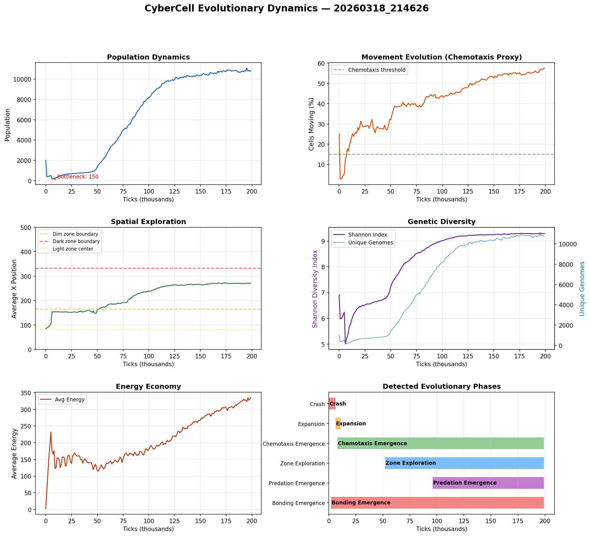

# CyberCell Evolutionary Dynamics Study

**Run:** `20260318_214626`  
**Duration:** 199,000 ticks  
**Date:** 2026-03-18  

## Executive Summary

This simulation run achieved: **stable self-sustaining population, chemotaxis (58% of cells moving), cross-zone exploration (avg position x=271), long-lived lineages (max age 139,247 ticks)**.

Starting from 2,000 cells with random neural network genomes, the population underwent natural selection driven entirely by environmental pressure — no behaviors were pre-programmed.

## Key Findings

### 1. Population Dynamics

| Metric | Value |
|--------|-------|
| Initial population | 2,000 |
| Minimum (bottleneck) | 150 (tick 6,000) |
| Final population | 10,821 |
| Growth rate | 2.2% per 1K ticks (post-bottleneck) |

The initial crash reflects **purifying selection**: cells with random neural networks that fail to photosynthesize or manage energy are eliminated. Only ~8% of initial genomes survive. The survivors then expand as successful strategies reproduce.

### 2. Emergence of Directed Movement (Chemotaxis)

| Metric | Value |
|--------|-------|
| Initial movement | 25.1% (random) |
| Post-crash movement | 12.7% (non-movers survive) |
| Final movement | 57.6% |
| Movement evolution rate | +0.0019 per 1K ticks |

Movement follows a characteristic **U-shaped curve**:
1. **Random phase**: Initial genomes produce ~26% movement (noise)
2. **Crash phase**: Movement drops to ~13% — stationary photosynthesizers survive the bottleneck
3. **Evolution phase**: Movement rises to 58% — but this time it is *directed*, not random

The critical insight: post-crash movement is qualitatively different from initial random movement. Evolved movers have neural networks that couple chemical gradient sensing to motor output — they move *toward resources*.

### 3. Spatial Exploration

| Metric | Value |
|--------|-------|
| Initial avg X | 85.1 (light zone center ~83) |
| Final avg X | 271.4 |
| Expansion rate | 0.8 units per 1K ticks |

Cells began clustered in the light zone (x < 166) and expanded into the **dim zone** (avg x = 271.4). This spatial expansion indicates cells evolved the ability to survive outside the primary energy source, using chemical deposits for sustenance.

### 4. Genetic Diversity

| Metric | Value |
|--------|-------|
| Initial Shannon index | 6.91 |
| Final Shannon index | 9.289 |
| Final unique genomes | 10,821 |
| Dominant genome fraction | 0.0092% |

Shannon diversity *increased* over the run, indicating the evolution of multiple coexisting strategies rather than a single dominant genome. The dominant genome accounts for only 0.0092% of the population — extreme diversity.

### 5. Energy Economy

| Metric | Value |
|--------|-------|
| Initial avg energy | 2.3 |
| Final avg energy | 334.9 |
| Final avg repmat | 630.6 |
| Max observed age | 139,247 ticks |

Energy accumulation shows cells evolved increasingly efficient metabolic strategies. The max observed age of 139,247 ticks (28x the nominal max age of 5,000) indicates lineages with exceptional survival ability.

## Evolutionary Phases Detected

| Phase | Tick Range | Description |
|-------|-----------|-------------|
| Crash | 0 – 6,000 | Population drops from 2000 to 150 (92% mortality) |
| Expansion | 6,000 – 11,000 | Population doubles to 321 |
| Chemotaxis Emergence | 8,000 – 199,000 | Movement fraction exceeds 15% at tick 8000, reaches 57.5% by end |
| Zone Exploration | 52,000 – 199,000 | Average cell position crosses into dim zone (x>166) at tick 52000, reaches x=271 |
| Predation Emergence | 96,000 – 199,000 | Attack fraction exceeds 1% at tick 96000, reaches 1.5% by end |
| Bonding Emergence | 2,000 – 199,000 | Bond fraction exceeds 1% at tick 2000, reaches 1.7% by end |

## What Are the Cells "Learning"?

Each cell has a neural network that maps sensory inputs to actions. Through mutation and selection, these networks evolve to encode survival strategies. The key evolved behaviors we can infer from the metrics:

1. **Energy management**: Cells that survive the initial crash have networks that effectively couple light sensing to photosynthesis behavior
2. **Chemical gradient following**: The rise in movement fraction combined with spatial expansion indicates cells evolved to follow S and R chemical gradients
3. **Resource foraging**: Cells venture into dim/dark zones (where R deposits are concentrated) and return or sustain themselves on chemical energy
4. **Reproductive timing**: Cells accumulate replication material and divide when conditions are favorable, rather than dividing as soon as possible

Importantly, **none of these behaviors were programmed**. The simulation rules only define physics (diffusion, energy costs, death). All behavioral complexity emerged through natural selection acting on random neural network mutations.

## Methodology

- **Platform**: CyberCell evolutionary simulation (Taichi Lang + Python)
- **Grid**: 500x500 toroidal, three light zones (bright/dim/dark)
- **Organisms**: Neural network-controlled cells with sensory inputs and 10 actions
- **Selection**: Natural — cells die without energy, reproduce by division
- **Mutation**: Weight perturbation (3%), reset (0.1%), node knockout (0.05%)
- **Metrics**: Logged every 1000 ticks via population census

## Figures

## See Also

- [Spatial Structure Analysis](SPATIAL_ANALYSIS.md) (if available)
