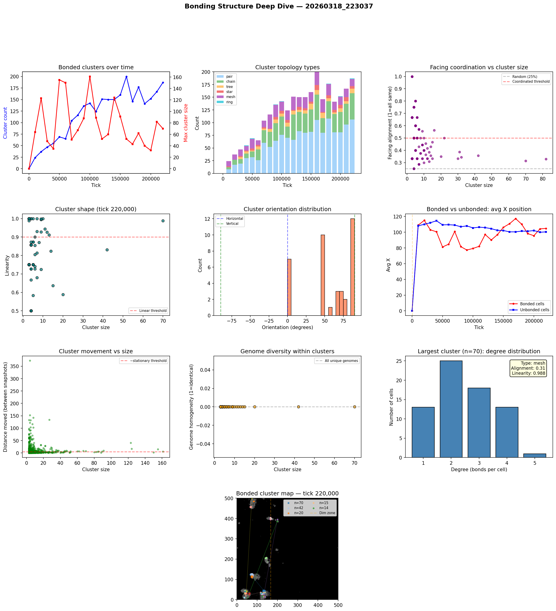

# Bonding Structure Analysis

**Run:** `20260318_223037`  
**Snapshot:** tick 220,000  
**Snapshots analyzed:** 23

## Overview

- Total cells: 5,788
- Bonded cells: 730 (12.6%)
- Bond pairs: 611
- Bonded clusters: 187

## Largest Bonded Clusters

| Rank | Size | Topology | Linearity | Alignment | Dominant Facing | Center |
|------|------|----------|-----------|-----------|-----------------|--------|
| 1 | 70 | mesh | 0.988 | 0.31 | down | (129, 45) |
| 2 | 42 | mesh | 0.831 | 0.36 | left | (75, 123) |
| 3 | 20 | mesh | 0.588 | 0.35 | left | (74, 114) |
| 4 | 15 | tree | 0.637 | 0.47 | down | (42, 32) |
| 5 | 14 | mesh | 0.823 | 0.43 | down | (130, 18) |
| 6 | 13 | mesh | 0.912 | 0.39 | left | (144, 204) |
| 7 | 12 | chain | 0.926 | 0.42 | down | (61, 29) |
| 8 | 11 | tree | 0.944 | 0.36 | right | (68, 457) |
| 9 | 10 | tree | 1.000 | 0.50 | down | (138, 66) |
| 10 | 9 | mesh | 0.995 | 0.44 | down | (127, 23) |
| 11 | 9 | tree | 0.724 | 0.33 | right | (133, 21) |
| 12 | 9 | mesh | 0.998 | 0.33 | up | (110, 32) |
| 13 | 9 | tree | 0.928 | 0.56 | up | (165, 396) |
| 14 | 8 | mesh | 0.871 | 0.38 | up | (167, 402) |
| 15 | 7 | mesh | 0.680 | 0.29 | up | (150, 184) |

## Topology Breakdown

| Type | Count | Description |
|------|-------|-------------|
| pair | 106 | Two cells bonded together |
| chain | 52 | Linear sequence, cells bonded end-to-end |
| mesh | 14 | Dense connections with loops |
| tree | 9 | Branching structure, no loops |
| star | 5 | One hub cell bonded to many leaves |
| ring | 1 | Circular bond chain |

## Facing Coordination

Of 81 clusters with 3+ cells, **34** (42%) show coordinated facing (>50% cells face same direction).

Coordinated clusters face predominantly:
- up: 11 clusters
- right: 9 clusters
- left: 9 clusters
- down: 5 clusters

## Cluster Movement

Tracking clusters (3+ cells) between snapshots (10K tick intervals):
- 846/1262 (67%) are stationary (moved < 5 cells)
- Average movement: 7.6 cells per 10K ticks
- Max movement: 372.5 cells

## Genome Diversity Within Clusters

- 81/81 clusters have ALL unique genomes (every cell is a distinct mutant)
- Average homogeneity: 0.000
- This means bonded cells are genetically related (parent-offspring chains) but each has undergone mutation, giving unique genome IDs.

## Spatial Distribution

- Bonded cells avg X: 104.8
- Unbonded cells avg X: 100.4
- Bonded clusters in light zone: majority centered at x < 166

## Implications for Multicellularity

### What's working
- Bond cost reduction (0.05 -> 0.01) made bonding evolutionarily viable
- Clusters up to 70+ cells are forming — genuine proto-multicellular structures
- Tree and chain topologies dominate — cells divide and bond with offspring

### Current limitations
- Bonded groups are mostly stationary — group movement is rare
- No neural signal propagation through bonds — only chemical sharing
- Cells share energy/structure/repmat but can't coordinate behavior
- Every cell runs the same neural network independently

### Path toward 'brain-like' cooperation
- **Signal relay**: Allow bonded cells to pass their G (signal) chemical directly to bonded partners, not just the environment. This creates a bond-based communication channel.
- **Sensory specialization**: Edge cells in a cluster sense the environment; interior cells sense only their bonded neighbors' signals. Different positions in the cluster would select for different neural network weights.
- **Bond-count-dependent behavior**: Cells already sense their bond_count. If interior cells (bond_count=4) evolve different behavior from edge cells (bond_count=1-2), that's the beginning of cell differentiation.

## Figures

