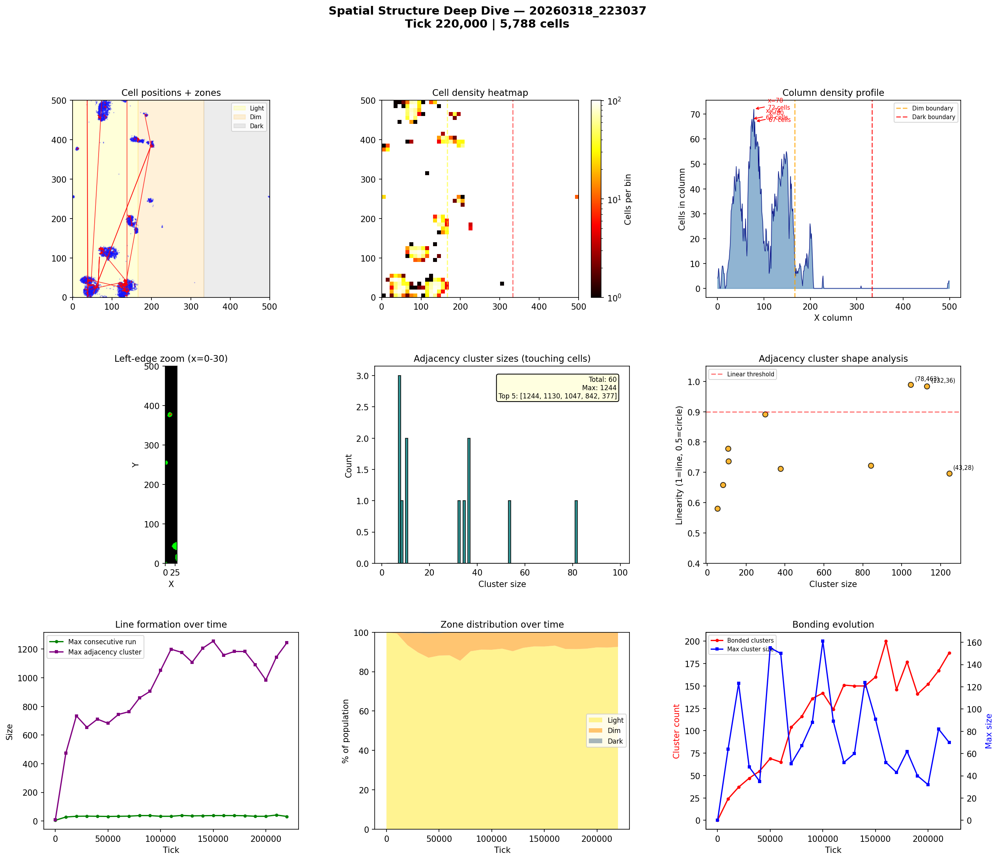
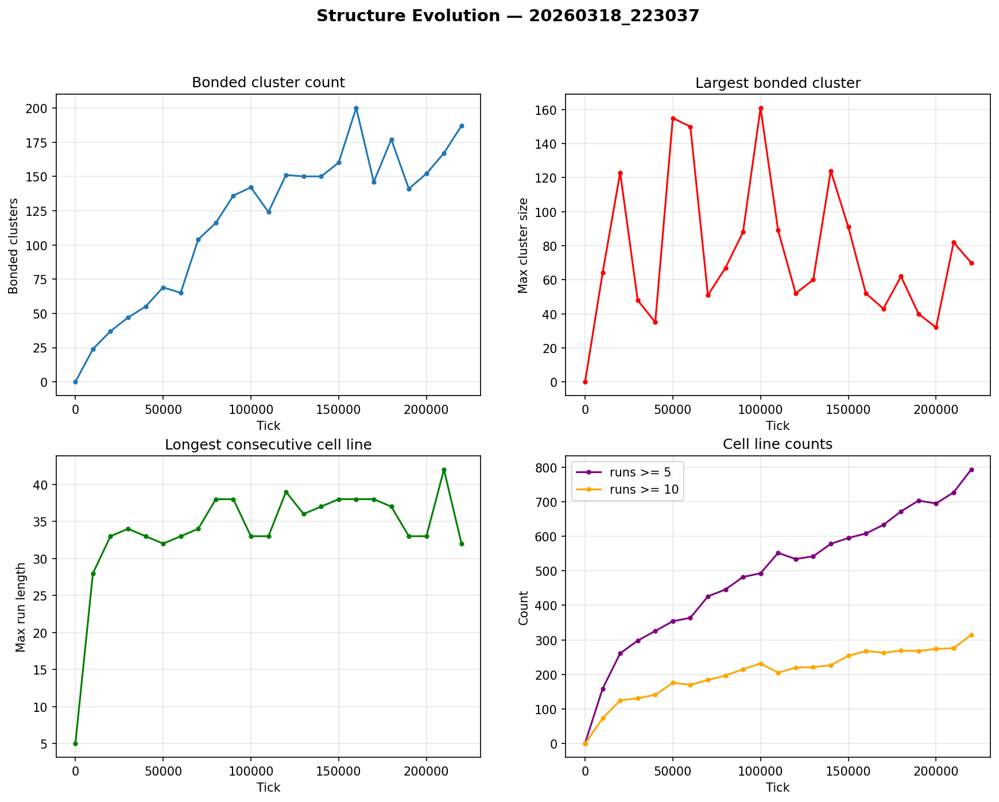

# Spatial Structure Analysis

**Run:** `20260318_223037`  
**Snapshot:** tick 220,000  
**Spatial snapshots analyzed:** 23  

## Population Distribution

| Zone | Cells | % |
|------|-------|---|
| Light (x < 166) | 5,358 | 92.6% |
| Dim (166-333) | 420 | 7.3% |
| Dark (x >= 333) | 10 | 0.2% |

Zone distribution evolved from 100% / 0% / 0% (light/dim/dark) at tick 0 to 93% / 7% / 0% by tick 220,000.

## Density Hotspots

- Densest column: x=78 (72 cells)
- Densest row: y=25 (70 cells)
- Top 5 columns by cell count: x=78 (72), x=74 (68), x=80 (67), x=83 (62), x=86 (59)

## Adjacency Clusters (touching cells)

Total clusters (2+ cells): 60  
Largest cluster: 1244 cells  

| Rank | Size | Linearity | Shape | Center (x,y) |
|------|------|-----------|-------|--------------|
| 1 | 1244 | 0.696 | blob | (43, 28) |
| 2 | 1130 | 0.985 | LINE | (132, 36) |
| 3 | 1047 | 0.990 | LINE | (78, 463) |
| 4 | 842 | 0.723 | elongated | (90, 114) |
| 5 | 377 | 0.712 | elongated | (147, 194) |
| 6 | 298 | 0.892 | elongated | (163, 400) |
| 7 | 109 | 0.737 | elongated | (161, 170) |
| 8 | 106 | 0.779 | elongated | (201, 388) |
| 9 | 81 | 0.659 | blob | (197, 246) |
| 10 | 53 | 0.580 | blob | (11, 377) |

## Consecutive Cell Runs (axis-aligned lines)

| Threshold | Count |
|-----------|-------|
| >= 3 cells | 1287 |
| >= 5 cells | 793 |
| >= 10 cells | 315 |
| Max length | 32 |

Top 10 longest runs:

| Rank | Length | Direction | Location |
|------|--------|-----------|----------|
| 1 | 32 | horizontal | row y=106, x=73 |
| 2 | 32 | horizontal | row y=115, x=72 |
| 3 | 31 | horizontal | row y=114, x=72 |
| 4 | 31 | vertical | col x=67, y=459 |
| 5 | 29 | horizontal | row y=16, x=115 |
| 6 | 29 | vertical | col x=139, y=7 |
| 7 | 28 | horizontal | row y=22, x=35 |
| 8 | 28 | horizontal | row y=41, x=21 |
| 9 | 28 | horizontal | row y=44, x=18 |
| 10 | 28 | vertical | col x=131, y=0 |

## Bonded Clusters

- Total bond pairs: 611
- Bonded clusters: 187
- Max bonded cluster: 70

## Figures

