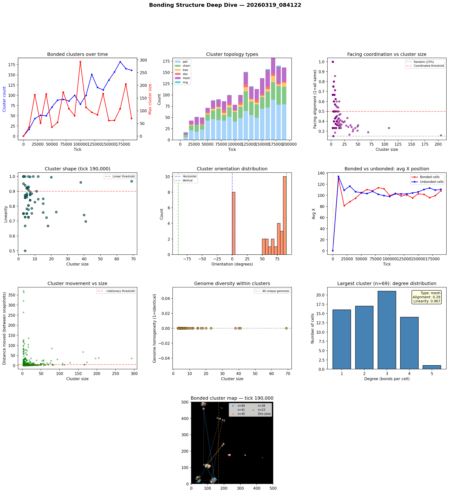

# Bonding Structure Analysis

**Run:** `20260319_084122`  
**Snapshot:** tick 190,000  
**Snapshots analyzed:** 20

## Overview

- Total cells: 3,218
- Bonded cells: 821 (25.5%)
- Bond pairs: 797
- Bonded clusters: 161

## Largest Bonded Clusters

| Rank | Size | Topology | Linearity | Alignment | Dominant Facing | Center |
|------|------|----------|-----------|-----------|-----------------|--------|
| 1 | 69 | mesh | 0.967 | 0.29 | up | (139, 40) |
| 2 | 41 | mesh | 0.697 | 0.32 | right | (105, 106) |
| 3 | 40 | mesh | 0.741 | 0.30 | up | (135, 22) |
| 4 | 38 | mesh | 0.960 | 0.34 | down | (101, 129) |
| 5 | 23 | mesh | 0.760 | 0.39 | down | (73, 491) |
| 6 | 20 | mesh | 0.995 | 0.40 | down | (92, 106) |
| 7 | 18 | mesh | 0.667 | 0.33 | right | (79, 485) |
| 8 | 17 | mesh | 0.723 | 0.35 | up | (233, 177) |
| 9 | 15 | mesh | 0.850 | 0.60 | left | (138, 25) |
| 10 | 15 | mesh | 0.758 | 0.33 | down | (74, 493) |
| 11 | 15 | mesh | 0.817 | 0.47 | left | (100, 109) |
| 12 | 12 | tree | 0.847 | 0.50 | right | (110, 111) |
| 13 | 12 | mesh | 1.000 | 0.42 | right | (75, 431) |
| 14 | 11 | tree | 0.900 | 0.46 | left | (113, 108) |
| 15 | 10 | mesh | 0.827 | 0.40 | up | (141, 34) |

## Topology Breakdown

| Type | Count | Description |
|------|-------|-------------|
| pair | 79 | Two cells bonded together |
| chain | 39 | Linear sequence, cells bonded end-to-end |
| mesh | 31 | Dense connections with loops |
| tree | 9 | Branching structure, no loops |
| star | 3 | One hub cell bonded to many leaves |

## Facing Coordination

Of 82 clusters with 3+ cells, **32** (39%) show coordinated facing (>50% cells face same direction).

Coordinated clusters face predominantly:
- right: 11 clusters
- left: 10 clusters
- down: 8 clusters
- up: 3 clusters

## Cluster Movement

Tracking clusters (3+ cells) between snapshots (10K tick intervals):
- 700/1009 (69%) are stationary (moved < 5 cells)
- Average movement: 8.4 cells per 10K ticks
- Max movement: 369.4 cells

## Genome Diversity Within Clusters

- 82/82 clusters have ALL unique genomes (every cell is a distinct mutant)
- Average homogeneity: 0.000
- This means bonded cells are genetically related (parent-offspring chains) but each has undergone mutation, giving unique genome IDs.

## Spatial Distribution

- Bonded cells avg X: 108.2
- Unbonded cells avg X: 110.6
- Bonded clusters in light zone: majority centered at x < 166

## Implications for Multicellularity

### What's working
- Bond cost reduction (0.05 -> 0.01) made bonding evolutionarily viable
- Clusters up to 70+ cells are forming — genuine proto-multicellular structures
- Tree and chain topologies dominate — cells divide and bond with offspring

### Current limitations
- Bonded groups are mostly stationary — group movement is rare
- No neural signal propagation through bonds — only chemical sharing
- Cells share energy/structure/repmat but can't coordinate behavior
- Every cell runs the same neural network independently

### Path toward 'brain-like' cooperation
- **Signal relay**: Allow bonded cells to pass their G (signal) chemical directly to bonded partners, not just the environment. This creates a bond-based communication channel.
- **Sensory specialization**: Edge cells in a cluster sense the environment; interior cells sense only their bonded neighbors' signals. Different positions in the cluster would select for different neural network weights.
- **Bond-count-dependent behavior**: Cells already sense their bond_count. If interior cells (bond_count=4) evolve different behavior from edge cells (bond_count=1-2), that's the beginning of cell differentiation.

## Figures

