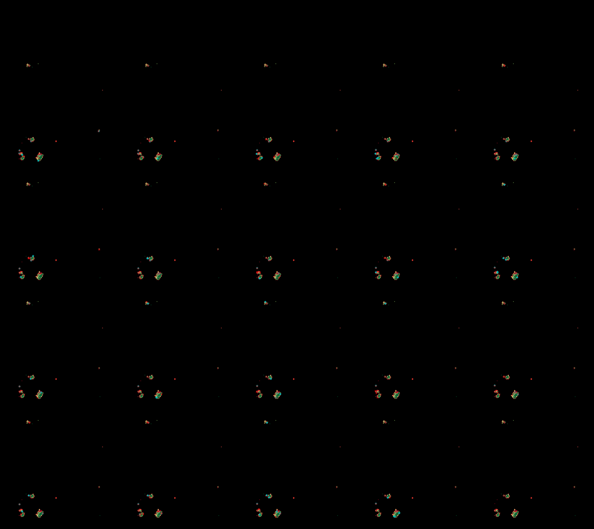
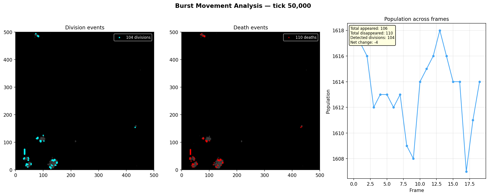
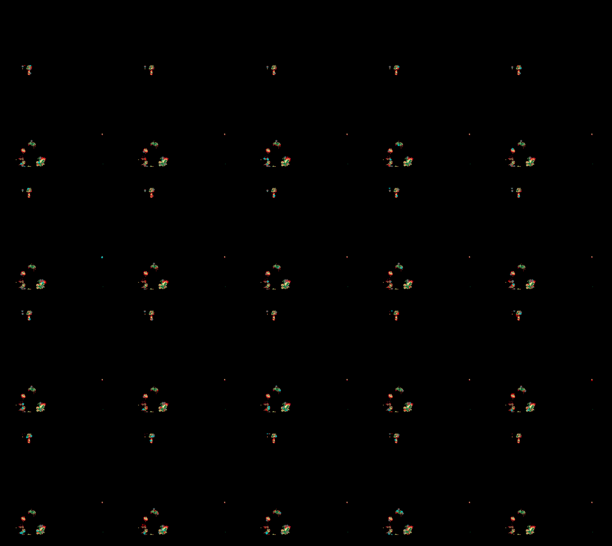
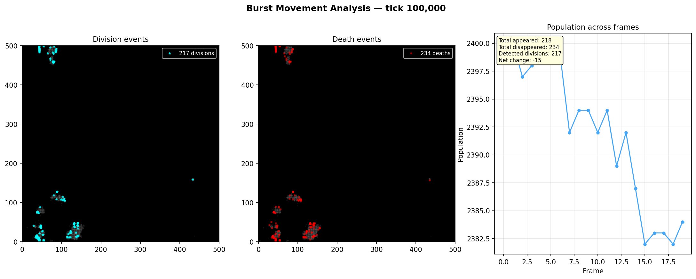
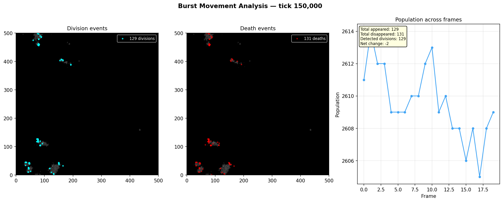

# Burst Snapshot Analysis

**Run:** `20260319_084122`  
**Bursts analyzed:** 3  

## Burst at tick 50,000

**Frames:** 20  

| Metric | Value |
|--------|-------|
| Avg population | 1616 |
| Total cells appeared | 106 |
| Total cells disappeared | 110 |
| Detected divisions | 104 |
| Net population change | -4 |
| Avg turnover per frame | 5.7 |

### Frame-by-frame

| Pair | Pop A | Pop B | Appeared | Disappeared | Divisions |
|------|-------|-------|----------|-------------|-----------|
| 0->1 | 1618 | 1617 | 7 | 8 | 7 |
| 1->2 | 1617 | 1616 | 5 | 6 | 5 |
| 2->3 | 1616 | 1612 | 6 | 10 | 6 |
| 3->4 | 1612 | 1613 | 7 | 6 | 7 |
| 4->5 | 1613 | 1613 | 7 | 7 | 7 |
| 5->6 | 1613 | 1612 | 4 | 5 | 4 |
| 6->7 | 1612 | 1613 | 6 | 5 | 6 |
| 7->8 | 1613 | 1609 | 4 | 8 | 4 |
| 8->9 | 1609 | 1608 | 6 | 7 | 5 |
| 9->10 | 1608 | 1614 | 9 | 3 | 8 |
| 10->11 | 1614 | 1615 | 5 | 4 | 5 |
| 11->12 | 1615 | 1616 | 4 | 3 | 4 |
| 12->13 | 1616 | 1618 | 6 | 4 | 6 |
| 13->14 | 1618 | 1616 | 2 | 4 | 2 |
| 14->15 | 1616 | 1614 | 3 | 5 | 3 |
| 15->16 | 1614 | 1614 | 4 | 4 | 4 |
| 16->17 | 1614 | 1607 | 6 | 13 | 6 |
| 17->18 | 1607 | 1611 | 8 | 4 | 8 |
| 18->19 | 1611 | 1614 | 7 | 4 | 7 |

## Burst at tick 100,000

**Frames:** 20  

| Metric | Value |
|--------|-------|
| Avg population | 2392 |
| Total cells appeared | 218 |
| Total cells disappeared | 234 |
| Detected divisions | 217 |
| Net population change | -15 |
| Avg turnover per frame | 11.9 |

### Frame-by-frame

| Pair | Pop A | Pop B | Appeared | Disappeared | Divisions |
|------|-------|-------|----------|-------------|-----------|
| 0->1 | 2399 | 2400 | 11 | 11 | 11 |
| 1->2 | 2400 | 2397 | 10 | 12 | 10 |
| 2->3 | 2397 | 2398 | 11 | 11 | 11 |
| 3->4 | 2398 | 2399 | 11 | 10 | 11 |
| 4->5 | 2399 | 2399 | 10 | 10 | 10 |
| 5->6 | 2399 | 2399 | 13 | 13 | 13 |
| 6->7 | 2399 | 2392 | 6 | 13 | 6 |
| 7->8 | 2392 | 2394 | 13 | 11 | 13 |
| 8->9 | 2394 | 2394 | 11 | 11 | 10 |
| 9->10 | 2394 | 2392 | 17 | 19 | 17 |
| 10->11 | 2392 | 2394 | 12 | 10 | 12 |
| 11->12 | 2394 | 2389 | 11 | 16 | 11 |
| 12->13 | 2389 | 2392 | 11 | 8 | 11 |
| 13->14 | 2392 | 2387 | 8 | 13 | 8 |
| 14->15 | 2387 | 2382 | 11 | 16 | 11 |
| 15->16 | 2382 | 2383 | 11 | 10 | 11 |
| 16->17 | 2383 | 2383 | 12 | 12 | 12 |
| 17->18 | 2383 | 2382 | 14 | 14 | 14 |
| 18->19 | 2382 | 2384 | 15 | 14 | 15 |

## Burst at tick 150,000

**Frames:** 20  

| Metric | Value |
|--------|-------|
| Avg population | 2610 |
| Total cells appeared | 129 |
| Total cells disappeared | 131 |
| Detected divisions | 129 |
| Net population change | -2 |
| Avg turnover per frame | 6.8 |

### Frame-by-frame

| Pair | Pop A | Pop B | Appeared | Disappeared | Divisions |
|------|-------|-------|----------|-------------|-----------|
| 0->1 | 2611 | 2614 | 8 | 5 | 8 |
| 1->2 | 2614 | 2612 | 4 | 6 | 4 |
| 2->3 | 2612 | 2612 | 6 | 6 | 6 |
| 3->4 | 2612 | 2609 | 4 | 7 | 4 |
| 4->5 | 2609 | 2609 | 8 | 8 | 8 |
| 5->6 | 2609 | 2609 | 10 | 10 | 10 |
| 6->7 | 2609 | 2610 | 7 | 6 | 7 |
| 7->8 | 2610 | 2610 | 6 | 6 | 6 |
| 8->9 | 2610 | 2612 | 8 | 6 | 8 |
| 9->10 | 2612 | 2613 | 8 | 7 | 8 |
| 10->11 | 2613 | 2609 | 6 | 10 | 6 |
| 11->12 | 2609 | 2610 | 11 | 10 | 11 |
| 12->13 | 2610 | 2608 | 8 | 10 | 8 |
| 13->14 | 2608 | 2608 | 6 | 6 | 6 |
| 14->15 | 2608 | 2606 | 5 | 7 | 5 |
| 15->16 | 2606 | 2608 | 9 | 7 | 9 |
| 16->17 | 2608 | 2605 | 3 | 6 | 3 |
| 17->18 | 2605 | 2608 | 8 | 5 | 8 |
| 18->19 | 2608 | 2609 | 4 | 3 | 4 |

