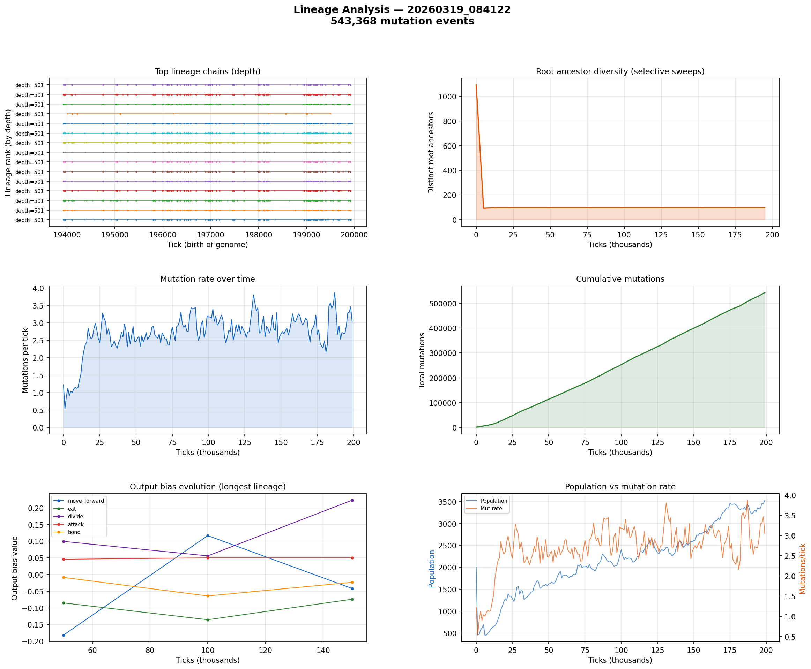

# Lineage Analysis

**Run:** `20260319_084122`  
**Mutation events:** 543,368  
**Tick range:** 0 - 199,964  

## Mutation Summary

| Metric | Value |
|--------|-------|
| Total mutation events | 543,368 |
| Unique parent genomes | 8,031 |
| Unique child genomes | 7,311 |
| Surviving genomes (latest snapshot) | 2,614 |
| Avg mutations/tick | 2.72 |

## Longest Surviving Lineages

| Rank | Depth | Root genome | Tip genome |
|------|-------|-------------|------------|
| 1 | 501 | 48110 | 49153 |
| 2 | 501 | 47971 | 49155 |
| 3 | 501 | 45048 | 49157 |
| 4 | 501 | 46050 | 49158 |
| 5 | 501 | 43529 | 49159 |
| 6 | 501 | 47587 | 49160 |
| 7 | 501 | 45209 | 49161 |
| 8 | 501 | 43529 | 49165 |
| 9 | 501 | 48569 | 49166 |
| 10 | 501 | 49353 | 49167 |

## Selective Sweep Indicators

- Initial root diversity: 1092
- Final root diversity: 97
- Minimum root diversity: 93 at tick ~5,000

A significant selective sweep is indicated: root diversity dropped by more than 50%, suggesting a dominant lineage displaced many competing lineages.

## Mutation Dynamics

| Metric | Value |
|--------|-------|
| Peak mutation rate | 3.87 per tick |
| Final mutation rate | 3.04 per tick |
| Total mutations | 543,368 |

## Figures

