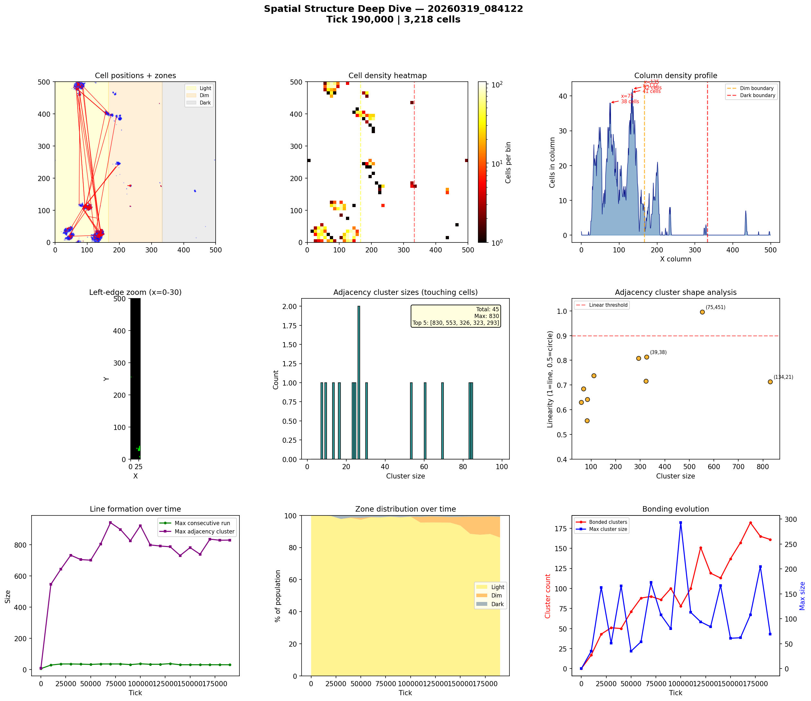
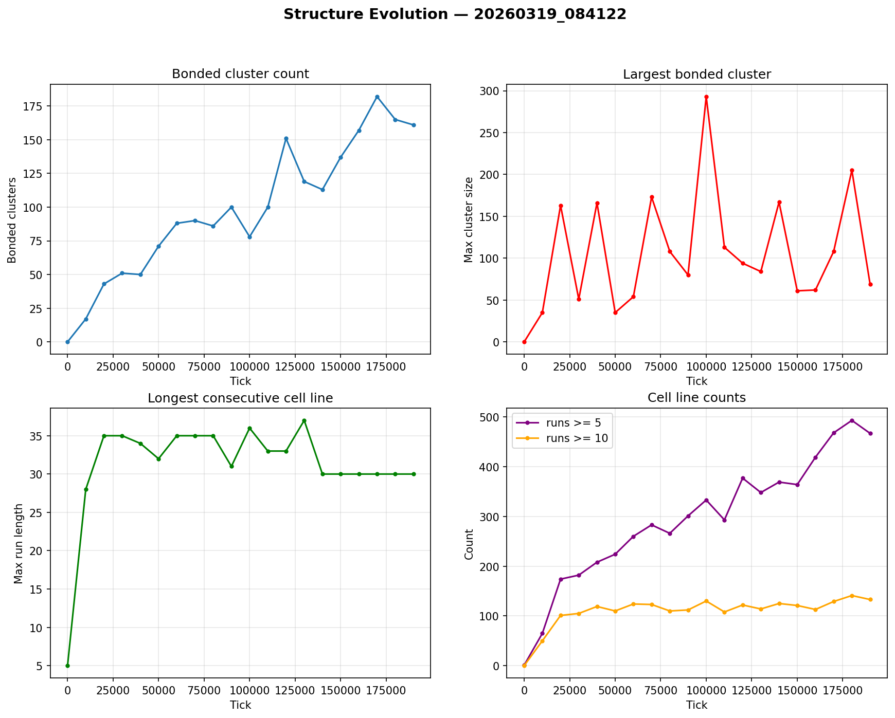

# Spatial Structure Analysis

**Run:** `20260319_084122`  
**Snapshot:** tick 190,000  
**Spatial snapshots analyzed:** 20  

## Population Distribution

| Zone | Cells | % |
|------|-------|---|
| Light (x < 166) | 2,773 | 86.2% |
| Dim (166-333) | 417 | 13.0% |
| Dark (x >= 333) | 28 | 0.9% |

Zone distribution evolved from 100% / 0% / 0% (light/dim/dark) at tick 0 to 86% / 13% / 1% by tick 190,000.

## Density Hotspots

- Densest column: x=135 (42 cells)
- Densest row: y=15 (53 cells)
- Top 5 columns by cell count: x=135 (42), x=132 (41), x=75 (38), x=77 (38), x=137 (37)

## Adjacency Clusters (touching cells)

Total clusters (2+ cells): 45  
Largest cluster: 830 cells  

| Rank | Size | Linearity | Shape | Center (x,y) |
|------|------|-----------|-------|--------------|
| 1 | 830 | 0.713 | elongated | (134, 21) |
| 2 | 553 | 0.996 | LINE | (75, 451) |
| 3 | 326 | 0.814 | elongated | (39, 38) |
| 4 | 323 | 0.715 | elongated | (100, 111) |
| 5 | 293 | 0.809 | elongated | (47, 18) |
| 6 | 111 | 0.739 | elongated | (161, 402) |
| 7 | 84 | 0.642 | blob | (196, 246) |
| 8 | 83 | 0.556 | blob | (201, 385) |
| 9 | 69 | 0.685 | blob | (81, 117) |
| 10 | 60 | 0.630 | blob | (176, 397) |

## Consecutive Cell Runs (axis-aligned lines)

| Threshold | Count |
|-----------|-------|
| >= 3 cells | 786 |
| >= 5 cells | 467 |
| >= 10 cells | 133 |
| Max length | 30 |

Top 10 longest runs:

| Rank | Length | Direction | Location |
|------|--------|-----------|----------|
| 1 | 30 | vertical | col x=137, y=6 |
| 2 | 25 | horizontal | row y=31, x=126 |
| 3 | 23 | horizontal | row y=495, x=70 |
| 4 | 23 | vertical | col x=141, y=14 |
| 5 | 22 | horizontal | row y=16, x=121 |
| 6 | 21 | horizontal | row y=485, x=69 |
| 7 | 20 | horizontal | row y=115, x=89 |
| 8 | 20 | vertical | col x=75, y=480 |
| 9 | 20 | vertical | col x=136, y=15 |
| 10 | 19 | horizontal | row y=15, x=35 |

## Bonded Clusters

- Total bond pairs: 797
- Bonded clusters: 161
- Max bonded cluster: 69

## Figures

