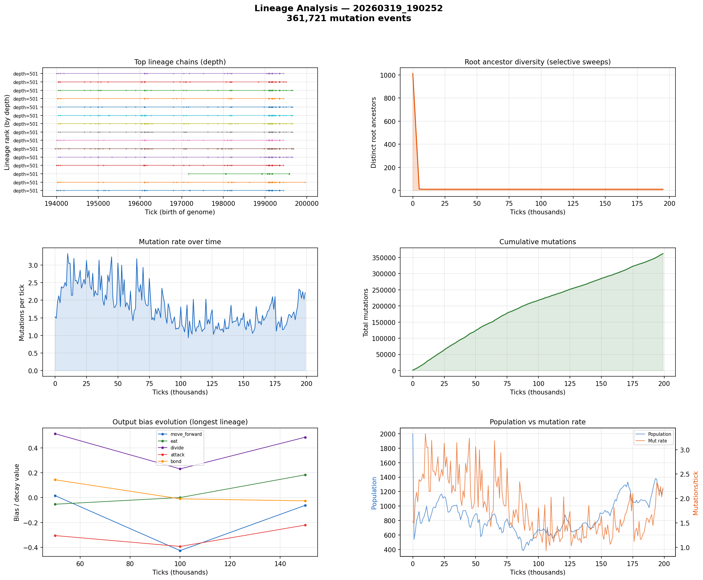

# Lineage Analysis

**Run:** `20260319_190252`  
**Mutation events:** 361,721  
**Tick range:** 0 - 199,972  

## Mutation Summary

| Metric | Value |
|--------|-------|
| Total mutation events | 361,721 |
| Unique parent genomes | 5,240 |
| Unique child genomes | 4,261 |
| Surviving genomes (latest snapshot) | 898 |
| Avg mutations/tick | 1.81 |

## Longest Surviving Lineages

| Rank | Depth | Root genome | Tip genome |
|------|-------|-------------|------------|
| 1 | 501 | 47794 | 49158 |
| 2 | 501 | 49671 | 49163 |
| 3 | 501 | 49558 | 49164 |
| 4 | 501 | 47794 | 49166 |
| 5 | 501 | 49628 | 49172 |
| 6 | 501 | 49628 | 49174 |
| 7 | 501 | 47794 | 49175 |
| 8 | 501 | 49628 | 49186 |
| 9 | 501 | 47794 | 49190 |
| 10 | 501 | 49628 | 49191 |

## Selective Sweep Indicators

- Initial root diversity: 1011
- Final root diversity: 11
- Minimum root diversity: 11 at tick ~10,000

A significant selective sweep is indicated: root diversity dropped by more than 50%, suggesting a dominant lineage displaced many competing lineages.

## Mutation Dynamics

| Metric | Value |
|--------|-------|
| Peak mutation rate | 3.33 per tick |
| Final mutation rate | 2.22 per tick |
| Total mutations | 361,721 |

## Figures

