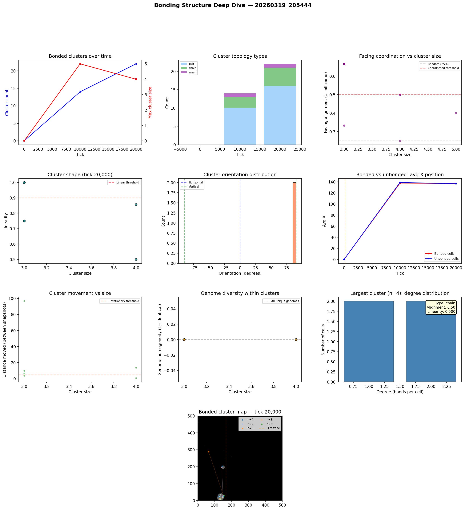

# Bonding Structure Analysis

**Run:** `20260319_205444`  
**Snapshot:** tick 20,000  
**Snapshots analyzed:** 3

## Overview

- Total cells: 1,495
- Bonded cells: 52 (3.5%)
- Bond pairs: 34
- Bonded clusters: 22

## Largest Bonded Clusters

| Rank | Size | Topology | Linearity | Alignment | Dominant Facing | Center |
|------|------|----------|-----------|-----------|-----------------|--------|
| 1 | 4 | chain | 0.500 | 0.50 | left | (126, 24) |
| 2 | 4 | chain | 0.857 | 0.50 | up | (148, 23) |
| 3 | 3 | chain | 1.000 | 0.67 | up | (123, 115) |
| 4 | 3 | mesh | 0.750 | 0.33 | left | (153, 27) |
| 5 | 3 | chain | 0.750 | 0.67 | right | (153, 30) |
| 6 | 3 | chain | 1.000 | 0.67 | up | (135, 8) |
| 7 | 2 | pair | 1.000 | 1.00 | down | (128, 5) |
| 8 | 2 | pair | 1.000 | 0.50 | up | (130, 12) |
| 9 | 2 | pair | 1.000 | 0.50 | up | (147, 26) |
| 10 | 2 | pair | 1.000 | 0.50 | up | (151, 30) |
| 11 | 2 | pair | 1.000 | 0.50 | right | (126, 3) |
| 12 | 2 | pair | 1.000 | 0.50 | up | (128, 8) |
| 13 | 2 | pair | 1.000 | 1.00 | down | (134, 9) |
| 14 | 2 | pair | 1.000 | 0.50 | left | (146, 112) |
| 15 | 2 | pair | 1.000 | 1.00 | down | (128, 7) |

## Topology Breakdown

| Type | Count | Description |
|------|-------|-------------|
| pair | 16 | Two cells bonded together |
| chain | 5 | Linear sequence, cells bonded end-to-end |
| mesh | 1 | Dense connections with loops |

## Facing Coordination

Of 6 clusters with 3+ cells, **3** (50%) show coordinated facing (>50% cells face same direction).

Coordinated clusters face predominantly:
- up: 2 clusters
- right: 1 clusters

## Cluster Movement

Tracking clusters (3+ cells) between snapshots (10K tick intervals):
- 2/6 (33%) are stationary (moved < 5 cells)
- Average movement: 21.9 cells per 10K ticks
- Max movement: 96.7 cells

## Genome Diversity Within Clusters

- 6/6 clusters have ALL unique genomes (every cell is a distinct mutant)
- Average homogeneity: 0.000
- This means bonded cells are genetically related (parent-offspring chains) but each has undergone mutation, giving unique genome IDs.

## Spatial Distribution

- Bonded cells avg X: 136.9
- Unbonded cells avg X: 136.6
- Bonded clusters in light zone: majority centered at x < 166

## Implications for Multicellularity

### What's working
- Bond cost reduction (0.05 -> 0.01) made bonding evolutionarily viable
- Clusters up to 70+ cells are forming — genuine proto-multicellular structures
- Tree and chain topologies dominate — cells divide and bond with offspring

### Current limitations
- Bonded groups are mostly stationary — group movement is rare
- No neural signal propagation through bonds — only chemical sharing
- Cells share energy/structure/repmat but can't coordinate behavior
- Every cell runs the same neural network independently

### Path toward 'brain-like' cooperation
- **Signal relay**: Allow bonded cells to pass their G (signal) chemical directly to bonded partners, not just the environment. This creates a bond-based communication channel.
- **Sensory specialization**: Edge cells in a cluster sense the environment; interior cells sense only their bonded neighbors' signals. Different positions in the cluster would select for different neural network weights.
- **Bond-count-dependent behavior**: Cells already sense their bond_count. If interior cells (bond_count=4) evolve different behavior from edge cells (bond_count=1-2), that's the beginning of cell differentiation.

## Figures

