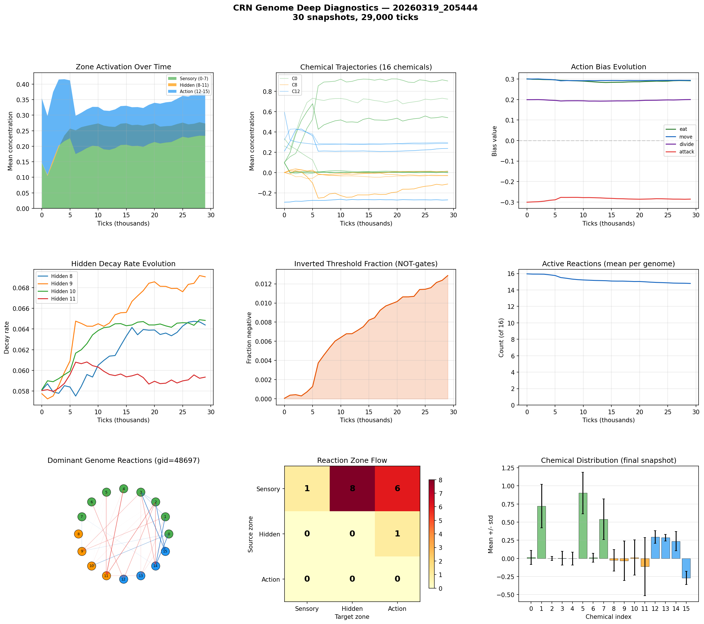

# CRN Genome Deep Analysis

**Run:** `20260319_205444`  
**Snapshots:** 30  
**Duration:** 29,000 ticks  
**Active genomes:** 1927  

## Chemical Summary

| Zone | Chemicals | Mean | Description |
|------|-----------|------|-------------|
| Sensory | 0-7 | 0.273 | Environment inputs |
| Hidden | 8-11 | -0.040 | Internal memory/gates |
| Action | 12-15 | 0.137 | Action triggers |

## Action Biases (population-weighted)

| Action | Bias Value | Interpretation |
|--------|-----------|----------------|
| eat | +0.291 | moderate positive |
| move | +0.293 | moderate positive |
| divide | +0.200 | moderate positive |
| attack | -0.286 | moderate negative |

## Hidden Decay Rates

Low decay = long memory. High decay = short-term reactivity.

| Chemical | Decay Rate | Memory Half-Life |
|----------|-----------|-----------------|
| Hidden 8 | 0.0644 | 10 ticks |
| Hidden 9 | 0.0690 | 10 ticks |
| Hidden 10 | 0.0648 | 10 ticks |
| Hidden 11 | 0.0593 | 11 ticks |

## Computational Sophistication

- **Active reactions:** 14.8 of 16
- **Inverted thresholds (NOT-gates):** 1.3%
- **Dominant genome:** gid=48697 (3 cells)

## Reaction Zone Flow (dominant genome)

| Source \ Target | Sensory | Hidden | Action |
|---------------|---------|--------|--------|
| Sensory | 1 | 8 | 6 |
| Hidden | 0 | 0 | 1 |
| Action | 0 | 0 | 0 |

## Key Findings

- Hidden chemicals are near zero — CRN is purely reactive
- Using 15/16 reactions — complex network
- Sensory->Hidden->Action pathway exists (8+1 reactions)

## Figures

