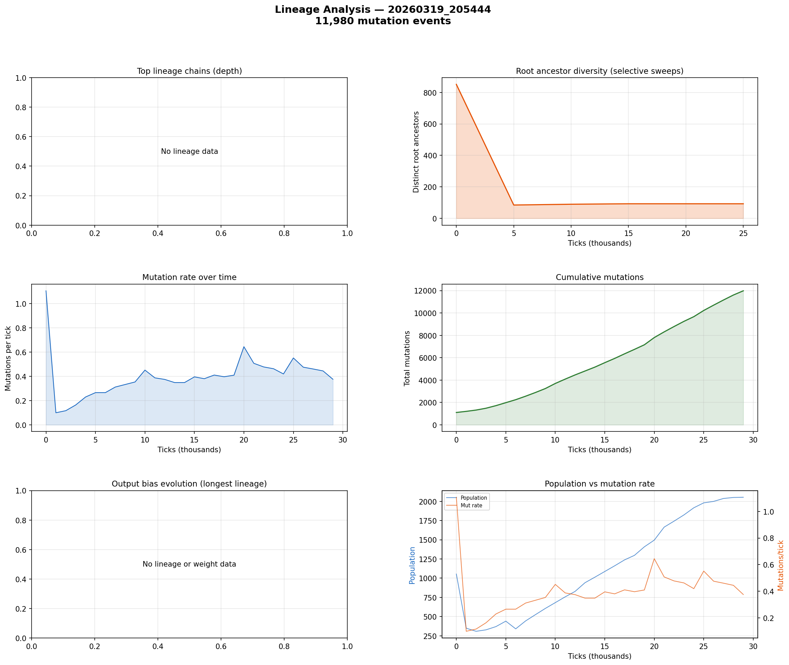

# Lineage Analysis

**Run:** `20260319_205444`  
**Mutation events:** 11,980  
**Tick range:** 0 - 29,402  

## Mutation Summary

| Metric | Value |
|--------|-------|
| Total mutation events | 11,980 |
| Unique parent genomes | 2,838 |
| Unique child genomes | 2,385 |
| Surviving genomes (latest snapshot) | 0 |
| Avg mutations/tick | 0.41 |

## Selective Sweep Indicators

- Initial root diversity: 851
- Final root diversity: 93
- Minimum root diversity: 85 at tick ~5,000

A significant selective sweep is indicated: root diversity dropped by more than 50%, suggesting a dominant lineage displaced many competing lineages.

## Mutation Dynamics

| Metric | Value |
|--------|-------|
| Peak mutation rate | 1.11 per tick |
| Final mutation rate | 0.38 per tick |
| Total mutations | 11,980 |

## Figures

