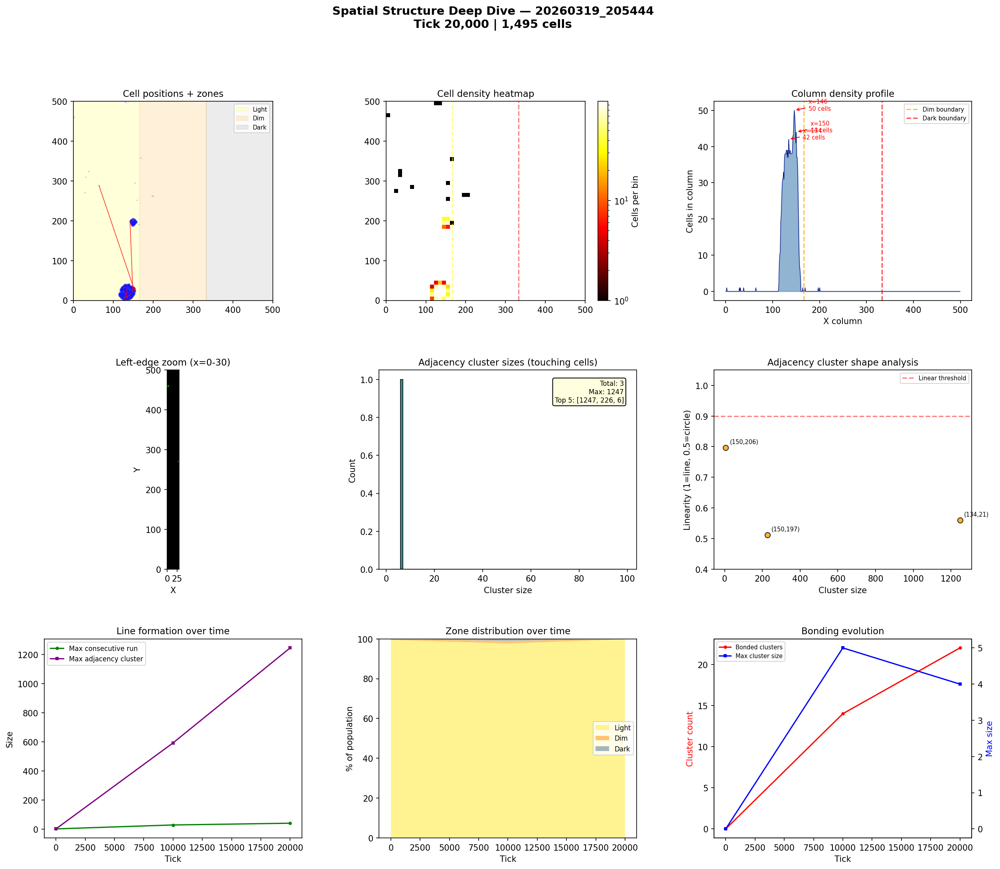
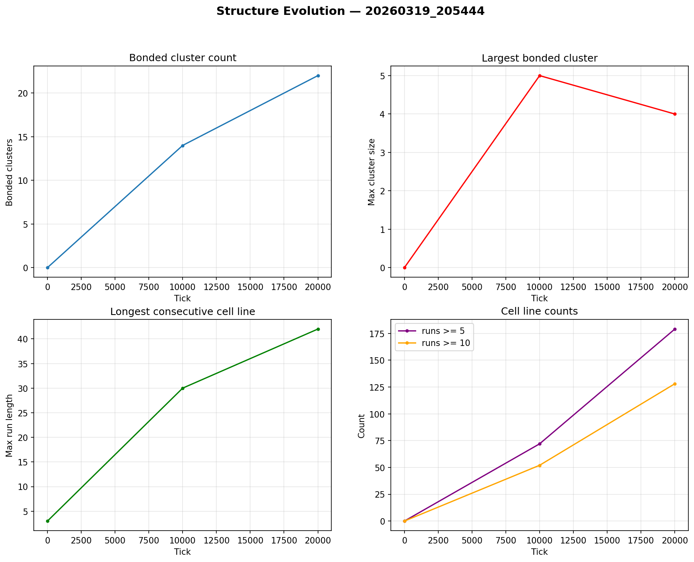

# Spatial Structure Analysis

**Run:** `20260319_205444`  
**Snapshot:** tick 20,000  
**Spatial snapshots analyzed:** 3  

## Population Distribution

| Zone | Cells | % |
|------|-------|---|
| Light (x < 166) | 1,492 | 99.8% |
| Dim (166-333) | 3 | 0.2% |
| Dark (x >= 333) | 0 | 0.0% |

Zone distribution evolved from 99% / 0% / 0% (light/dim/dark) at tick 0 to 100% / 0% / 0% by tick 20,000.

## Density Hotspots

- Densest column: x=146 (50 cells)
- Densest row: y=17 (40 cells)
- Top 5 columns by cell count: x=146 (50), x=150 (44), x=134 (42), x=132 (39), x=137 (39)

## Adjacency Clusters (touching cells)

Total clusters (2+ cells): 3  
Largest cluster: 1247 cells  

| Rank | Size | Linearity | Shape | Center (x,y) |
|------|------|-----------|-------|--------------|
| 1 | 1247 | 0.559 | blob | (134, 21) |
| 2 | 226 | 0.511 | blob | (150, 197) |
| 3 | 6 | 0.796 | elongated | (150, 206) |

## Consecutive Cell Runs (axis-aligned lines)

| Threshold | Count |
|-----------|-------|
| >= 3 cells | 205 |
| >= 5 cells | 179 |
| >= 10 cells | 128 |
| Max length | 42 |

Top 10 longest runs:

| Rank | Length | Direction | Location |
|------|--------|-----------|----------|
| 1 | 42 | vertical | col x=134, y=1 |
| 2 | 39 | horizontal | row y=14, x=114 |
| 3 | 39 | horizontal | row y=25, x=117 |
| 4 | 39 | vertical | col x=135, y=2 |
| 5 | 38 | vertical | col x=132, y=3 |
| 6 | 37 | horizontal | row y=23, x=119 |
| 7 | 36 | horizontal | row y=31, x=119 |
| 8 | 34 | vertical | col x=126, y=6 |
| 9 | 33 | vertical | col x=125, y=6 |
| 10 | 33 | vertical | col x=143, y=4 |

## Bonded Clusters

- Total bond pairs: 34
- Bonded clusters: 22
- Max bonded cluster: 4

## Figures

