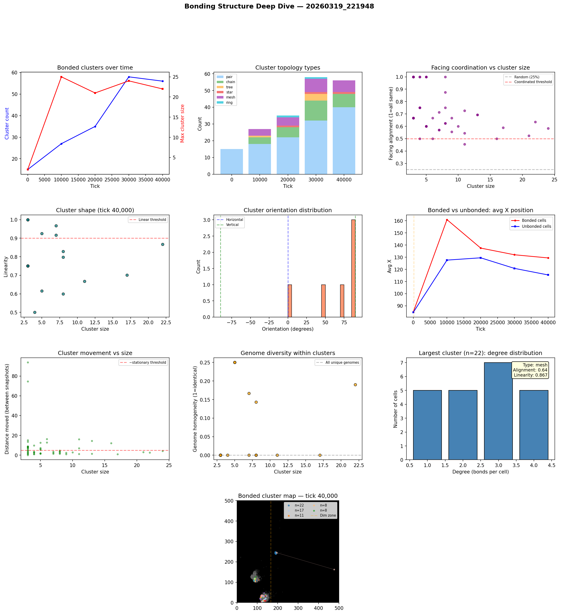

# Bonding Structure Analysis

**Run:** `20260319_221948`  
**Snapshot:** tick 40,000  
**Snapshots analyzed:** 5

## Overview

- Total cells: 3,125
- Bonded cells: 197 (6.3%)
- Bond pairs: 163
- Bonded clusters: 56

## Largest Bonded Clusters

| Rank | Size | Topology | Linearity | Alignment | Dominant Facing | Center |
|------|------|----------|-----------|-----------|-----------------|--------|
| 1 | 22 | mesh | 0.867 | 0.64 | right | (190, 243) |
| 2 | 17 | mesh | 0.701 | 0.59 | right | (135, 14) |
| 3 | 11 | mesh | 0.668 | 0.46 | right | (91, 113) |
| 4 | 8 | chain | 0.828 | 0.62 | right | (132, 10) |
| 5 | 8 | mesh | 0.600 | 1.00 | up | (125, 26) |
| 6 | 8 | mesh | 0.798 | 0.62 | right | (87, 117) |
| 7 | 7 | chain | 0.967 | 0.57 | up | (138, 11) |
| 8 | 7 | mesh | 0.917 | 0.57 | right | (121, 34) |
| 9 | 5 | chain | 0.925 | 0.60 | up | (115, 20) |
| 10 | 5 | star | 0.615 | 1.00 | up | (129, 32) |
| 11 | 4 | mesh | 0.500 | 0.75 | up | (106, 112) |
| 12 | 3 | chain | 1.000 | 0.67 | left | (288, 217) |
| 13 | 3 | chain | 0.750 | 0.67 | up | (118, 29) |
| 14 | 3 | chain | 0.750 | 1.00 | up | (130, 29) |
| 15 | 3 | chain | 0.750 | 1.00 | up | (128, 28) |

## Topology Breakdown

| Type | Count | Description |
|------|-------|-------------|
| pair | 40 | Two cells bonded together |
| chain | 8 | Linear sequence, cells bonded end-to-end |
| mesh | 7 | Dense connections with loops |
| star | 1 | One hub cell bonded to many leaves |

## Facing Coordination

Of 16 clusters with 3+ cells, **15** (94%) show coordinated facing (>50% cells face same direction).

Coordinated clusters face predominantly:
- up: 8 clusters
- right: 6 clusters
- left: 1 clusters

## Cluster Movement

Tracking clusters (3+ cells) between snapshots (10K tick intervals):
- 32/55 (58%) are stationary (moved < 5 cells)
- Average movement: 8.3 cells per 10K ticks
- Max movement: 93.7 cells

## Genome Diversity Within Clusters

- 11/16 clusters have ALL unique genomes (every cell is a distinct mutant)
- Average homogeneity: 0.062
- This means bonded cells are genetically related (parent-offspring chains) but each has undergone mutation, giving unique genome IDs.

## Spatial Distribution

- Bonded cells avg X: 129.4
- Unbonded cells avg X: 115.4
- Bonded clusters in light zone: majority centered at x < 166

## Implications for Multicellularity

### What's working
- Bond cost reduction (0.05 -> 0.01) made bonding evolutionarily viable
- Clusters up to 70+ cells are forming — genuine proto-multicellular structures
- Tree and chain topologies dominate — cells divide and bond with offspring

### Current limitations
- Bonded groups are mostly stationary — group movement is rare
- No neural signal propagation through bonds — only chemical sharing
- Cells share energy/structure/repmat but can't coordinate behavior
- Every cell runs the same neural network independently

### Path toward 'brain-like' cooperation
- **Signal relay**: Allow bonded cells to pass their G (signal) chemical directly to bonded partners, not just the environment. This creates a bond-based communication channel.
- **Sensory specialization**: Edge cells in a cluster sense the environment; interior cells sense only their bonded neighbors' signals. Different positions in the cluster would select for different neural network weights.
- **Bond-count-dependent behavior**: Cells already sense their bond_count. If interior cells (bond_count=4) evolve different behavior from edge cells (bond_count=1-2), that's the beginning of cell differentiation.

## Figures

