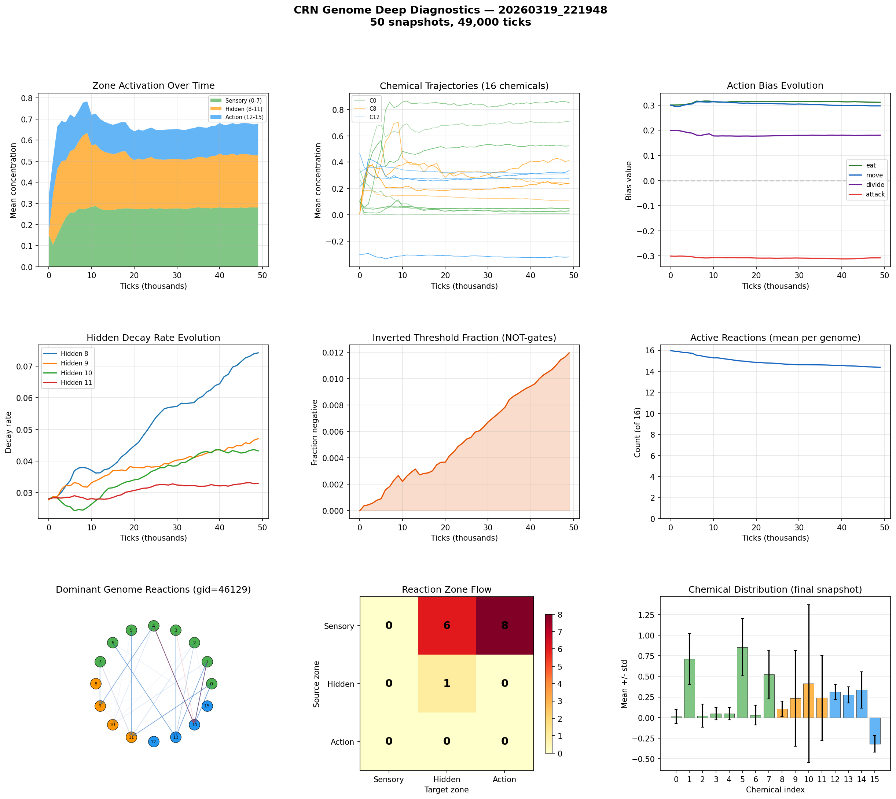

# CRN Genome Deep Analysis

**Run:** `20260319_221948`  
**Snapshots:** 50  
**Duration:** 49,000 ticks  
**Active genomes:** 3267  

## Chemical Summary

| Zone | Chemicals | Mean | Description |
|------|-----------|------|-------------|
| Sensory | 0-7 | 0.281 | Environment inputs |
| Hidden | 8-11 | 0.247 | Internal memory/gates |
| Action | 12-15 | 0.150 | Action triggers |

## Action Biases (population-weighted)

| Action | Bias Value | Interpretation |
|--------|-----------|----------------|
| eat | +0.311 | strong positive |
| move | +0.297 | moderate positive |
| divide | +0.180 | moderate positive |
| attack | -0.307 | strong negative |

## Hidden Decay Rates

Low decay = long memory. High decay = short-term reactivity.

| Chemical | Decay Rate | Memory Half-Life |
|----------|-----------|-----------------|
| Hidden 8 | 0.0742 | 9 ticks |
| Hidden 9 | 0.0471 | 14 ticks |
| Hidden 10 | 0.0432 | 16 ticks |
| Hidden 11 | 0.0330 | 21 ticks |

## Computational Sophistication

- **Active reactions:** 14.4 of 16
- **Inverted thresholds (NOT-gates):** 1.2%
- **Dominant genome:** gid=46129 (3 cells)

## Reaction Zone Flow (dominant genome)

| Source \ Target | Sensory | Hidden | Action |
|---------------|---------|--------|--------|
| Sensory | 0 | 6 | 8 |
| Hidden | 0 | 1 | 0 |
| Action | 0 | 0 | 0 |

## Key Findings

- Hidden chemicals are active — CRN is using internal state
- Using 14/16 reactions — complex network
- Direct Sensory->Action pathway (8 reactions), no hidden processing

## Figures

