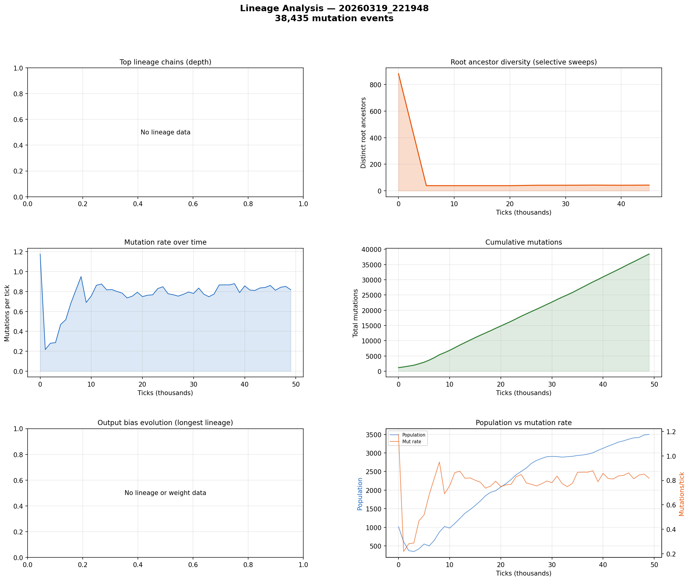

# Lineage Analysis

**Run:** `20260319_221948`  
**Mutation events:** 38,435  
**Tick range:** 0 - 49,975  

## Mutation Summary

| Metric | Value |
|--------|-------|
| Total mutation events | 38,435 |
| Unique parent genomes | 4,775 |
| Unique child genomes | 4,101 |
| Surviving genomes (latest snapshot) | 0 |
| Avg mutations/tick | 0.77 |

## Selective Sweep Indicators

- Initial root diversity: 881
- Final root diversity: 43
- Minimum root diversity: 39 at tick ~5,000

A significant selective sweep is indicated: root diversity dropped by more than 50%, suggesting a dominant lineage displaced many competing lineages.

## Mutation Dynamics

| Metric | Value |
|--------|-------|
| Peak mutation rate | 1.18 per tick |
| Final mutation rate | 0.82 per tick |
| Total mutations | 38,435 |

## Figures

