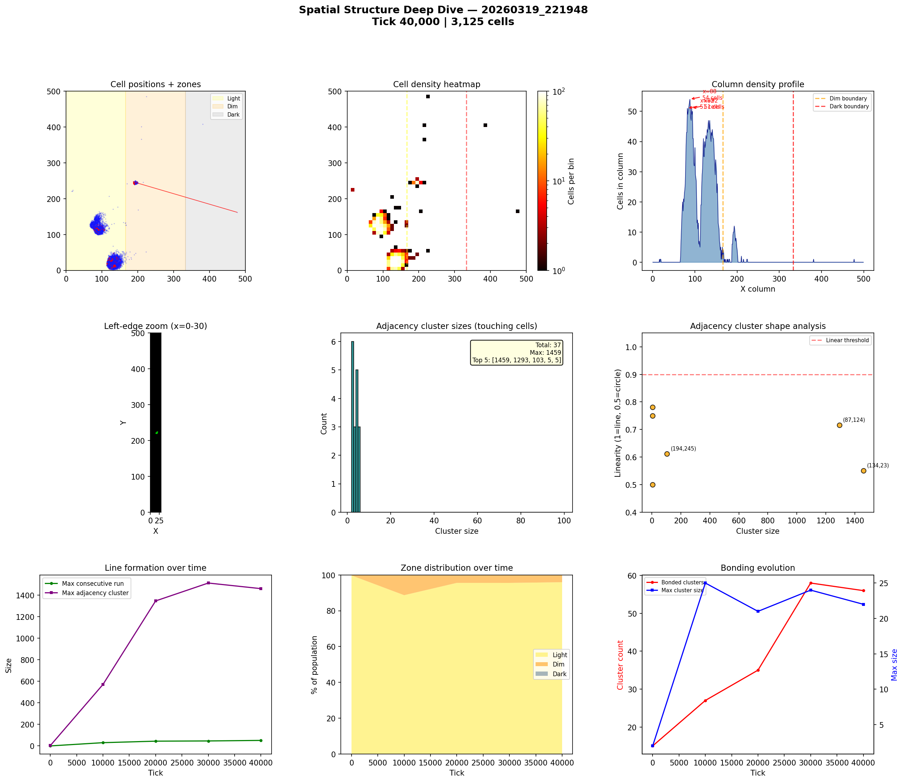
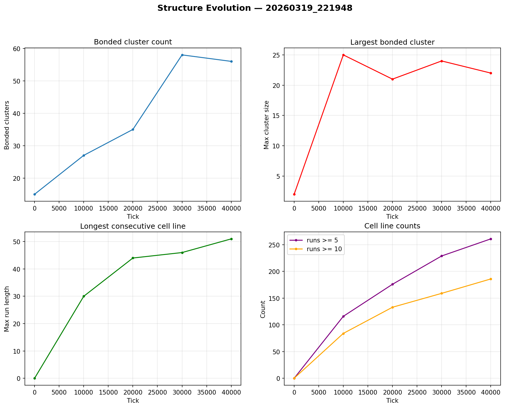

# Spatial Structure Analysis

**Run:** `20260319_221948`  
**Snapshot:** tick 40,000  
**Spatial snapshots analyzed:** 5  

## Population Distribution

| Zone | Cells | % |
|------|-------|---|
| Light (x < 166) | 2,997 | 95.9% |
| Dim (166-333) | 126 | 4.0% |
| Dark (x >= 333) | 2 | 0.1% |

Zone distribution evolved from 100% / 0% / 0% (light/dim/dark) at tick 0 to 96% / 4% / 0% by tick 40,000.

## Density Hotspots

- Densest column: x=88 (54 cells)
- Densest row: y=21 (45 cells)
- Top 5 columns by cell count: x=88 (54), x=82 (51), x=92 (51), x=94 (50), x=132 (47)

## Adjacency Clusters (touching cells)

Total clusters (2+ cells): 37  
Largest cluster: 1459 cells  

| Rank | Size | Linearity | Shape | Center (x,y) |
|------|------|-----------|-------|--------------|
| 1 | 1459 | 0.551 | blob | (134, 23) |
| 2 | 1293 | 0.715 | elongated | (87, 124) |
| 3 | 103 | 0.612 | blob | (194, 245) |
| 4 | 5 | 0.781 | elongated | (99, 130) |
| 5 | 5 | 0.500 | blob | (114, 127) |
| 6 | 5 | 0.750 | elongated | (95, 159) |

## Consecutive Cell Runs (axis-aligned lines)

| Threshold | Count |
|-----------|-------|
| >= 3 cells | 330 |
| >= 5 cells | 261 |
| >= 10 cells | 186 |
| Max length | 51 |

Top 10 longest runs:

| Rank | Length | Direction | Location |
|------|--------|-----------|----------|
| 1 | 51 | vertical | col x=82, y=103 |
| 2 | 48 | vertical | col x=87, y=100 |
| 3 | 44 | vertical | col x=136, y=2 |
| 4 | 44 | vertical | col x=141, y=3 |
| 5 | 43 | vertical | col x=129, y=3 |
| 6 | 42 | horizontal | row y=15, x=113 |
| 7 | 42 | horizontal | row y=20, x=113 |
| 8 | 42 | vertical | col x=135, y=3 |
| 9 | 41 | horizontal | row y=16, x=114 |
| 10 | 41 | vertical | col x=130, y=3 |

## Bonded Clusters

- Total bond pairs: 163
- Bonded clusters: 56
- Max bonded cluster: 22

## Figures

