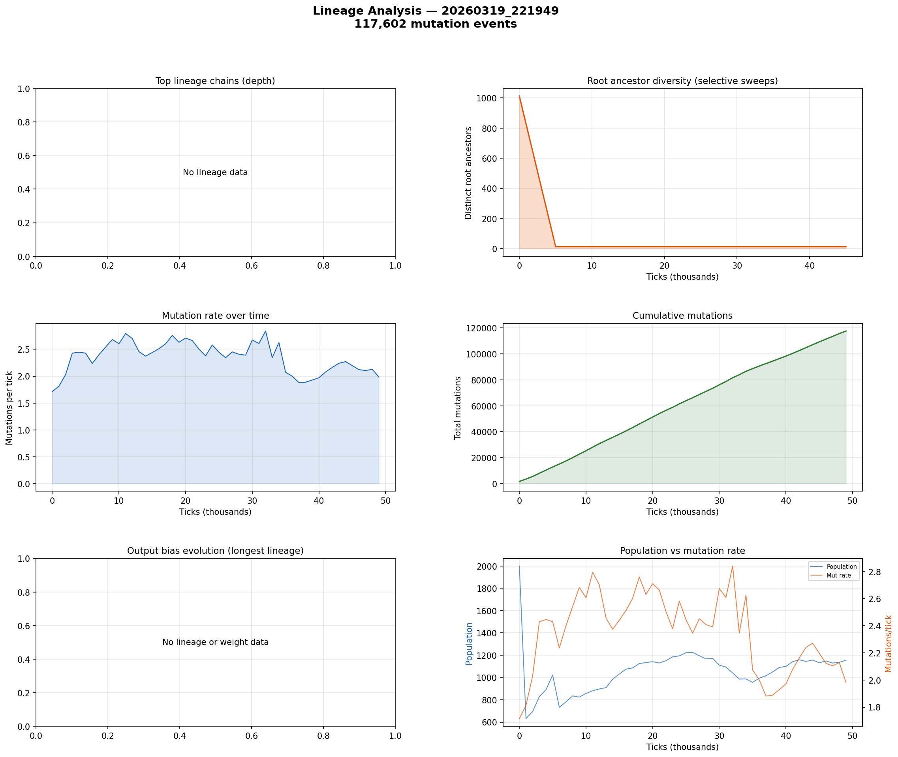

# Lineage Analysis

**Run:** `20260319_221949`  
**Mutation events:** 117,602  
**Tick range:** 0 - 49,960  

## Mutation Summary

| Metric | Value |
|--------|-------|
| Total mutation events | 117,602 |
| Unique parent genomes | 4,872 |
| Unique child genomes | 3,885 |
| Surviving genomes (latest snapshot) | 0 |
| Avg mutations/tick | 2.35 |

## Selective Sweep Indicators

- Initial root diversity: 1013
- Final root diversity: 13
- Minimum root diversity: 13 at tick ~5,000

A significant selective sweep is indicated: root diversity dropped by more than 50%, suggesting a dominant lineage displaced many competing lineages.

## Mutation Dynamics

| Metric | Value |
|--------|-------|
| Peak mutation rate | 2.84 per tick |
| Final mutation rate | 1.98 per tick |
| Total mutations | 117,602 |

## Figures

