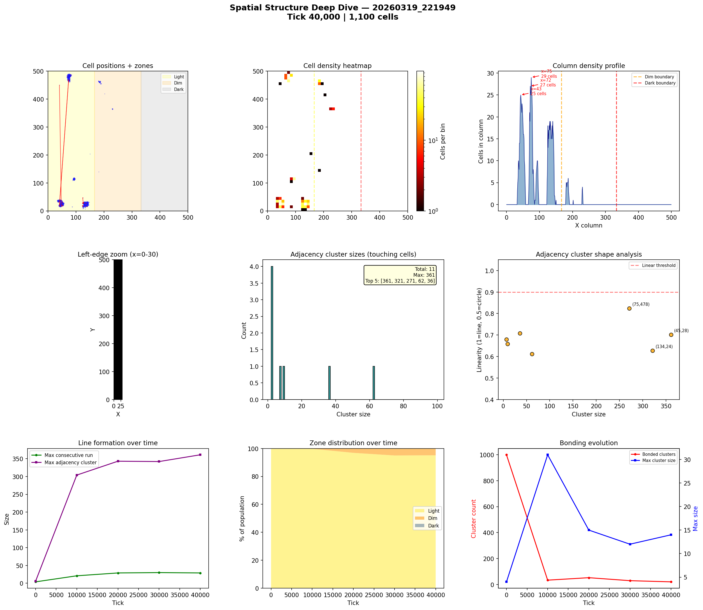
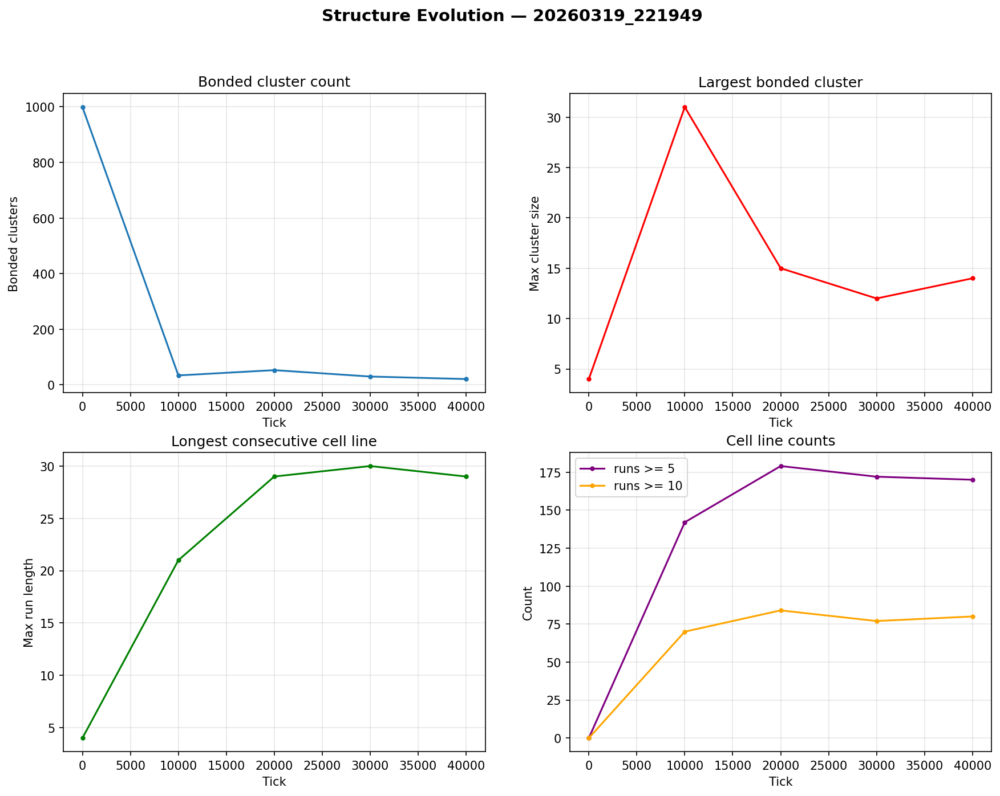

# Spatial Structure Analysis

**Run:** `20260319_221949`  
**Snapshot:** tick 40,000  
**Spatial snapshots analyzed:** 5  

## Population Distribution

| Zone | Cells | % |
|------|-------|---|
| Light (x < 166) | 1,046 | 95.1% |
| Dim (166-333) | 54 | 4.9% |
| Dark (x >= 333) | 0 | 0.0% |

Zone distribution evolved from 100% / 0% / 0% (light/dim/dark) at tick 0 to 95% / 5% / 0% by tick 40,000.

## Density Hotspots

- Densest column: x=75 (29 cells)
- Densest row: y=22 (37 cells)
- Top 5 columns by cell count: x=75 (29), x=72 (27), x=43 (25), x=47 (23), x=70 (21)

## Adjacency Clusters (touching cells)

Total clusters (2+ cells): 11  
Largest cluster: 361 cells  

| Rank | Size | Linearity | Shape | Center (x,y) |
|------|------|-----------|-------|--------------|
| 1 | 361 | 0.702 | elongated | (45, 28) |
| 2 | 321 | 0.627 | blob | (134, 24) |
| 3 | 271 | 0.824 | elongated | (75, 478) |
| 4 | 62 | 0.612 | blob | (93, 114) |
| 5 | 36 | 0.708 | elongated | (184, 462) |
| 6 | 9 | 0.659 | blob | (230, 365) |
| 7 | 7 | 0.680 | blob | (188, 455) |

## Consecutive Cell Runs (axis-aligned lines)

| Threshold | Count |
|-----------|-------|
| >= 3 cells | 248 |
| >= 5 cells | 170 |
| >= 10 cells | 80 |
| Max length | 29 |

Top 10 longest runs:

| Rank | Length | Direction | Location |
|------|--------|-----------|----------|
| 1 | 29 | vertical | col x=75, y=463 |
| 2 | 26 | vertical | col x=72, y=464 |
| 3 | 21 | horizontal | row y=30, x=124 |
| 4 | 20 | horizontal | row y=26, x=125 |
| 5 | 20 | horizontal | row y=28, x=125 |
| 6 | 19 | vertical | col x=49, y=17 |
| 7 | 18 | horizontal | row y=20, x=38 |
| 8 | 18 | vertical | col x=47, y=16 |
| 9 | 18 | vertical | col x=129, y=16 |
| 10 | 17 | vertical | col x=74, y=472 |

## Bonded Clusters

- Total bond pairs: 46
- Bonded clusters: 21
- Max bonded cluster: 14

## Figures

