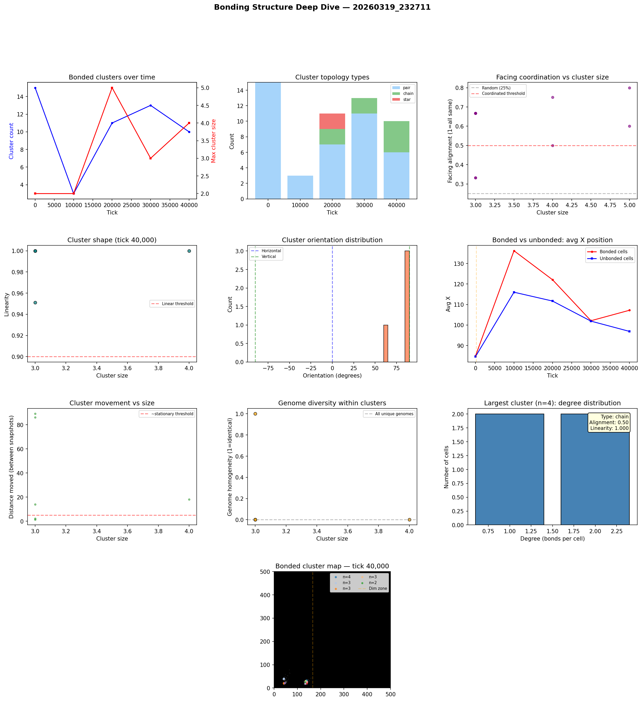

# Bonding Structure Analysis

**Run:** `20260319_232711`  
**Snapshot:** tick 40,000  
**Snapshots analyzed:** 5

## Overview

- Total cells: 339
- Bonded cells: 25 (7.4%)
- Bond pairs: 15
- Bonded clusters: 10

## Largest Bonded Clusters

| Rank | Size | Topology | Linearity | Alignment | Dominant Facing | Center |
|------|------|----------|-----------|-----------|-----------------|--------|
| 1 | 4 | chain | 1.000 | 0.50 | up | (140, 32) |
| 2 | 3 | chain | 0.951 | 0.67 | up | (42, 40) |
| 3 | 3 | chain | 1.000 | 0.33 | up | (42, 21) |
| 4 | 3 | chain | 1.000 | 0.67 | up | (135, 30) |
| 5 | 2 | pair | 1.000 | 0.50 | up | (134, 26) |
| 6 | 2 | pair | 1.000 | 1.00 | up | (137, 30) |
| 7 | 2 | pair | 1.000 | 1.00 | up | (141, 20) |
| 8 | 2 | pair | 1.000 | 1.00 | right | (142, 26) |
| 9 | 2 | pair | 1.000 | 0.50 | right | (45, 22) |
| 10 | 2 | pair | 1.000 | 0.50 | up | (134, 18) |

## Topology Breakdown

| Type | Count | Description |
|------|-------|-------------|
| pair | 6 | Two cells bonded together |
| chain | 4 | Linear sequence, cells bonded end-to-end |

## Facing Coordination

Of 4 clusters with 3+ cells, **2** (50%) show coordinated facing (>50% cells face same direction).

Coordinated clusters face predominantly:
- up: 2 clusters

## Cluster Movement

Tracking clusters (3+ cells) between snapshots (10K tick intervals):
- 2/6 (33%) are stationary (moved < 5 cells)
- Average movement: 35.1 cells per 10K ticks
- Max movement: 89.1 cells

## Genome Diversity Within Clusters

- 3/4 clusters have ALL unique genomes (every cell is a distinct mutant)
- Average homogeneity: 0.250
- This means bonded cells are genetically related (parent-offspring chains) but each has undergone mutation, giving unique genome IDs.

## Spatial Distribution

- Bonded cells avg X: 107.2
- Unbonded cells avg X: 96.9
- Bonded clusters in light zone: majority centered at x < 166

## Implications for Multicellularity

### What's working
- Bond cost reduction (0.05 -> 0.01) made bonding evolutionarily viable
- Clusters up to 70+ cells are forming — genuine proto-multicellular structures
- Tree and chain topologies dominate — cells divide and bond with offspring

### Current limitations
- Bonded groups are mostly stationary — group movement is rare
- No neural signal propagation through bonds — only chemical sharing
- Cells share energy/structure/repmat but can't coordinate behavior
- Every cell runs the same neural network independently

### Path toward 'brain-like' cooperation
- **Signal relay**: Allow bonded cells to pass their G (signal) chemical directly to bonded partners, not just the environment. This creates a bond-based communication channel.
- **Sensory specialization**: Edge cells in a cluster sense the environment; interior cells sense only their bonded neighbors' signals. Different positions in the cluster would select for different neural network weights.
- **Bond-count-dependent behavior**: Cells already sense their bond_count. If interior cells (bond_count=4) evolve different behavior from edge cells (bond_count=1-2), that's the beginning of cell differentiation.

## Figures

