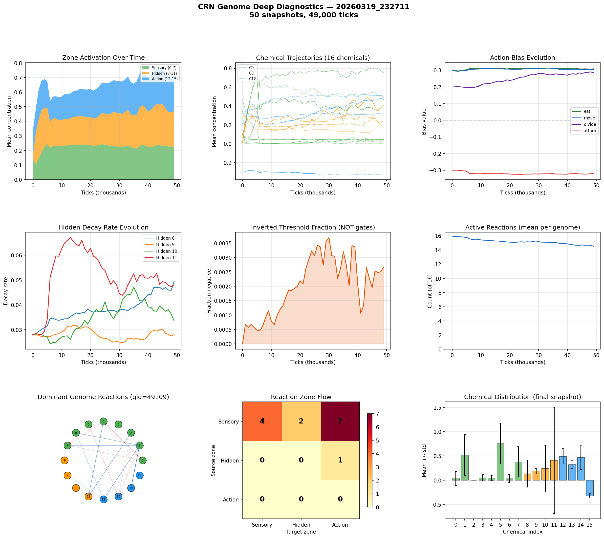

# CRN Genome Deep Analysis

**Run:** `20260319_232711`  
**Snapshots:** 50  
**Duration:** 49,000 ticks  
**Active genomes:** 304  

## Chemical Summary

| Zone | Chemicals | Mean | Description |
|------|-----------|------|-------------|
| Sensory | 0-7 | 0.226 | Environment inputs |
| Hidden | 8-11 | 0.243 | Internal memory/gates |
| Action | 12-15 | 0.241 | Action triggers |

## Action Biases (population-weighted)

| Action | Bias Value | Interpretation |
|--------|-----------|----------------|
| eat | +0.308 | strong positive |
| move | +0.304 | strong positive |
| divide | +0.286 | moderate positive |
| attack | -0.321 | strong negative |

## Hidden Decay Rates

Low decay = long memory. High decay = short-term reactivity.

| Chemical | Decay Rate | Memory Half-Life |
|----------|-----------|-----------------|
| Hidden 8 | 0.0494 | 14 ticks |
| Hidden 9 | 0.0280 | 24 ticks |
| Hidden 10 | 0.0336 | 20 ticks |
| Hidden 11 | 0.0481 | 14 ticks |

## Computational Sophistication

- **Active reactions:** 14.5 of 16
- **Inverted thresholds (NOT-gates):** 0.3%
- **Dominant genome:** gid=49109 (2 cells)

## Reaction Zone Flow (dominant genome)

| Source \ Target | Sensory | Hidden | Action |
|---------------|---------|--------|--------|
| Sensory | 4 | 2 | 7 |
| Hidden | 0 | 0 | 1 |
| Action | 0 | 0 | 0 |

## Key Findings

- Hidden chemicals are active — CRN is using internal state
- Using 15/16 reactions — complex network
- Sensory->Hidden->Action pathway exists (2+1 reactions)

## Figures

