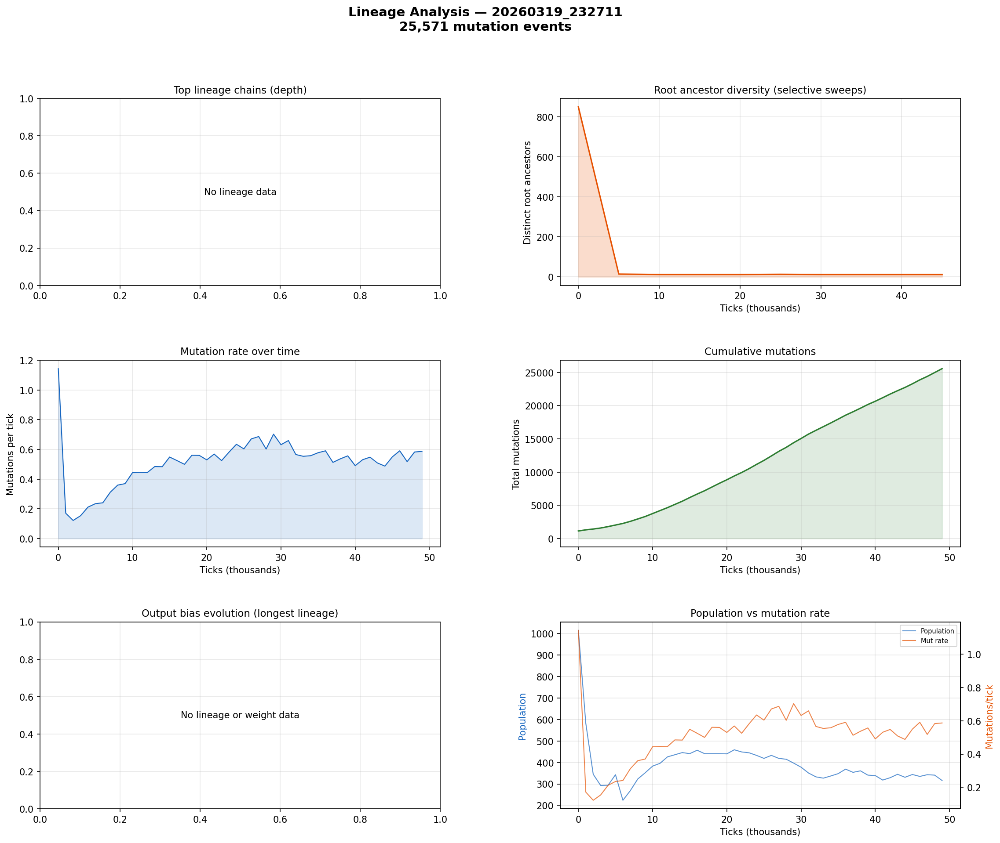

# Lineage Analysis

**Run:** `20260319_232711`  
**Mutation events:** 25,571  
**Tick range:** 0 - 49,875  

## Mutation Summary

| Metric | Value |
|--------|-------|
| Total mutation events | 25,571 |
| Unique parent genomes | 1,915 |
| Unique child genomes | 1,144 |
| Surviving genomes (latest snapshot) | 0 |
| Avg mutations/tick | 0.51 |

## Selective Sweep Indicators

- Initial root diversity: 849
- Final root diversity: 12
- Minimum root diversity: 12 at tick ~10,000

A significant selective sweep is indicated: root diversity dropped by more than 50%, suggesting a dominant lineage displaced many competing lineages.

## Mutation Dynamics

| Metric | Value |
|--------|-------|
| Peak mutation rate | 1.14 per tick |
| Final mutation rate | 0.59 per tick |
| Total mutations | 25,571 |

## Figures

