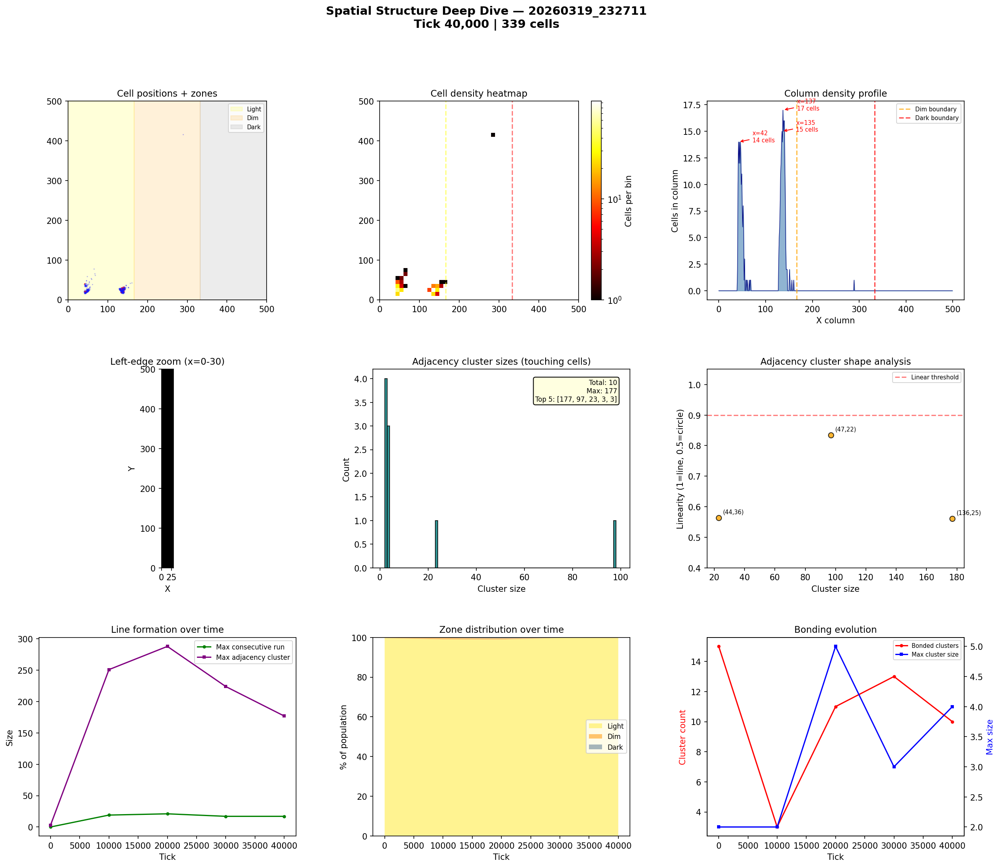
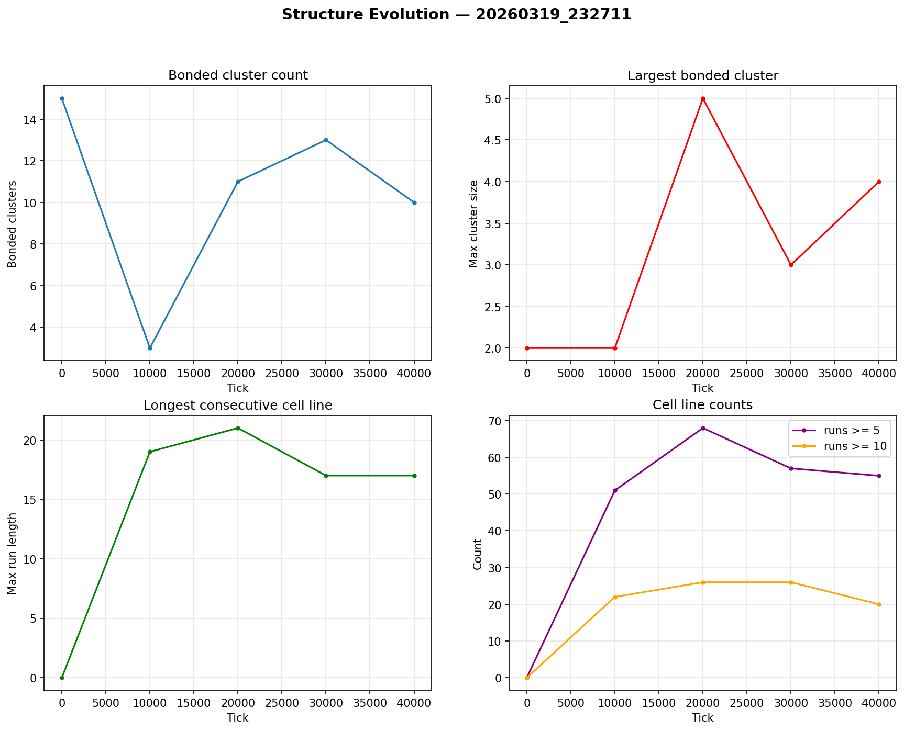

# Spatial Structure Analysis

**Run:** `20260319_232711`  
**Snapshot:** tick 40,000  
**Spatial snapshots analyzed:** 5  

## Population Distribution

| Zone | Cells | % |
|------|-------|---|
| Light (x < 166) | 338 | 99.7% |
| Dim (166-333) | 1 | 0.3% |
| Dark (x >= 333) | 0 | 0.0% |

Zone distribution evolved from 100% / 0% / 0% (light/dim/dark) at tick 0 to 100% / 0% / 0% by tick 40,000.

## Density Hotspots

- Densest column: x=137 (17 cells)
- Densest row: y=25 (23 cells)
- Top 5 columns by cell count: x=137 (17), x=135 (15), x=42 (14), x=44 (14), x=46 (14)

## Adjacency Clusters (touching cells)

Total clusters (2+ cells): 10  
Largest cluster: 177 cells  

| Rank | Size | Linearity | Shape | Center (x,y) |
|------|------|-----------|-------|--------------|
| 1 | 177 | 0.560 | blob | (136, 25) |
| 2 | 97 | 0.834 | elongated | (47, 22) |
| 3 | 23 | 0.563 | blob | (44, 36) |

## Consecutive Cell Runs (axis-aligned lines)

| Threshold | Count |
|-----------|-------|
| >= 3 cells | 67 |
| >= 5 cells | 55 |
| >= 10 cells | 20 |
| Max length | 17 |

Top 10 longest runs:

| Rank | Length | Direction | Location |
|------|--------|-----------|----------|
| 1 | 17 | horizontal | row y=28, x=128 |
| 2 | 16 | horizontal | row y=27, x=128 |
| 3 | 16 | horizontal | row y=29, x=128 |
| 4 | 16 | vertical | col x=137, y=16 |
| 5 | 16 | vertical | col x=139, y=16 |
| 6 | 15 | horizontal | row y=26, x=129 |
| 7 | 15 | vertical | col x=135, y=17 |
| 8 | 15 | vertical | col x=138, y=17 |
| 9 | 14 | horizontal | row y=25, x=129 |
| 10 | 14 | vertical | col x=136, y=17 |

## Bonded Clusters

- Total bond pairs: 15
- Bonded clusters: 10
- Max bonded cluster: 4

## Figures

