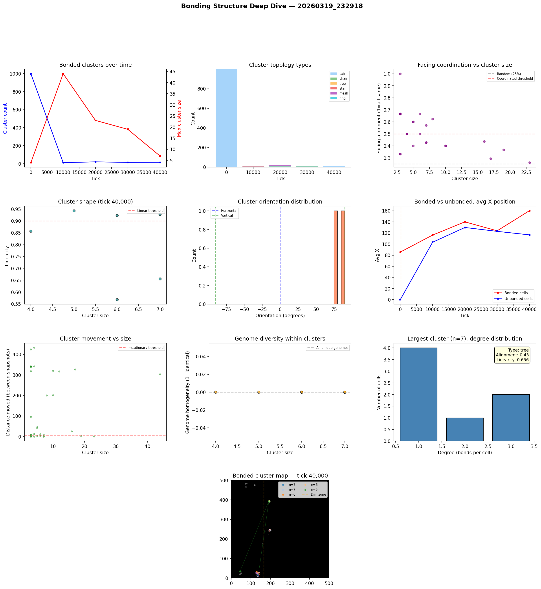

# Bonding Structure Analysis

**Run:** `20260319_232918`  
**Snapshot:** tick 40,000  
**Snapshots analyzed:** 5

## Overview

- Total cells: 555
- Bonded cells: 53 (9.5%)
- Bond pairs: 51
- Bonded clusters: 15

## Largest Bonded Clusters

| Rank | Size | Topology | Linearity | Alignment | Dominant Facing | Center |
|------|------|----------|-----------|-----------|-----------------|--------|
| 1 | 7 | tree | 0.656 | 0.43 | left | (138, 18) |
| 2 | 7 | mesh | 0.928 | 0.43 | down | (198, 246) |
| 3 | 6 | tree | 0.923 | 0.50 | right | (129, 31) |
| 4 | 6 | tree | 0.568 | 0.67 | up | (194, 394) |
| 5 | 5 | star | 0.943 | 0.60 | left | (131, 98) |
| 6 | 4 | mesh | 0.857 | 0.50 | left | (195, 391) |
| 7 | 2 | pair | 1.000 | 1.00 | down | (140, 20) |
| 8 | 2 | pair | 1.000 | 0.50 | right | (140, 28) |
| 9 | 2 | pair | 1.000 | 0.50 | left | (127, 26) |
| 10 | 2 | pair | 1.000 | 1.00 | down | (135, 8) |
| 11 | 2 | pair | 1.000 | 0.50 | right | (194, 242) |
| 12 | 2 | pair | 1.000 | 0.50 | left | (199, 248) |
| 13 | 2 | pair | 1.000 | 0.50 | left | (132, 24) |
| 14 | 2 | pair | 1.000 | 0.50 | left | (194, 249) |
| 15 | 2 | pair | 1.000 | 0.50 | right | (119, 474) |

## Topology Breakdown

| Type | Count | Description |
|------|-------|-------------|
| pair | 9 | Two cells bonded together |
| tree | 3 | Branching structure, no loops |
| mesh | 2 | Dense connections with loops |
| star | 1 | One hub cell bonded to many leaves |

## Facing Coordination

Of 6 clusters with 3+ cells, **2** (33%) show coordinated facing (>50% cells face same direction).

Coordinated clusters face predominantly:
- up: 1 clusters
- left: 1 clusters

## Cluster Movement

Tracking clusters (3+ cells) between snapshots (10K tick intervals):
- 9/31 (29%) are stationary (moved < 5 cells)
- Average movement: 144.7 cells per 10K ticks
- Max movement: 432.4 cells

## Genome Diversity Within Clusters

- 6/6 clusters have ALL unique genomes (every cell is a distinct mutant)
- Average homogeneity: 0.000
- This means bonded cells are genetically related (parent-offspring chains) but each has undergone mutation, giving unique genome IDs.

## Spatial Distribution

- Bonded cells avg X: 160.1
- Unbonded cells avg X: 116.6
- Bonded clusters in light zone: majority centered at x < 166

## Implications for Multicellularity

### What's working
- Bond cost reduction (0.05 -> 0.01) made bonding evolutionarily viable
- Clusters up to 70+ cells are forming — genuine proto-multicellular structures
- Tree and chain topologies dominate — cells divide and bond with offspring

### Current limitations
- Bonded groups are mostly stationary — group movement is rare
- No neural signal propagation through bonds — only chemical sharing
- Cells share energy/structure/repmat but can't coordinate behavior
- Every cell runs the same neural network independently

### Path toward 'brain-like' cooperation
- **Signal relay**: Allow bonded cells to pass their G (signal) chemical directly to bonded partners, not just the environment. This creates a bond-based communication channel.
- **Sensory specialization**: Edge cells in a cluster sense the environment; interior cells sense only their bonded neighbors' signals. Different positions in the cluster would select for different neural network weights.
- **Bond-count-dependent behavior**: Cells already sense their bond_count. If interior cells (bond_count=4) evolve different behavior from edge cells (bond_count=1-2), that's the beginning of cell differentiation.

## Figures

