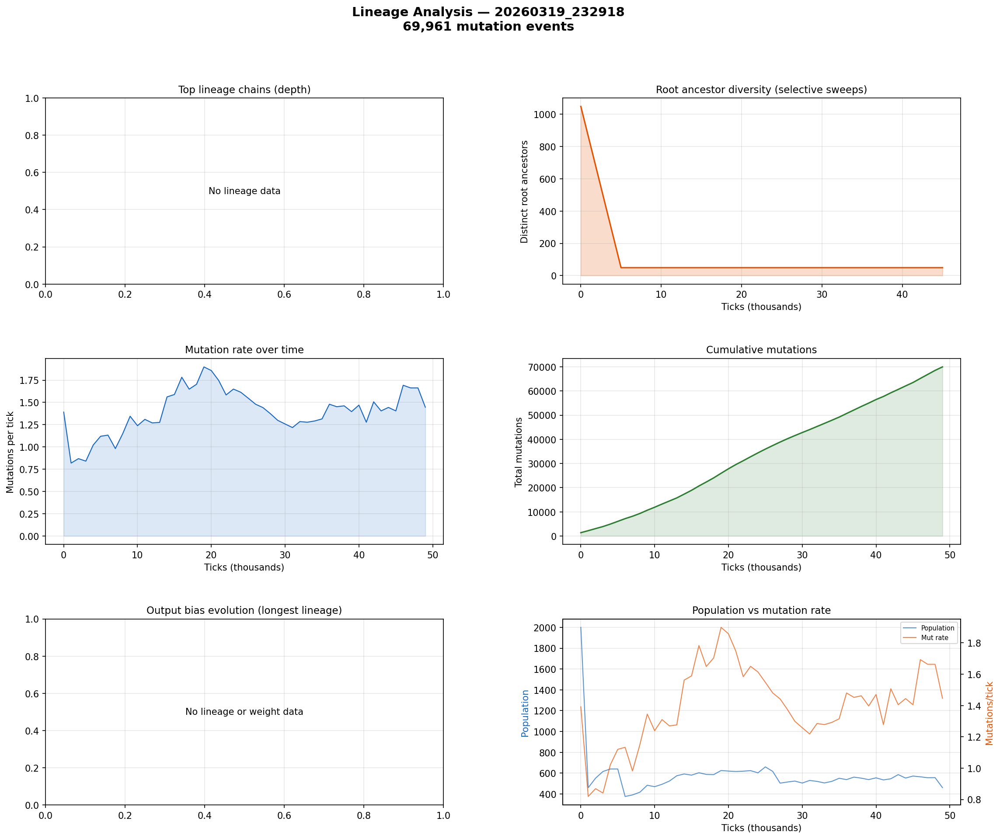

# Lineage Analysis

**Run:** `20260319_232918`  
**Mutation events:** 69,961  
**Tick range:** 0 - 49,917  

## Mutation Summary

| Metric | Value |
|--------|-------|
| Total mutation events | 69,961 |
| Unique parent genomes | 3,443 |
| Unique child genomes | 2,524 |
| Surviving genomes (latest snapshot) | 0 |
| Avg mutations/tick | 1.40 |

## Selective Sweep Indicators

- Initial root diversity: 1049
- Final root diversity: 49
- Minimum root diversity: 49 at tick ~5,000

A significant selective sweep is indicated: root diversity dropped by more than 50%, suggesting a dominant lineage displaced many competing lineages.

## Mutation Dynamics

| Metric | Value |
|--------|-------|
| Peak mutation rate | 1.90 per tick |
| Final mutation rate | 1.45 per tick |
| Total mutations | 69,961 |

## Figures

