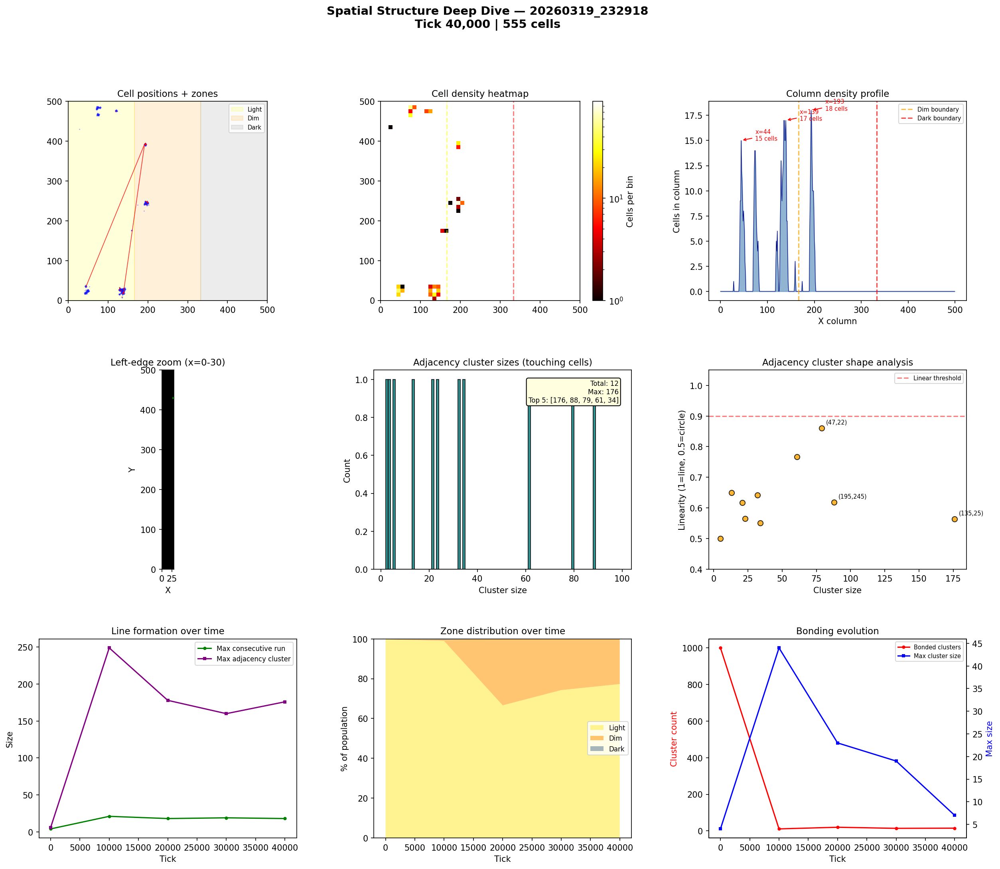
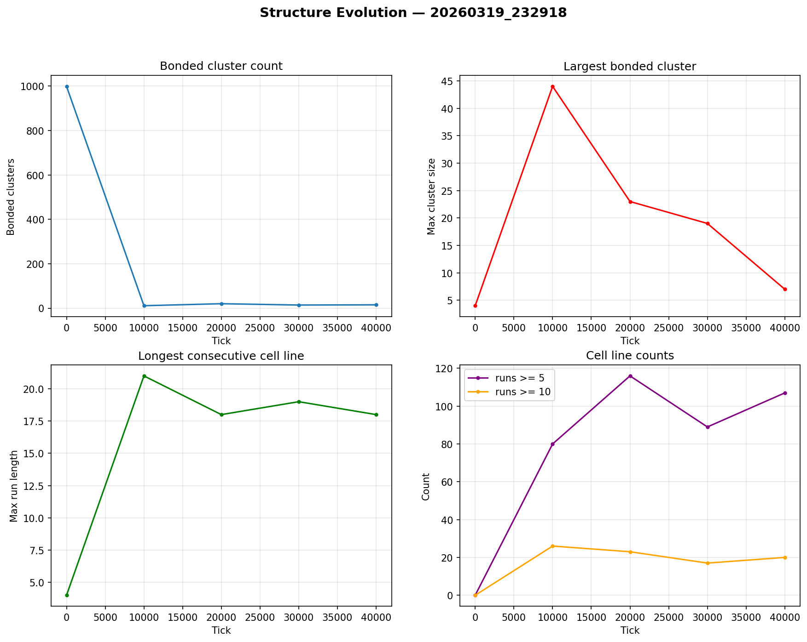

# Spatial Structure Analysis

**Run:** `20260319_232918`  
**Snapshot:** tick 40,000  
**Spatial snapshots analyzed:** 5  

## Population Distribution

| Zone | Cells | % |
|------|-------|---|
| Light (x < 166) | 429 | 77.3% |
| Dim (166-333) | 126 | 22.7% |
| Dark (x >= 333) | 0 | 0.0% |

Zone distribution evolved from 100% / 0% / 0% (light/dim/dark) at tick 0 to 77% / 23% / 0% by tick 40,000.

## Density Hotspots

- Densest column: x=193 (18 cells)
- Densest row: y=26 (24 cells)
- Top 5 columns by cell count: x=193 (18), x=139 (17), x=44 (15), x=129 (13), x=49 (8)

## Adjacency Clusters (touching cells)

Total clusters (2+ cells): 12  
Largest cluster: 176 cells  

| Rank | Size | Linearity | Shape | Center (x,y) |
|------|------|-----------|-------|--------------|
| 1 | 176 | 0.564 | blob | (135, 25) |
| 2 | 88 | 0.618 | blob | (195, 245) |
| 3 | 79 | 0.860 | elongated | (47, 22) |
| 4 | 61 | 0.767 | elongated | (75, 483) |
| 5 | 34 | 0.551 | blob | (75, 466) |
| 6 | 32 | 0.642 | blob | (193, 392) |
| 7 | 23 | 0.566 | blob | (120, 476) |
| 8 | 21 | 0.617 | blob | (44, 36) |
| 9 | 13 | 0.649 | blob | (129, 16) |
| 10 | 5 | 0.500 | blob | (159, 176) |

## Consecutive Cell Runs (axis-aligned lines)

| Threshold | Count |
|-----------|-------|
| >= 3 cells | 156 |
| >= 5 cells | 107 |
| >= 10 cells | 20 |
| Max length | 18 |

Top 10 longest runs:

| Rank | Length | Direction | Location |
|------|--------|-----------|----------|
| 1 | 18 | horizontal | row y=27, x=126 |
| 2 | 17 | horizontal | row y=28, x=127 |
| 3 | 16 | vertical | col x=139, y=16 |
| 4 | 15 | vertical | col x=137, y=16 |
| 5 | 13 | horizontal | row y=26, x=127 |
| 6 | 13 | horizontal | row y=29, x=128 |
| 7 | 13 | vertical | col x=134, y=18 |
| 8 | 12 | horizontal | row y=243, x=190 |
| 9 | 11 | horizontal | row y=244, x=191 |
| 10 | 11 | horizontal | row y=245, x=191 |

## Bonded Clusters

- Total bond pairs: 51
- Bonded clusters: 15
- Max bonded cluster: 7

## Figures

