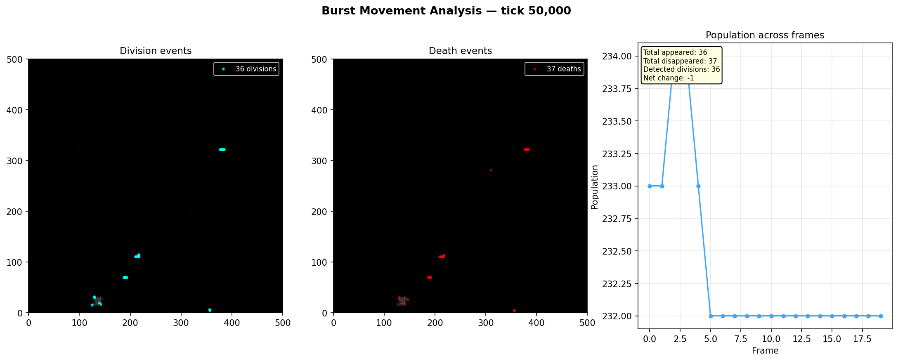
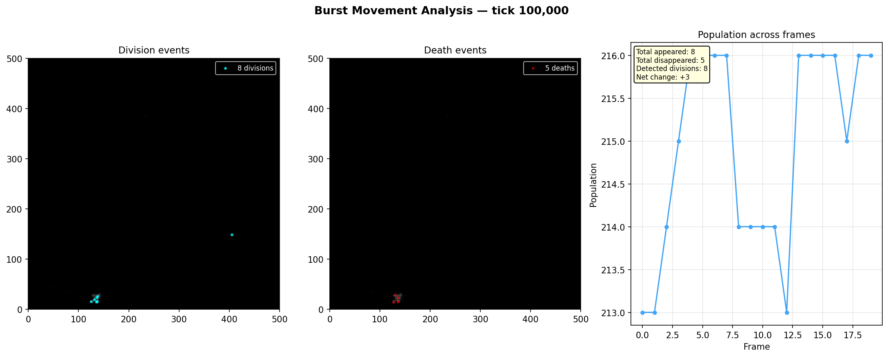
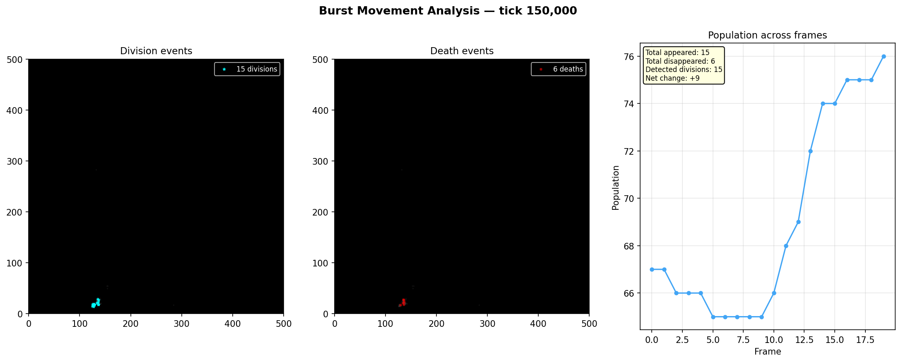

# Burst Snapshot Analysis

**Run:** `20260319_235914`  
**Bursts analyzed:** 3  

## Burst at tick 50,000

**Frames:** 20  

| Metric | Value |
|--------|-------|
| Avg population | 232 |
| Total cells appeared | 36 |
| Total cells disappeared | 37 |
| Detected divisions | 36 |
| Net population change | -1 |
| Avg turnover per frame | 1.9 |

### Frame-by-frame

| Pair | Pop A | Pop B | Appeared | Disappeared | Divisions |
|------|-------|-------|----------|-------------|-----------|
| 0->1 | 233 | 233 | 2 | 2 | 2 |
| 1->2 | 233 | 234 | 4 | 3 | 4 |
| 2->3 | 234 | 234 | 2 | 2 | 2 |
| 3->4 | 234 | 233 | 2 | 3 | 2 |
| 4->5 | 233 | 232 | 2 | 3 | 2 |
| 5->6 | 232 | 232 | 2 | 2 | 2 |
| 6->7 | 232 | 232 | 0 | 0 | 0 |
| 7->8 | 232 | 232 | 2 | 2 | 2 |
| 8->9 | 232 | 232 | 3 | 3 | 3 |
| 9->10 | 232 | 232 | 2 | 2 | 2 |
| 10->11 | 232 | 232 | 2 | 2 | 2 |
| 11->12 | 232 | 232 | 0 | 0 | 0 |
| 12->13 | 232 | 232 | 1 | 1 | 1 |
| 13->14 | 232 | 232 | 1 | 1 | 1 |
| 14->15 | 232 | 232 | 3 | 3 | 3 |
| 15->16 | 232 | 232 | 2 | 2 | 2 |
| 16->17 | 232 | 232 | 1 | 1 | 1 |
| 17->18 | 232 | 232 | 3 | 3 | 3 |
| 18->19 | 232 | 232 | 2 | 2 | 2 |

## Burst at tick 100,000

**Frames:** 20  

| Metric | Value |
|--------|-------|
| Avg population | 214 |
| Total cells appeared | 8 |
| Total cells disappeared | 5 |
| Detected divisions | 8 |
| Net population change | +3 |
| Avg turnover per frame | 0.3 |

### Frame-by-frame

| Pair | Pop A | Pop B | Appeared | Disappeared | Divisions |
|------|-------|-------|----------|-------------|-----------|
| 0->1 | 213 | 213 | 1 | 1 | 1 |
| 1->2 | 213 | 214 | 1 | 0 | 1 |
| 2->3 | 214 | 215 | 1 | 0 | 1 |
| 3->4 | 215 | 216 | 1 | 0 | 1 |
| 4->5 | 216 | 216 | 0 | 0 | 0 |
| 5->6 | 216 | 216 | 0 | 0 | 0 |
| 6->7 | 216 | 216 | 0 | 0 | 0 |
| 7->8 | 216 | 214 | 0 | 2 | 0 |
| 8->9 | 214 | 214 | 0 | 0 | 0 |
| 9->10 | 214 | 214 | 0 | 0 | 0 |
| 10->11 | 214 | 214 | 0 | 0 | 0 |
| 11->12 | 214 | 213 | 0 | 1 | 0 |
| 12->13 | 213 | 216 | 3 | 0 | 3 |
| 13->14 | 216 | 216 | 0 | 0 | 0 |
| 14->15 | 216 | 216 | 0 | 0 | 0 |
| 15->16 | 216 | 216 | 0 | 0 | 0 |
| 16->17 | 216 | 215 | 0 | 1 | 0 |
| 17->18 | 215 | 216 | 1 | 0 | 1 |
| 18->19 | 216 | 216 | 0 | 0 | 0 |

## Burst at tick 150,000

**Frames:** 20  

| Metric | Value |
|--------|-------|
| Avg population | 72 |
| Total cells appeared | 15 |
| Total cells disappeared | 6 |
| Detected divisions | 15 |
| Net population change | +9 |
| Avg turnover per frame | 0.6 |

### Frame-by-frame

| Pair | Pop A | Pop B | Appeared | Disappeared | Divisions |
|------|-------|-------|----------|-------------|-----------|
| 0->1 | 67 | 67 | 0 | 0 | 0 |
| 1->2 | 67 | 66 | 0 | 1 | 0 |
| 2->3 | 66 | 66 | 0 | 0 | 0 |
| 3->4 | 66 | 66 | 0 | 0 | 0 |
| 4->5 | 66 | 65 | 0 | 1 | 0 |
| 5->6 | 65 | 65 | 0 | 0 | 0 |
| 6->7 | 65 | 65 | 0 | 0 | 0 |
| 7->8 | 65 | 65 | 0 | 0 | 0 |
| 8->9 | 65 | 65 | 0 | 0 | 0 |
| 9->10 | 65 | 66 | 2 | 1 | 2 |
| 10->11 | 66 | 68 | 2 | 0 | 2 |
| 11->12 | 68 | 69 | 2 | 1 | 2 |
| 12->13 | 69 | 72 | 3 | 0 | 3 |
| 13->14 | 72 | 74 | 3 | 1 | 3 |
| 14->15 | 74 | 74 | 0 | 0 | 0 |
| 15->16 | 74 | 75 | 1 | 0 | 1 |
| 16->17 | 75 | 75 | 0 | 0 | 0 |
| 17->18 | 75 | 75 | 0 | 0 | 0 |
| 18->19 | 75 | 76 | 2 | 1 | 2 |

