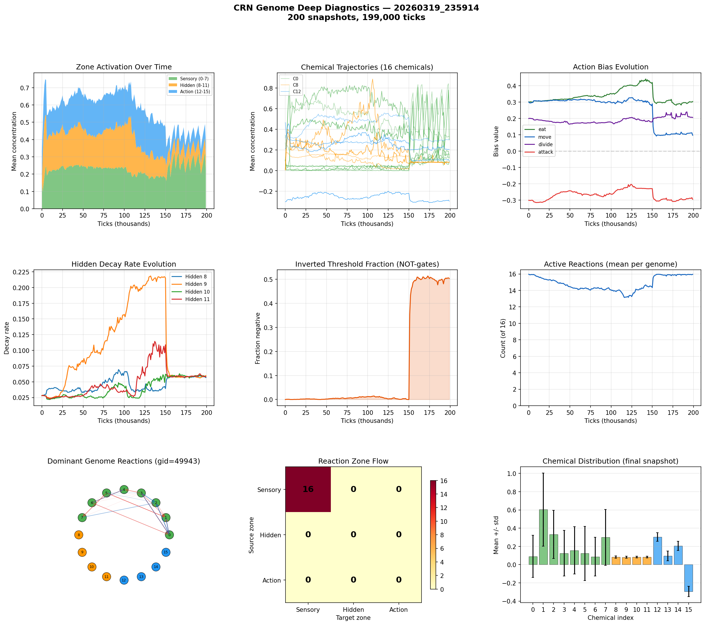

# CRN Genome Deep Analysis

**Run:** `20260319_235914`  
**Snapshots:** 200  
**Duration:** 199,000 ticks  
**Active genomes:** 146  

## Chemical Summary

| Zone | Chemicals | Mean | Description |
|------|-----------|------|-------------|
| Sensory | 0-7 | 0.227 | Environment inputs |
| Hidden | 8-11 | 0.082 | Internal memory/gates |
| Action | 12-15 | 0.077 | Action triggers |

## Action Biases (population-weighted)

| Action | Bias Value | Interpretation |
|--------|-----------|----------------|
| eat | +0.303 | strong positive |
| move | +0.097 | weak positive |
| divide | +0.206 | moderate positive |
| attack | -0.294 | moderate negative |

## Hidden Decay Rates

Low decay = long memory. High decay = short-term reactivity.

| Chemical | Decay Rate | Memory Half-Life |
|----------|-----------|-----------------|
| Hidden 8 | 0.0567 | 12 ticks |
| Hidden 9 | 0.0599 | 11 ticks |
| Hidden 10 | 0.0580 | 11 ticks |
| Hidden 11 | 0.0580 | 11 ticks |

## Computational Sophistication

- **Active reactions:** 16.0 of 16
- **Inverted thresholds (NOT-gates):** 50.4%
- **Dominant genome:** gid=49943 (2 cells)

## Reaction Zone Flow (dominant genome)

| Source \ Target | Sensory | Hidden | Action |
|---------------|---------|--------|--------|
| Sensory | 16 | 0 | 0 |
| Hidden | 0 | 0 | 0 |
| Action | 0 | 0 | 0 |

## Key Findings

- Hidden chemicals are active — CRN is using internal state
- 50% inverted thresholds indicate NOT-gate logic has evolved
- Using 16/16 reactions — complex network

## Figures

