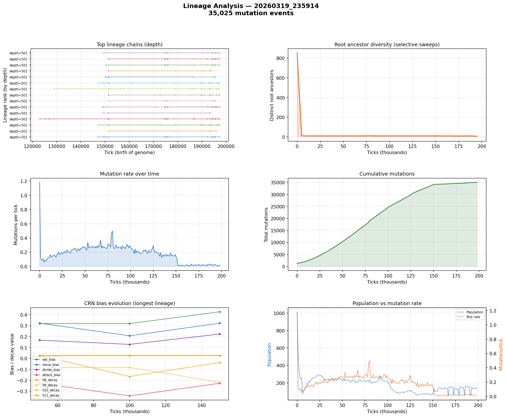

# Lineage Analysis

**Run:** `20260319_235914`  
**Mutation events:** 35,025  
**Tick range:** 0 - 198,667  

## Mutation Summary

| Metric | Value |
|--------|-------|
| Total mutation events | 35,025 |
| Unique parent genomes | 1,569 |
| Unique child genomes | 1,171 |
| Surviving genomes (latest snapshot) | 64 |
| Avg mutations/tick | 0.18 |

## Longest Surviving Lineages

| Rank | Depth | Root genome | Tip genome |
|------|-------|-------------|------------|
| 1 | 501 | 49982 | 49793 |
| 2 | 501 | 49971 | 49922 |
| 3 | 501 | 49971 | 49927 |
| 4 | 501 | 49982 | 49929 |
| 5 | 501 | 49900 | 49803 |
| 6 | 501 | 49889 | 49805 |
| 7 | 501 | 49890 | 49934 |
| 8 | 501 | 49971 | 49938 |
| 9 | 501 | 49971 | 49811 |
| 10 | 501 | 49900 | 49939 |

## Selective Sweep Indicators

- Initial root diversity: 852
- Final root diversity: 8
- Minimum root diversity: 8 at tick ~195,000

A significant selective sweep is indicated: root diversity dropped by more than 50%, suggesting a dominant lineage displaced many competing lineages.

## Mutation Dynamics

| Metric | Value |
|--------|-------|
| Peak mutation rate | 1.18 per tick |
| Final mutation rate | 0.02 per tick |
| Total mutations | 35,025 |

## Figures

