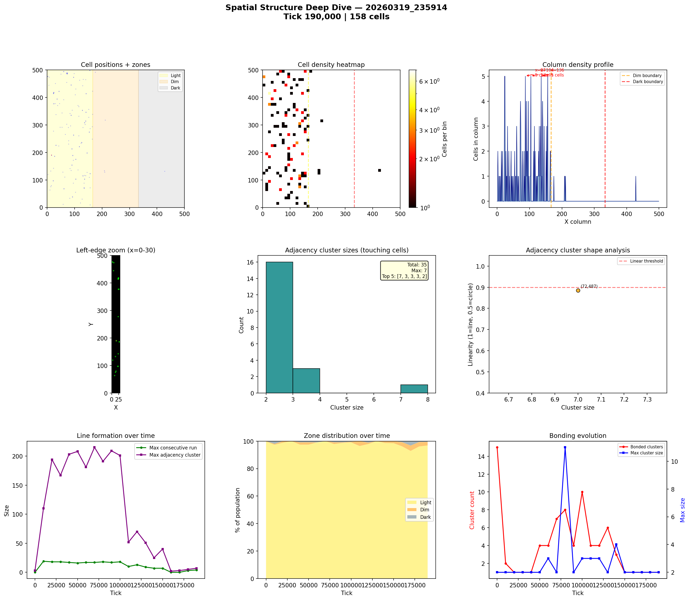
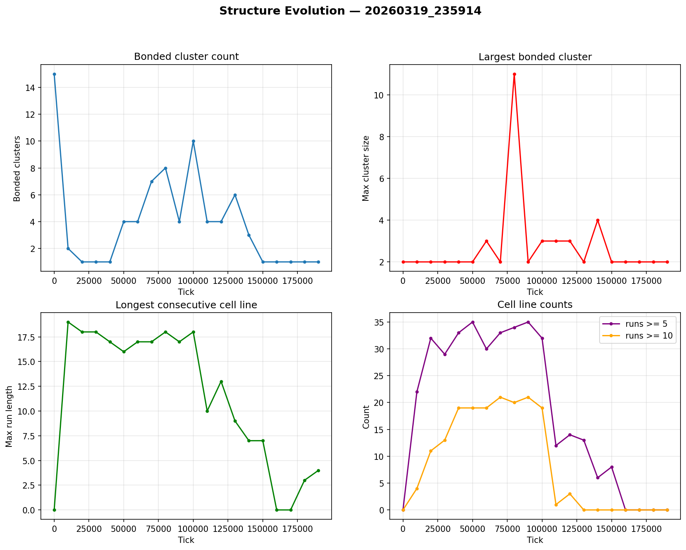

# Spatial Structure Analysis

**Run:** `20260319_235914`  
**Snapshot:** tick 190,000  
**Spatial snapshots analyzed:** 20  

## Population Distribution

| Zone | Cells | % |
|------|-------|---|
| Light (x < 166) | 153 | 96.8% |
| Dim (166-333) | 4 | 2.5% |
| Dark (x >= 333) | 1 | 0.6% |

Zone distribution evolved from 100% / 0% / 0% (light/dim/dark) at tick 0 to 97% / 3% / 1% by tick 190,000.

## Density Hotspots

- Densest column: x=23 (5 cells)
- Densest row: y=378 (3 cells)
- Top 5 columns by cell count: x=87 (5), x=104 (5), x=136 (5), x=156 (5)

## Adjacency Clusters (touching cells)

Total clusters (2+ cells): 35  
Largest cluster: 7 cells  

| Rank | Size | Linearity | Shape | Center (x,y) |
|------|------|-----------|-------|--------------|
| 1 | 7 | 0.886 | elongated | (72, 487) |

## Consecutive Cell Runs (axis-aligned lines)

| Threshold | Count |
|-----------|-------|
| >= 3 cells | 3 |
| >= 5 cells | 0 |
| >= 10 cells | 0 |
| Max length | 4 |

Top 10 longest runs:

| Rank | Length | Direction | Location |
|------|--------|-----------|----------|
| 1 | 4 | vertical | col x=72, y=486 |
| 2 | 3 | vertical | col x=23, y=414 |
| 3 | 3 | vertical | col x=24, y=417 |

## Bonded Clusters

- Total bond pairs: 1
- Bonded clusters: 1
- Max bonded cluster: 2

## Figures

