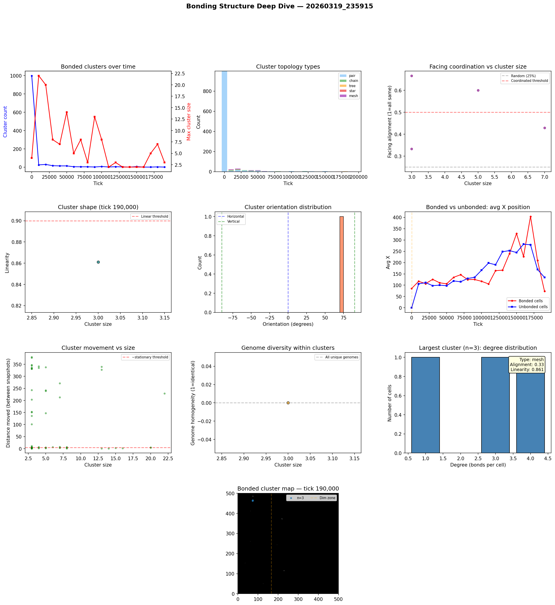

# Bonding Structure Analysis

**Run:** `20260319_235915`  
**Snapshot:** tick 190,000  
**Snapshots analyzed:** 20

## Overview

- Total cells: 48
- Bonded cells: 3 (6.2%)
- Bond pairs: 4
- Bonded clusters: 1

## Largest Bonded Clusters

| Rank | Size | Topology | Linearity | Alignment | Dominant Facing | Center |
|------|------|----------|-----------|-----------|-----------------|--------|
| 1 | 3 | mesh | 0.861 | 0.33 | up | (74, 464) |

## Topology Breakdown

| Type | Count | Description |
|------|-------|-------------|
| mesh | 1 | Dense connections with loops |

## Facing Coordination

Of 1 clusters with 3+ cells, **0** (0%) show coordinated facing (>50% cells face same direction).

## Cluster Movement

Tracking clusters (3+ cells) between snapshots (10K tick intervals):
- 27/61 (44%) are stationary (moved < 5 cells)
- Average movement: 113.7 cells per 10K ticks
- Max movement: 379.8 cells

## Genome Diversity Within Clusters

- 1/1 clusters have ALL unique genomes (every cell is a distinct mutant)
- Average homogeneity: 0.000
- This means bonded cells are genetically related (parent-offspring chains) but each has undergone mutation, giving unique genome IDs.

## Spatial Distribution

- Bonded cells avg X: 73.7
- Unbonded cells avg X: 134.4
- Bonded clusters in light zone: majority centered at x < 166

## Implications for Multicellularity

### What's working
- Bond cost reduction (0.05 -> 0.01) made bonding evolutionarily viable
- Clusters up to 70+ cells are forming — genuine proto-multicellular structures
- Tree and chain topologies dominate — cells divide and bond with offspring

### Current limitations
- Bonded groups are mostly stationary — group movement is rare
- No neural signal propagation through bonds — only chemical sharing
- Cells share energy/structure/repmat but can't coordinate behavior
- Every cell runs the same neural network independently

### Path toward 'brain-like' cooperation
- **Signal relay**: Allow bonded cells to pass their G (signal) chemical directly to bonded partners, not just the environment. This creates a bond-based communication channel.
- **Sensory specialization**: Edge cells in a cluster sense the environment; interior cells sense only their bonded neighbors' signals. Different positions in the cluster would select for different neural network weights.
- **Bond-count-dependent behavior**: Cells already sense their bond_count. If interior cells (bond_count=4) evolve different behavior from edge cells (bond_count=1-2), that's the beginning of cell differentiation.

## Figures

