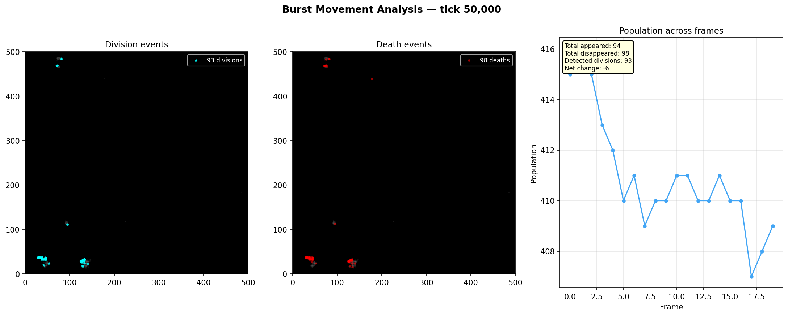
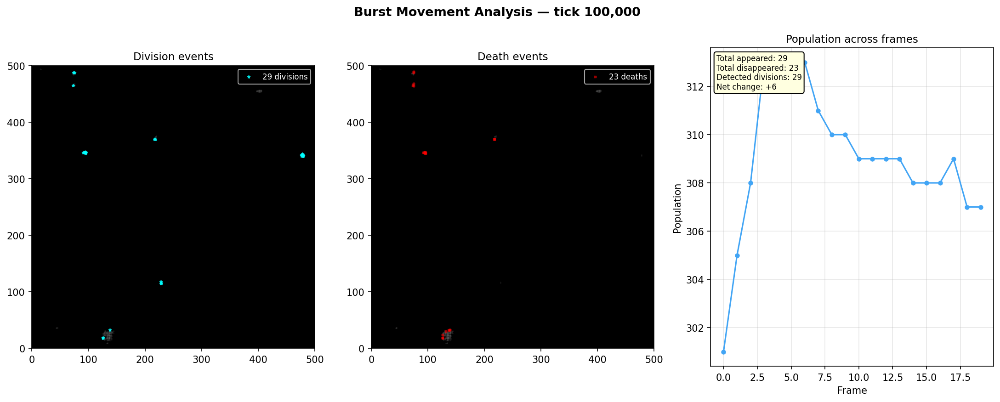
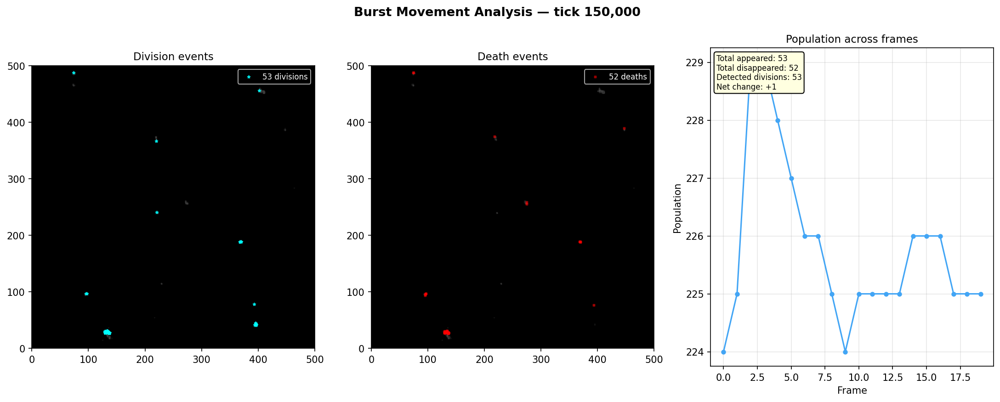

# Burst Snapshot Analysis

**Run:** `20260319_235915`  
**Bursts analyzed:** 3  

## Burst at tick 50,000

**Frames:** 20  

| Metric | Value |
|--------|-------|
| Avg population | 412 |
| Total cells appeared | 94 |
| Total cells disappeared | 98 |
| Detected divisions | 93 |
| Net population change | -6 |
| Avg turnover per frame | 5.1 |

### Frame-by-frame

| Pair | Pop A | Pop B | Appeared | Disappeared | Divisions |
|------|-------|-------|----------|-------------|-----------|
| 0->1 | 415 | 416 | 9 | 7 | 9 |
| 1->2 | 416 | 415 | 6 | 7 | 6 |
| 2->3 | 415 | 413 | 7 | 9 | 7 |
| 3->4 | 413 | 412 | 6 | 6 | 6 |
| 4->5 | 412 | 410 | 6 | 8 | 6 |
| 5->6 | 410 | 411 | 6 | 5 | 5 |
| 6->7 | 411 | 409 | 5 | 7 | 5 |
| 7->8 | 409 | 410 | 8 | 7 | 8 |
| 8->9 | 410 | 410 | 4 | 4 | 4 |
| 9->10 | 410 | 411 | 4 | 3 | 4 |
| 10->11 | 411 | 411 | 3 | 3 | 3 |
| 11->12 | 411 | 410 | 4 | 5 | 4 |
| 12->13 | 410 | 410 | 4 | 4 | 4 |
| 13->14 | 410 | 411 | 3 | 2 | 3 |
| 14->15 | 411 | 410 | 3 | 4 | 3 |
| 15->16 | 410 | 410 | 4 | 4 | 4 |
| 16->17 | 410 | 407 | 5 | 8 | 5 |
| 17->18 | 407 | 408 | 4 | 3 | 4 |
| 18->19 | 408 | 409 | 3 | 2 | 3 |

## Burst at tick 100,000

**Frames:** 20  

| Metric | Value |
|--------|-------|
| Avg population | 304 |
| Total cells appeared | 29 |
| Total cells disappeared | 23 |
| Detected divisions | 29 |
| Net population change | +6 |
| Avg turnover per frame | 1.4 |

### Frame-by-frame

| Pair | Pop A | Pop B | Appeared | Disappeared | Divisions |
|------|-------|-------|----------|-------------|-----------|
| 0->1 | 301 | 305 | 5 | 1 | 5 |
| 1->2 | 305 | 308 | 4 | 1 | 4 |
| 2->3 | 308 | 313 | 6 | 1 | 6 |
| 3->4 | 313 | 313 | 2 | 2 | 2 |
| 4->5 | 313 | 313 | 1 | 1 | 1 |
| 5->6 | 313 | 313 | 2 | 2 | 2 |
| 6->7 | 313 | 311 | 1 | 3 | 1 |
| 7->8 | 311 | 310 | 3 | 4 | 3 |
| 8->9 | 310 | 310 | 0 | 0 | 0 |
| 9->10 | 310 | 309 | 0 | 1 | 0 |
| 10->11 | 309 | 309 | 0 | 0 | 0 |
| 11->12 | 309 | 309 | 0 | 0 | 0 |
| 12->13 | 309 | 309 | 0 | 0 | 0 |
| 13->14 | 309 | 308 | 1 | 2 | 1 |
| 14->15 | 308 | 308 | 1 | 1 | 1 |
| 15->16 | 308 | 308 | 1 | 1 | 1 |
| 16->17 | 308 | 309 | 1 | 0 | 1 |
| 17->18 | 309 | 307 | 0 | 2 | 0 |
| 18->19 | 307 | 307 | 1 | 1 | 1 |

## Burst at tick 150,000

**Frames:** 20  

| Metric | Value |
|--------|-------|
| Avg population | 224 |
| Total cells appeared | 53 |
| Total cells disappeared | 52 |
| Detected divisions | 53 |
| Net population change | +1 |
| Avg turnover per frame | 2.8 |

### Frame-by-frame

| Pair | Pop A | Pop B | Appeared | Disappeared | Divisions |
|------|-------|-------|----------|-------------|-----------|
| 0->1 | 224 | 225 | 4 | 3 | 4 |
| 1->2 | 225 | 229 | 7 | 3 | 7 |
| 2->3 | 229 | 229 | 5 | 5 | 5 |
| 3->4 | 229 | 228 | 3 | 4 | 3 |
| 4->5 | 228 | 227 | 2 | 3 | 2 |
| 5->6 | 227 | 226 | 2 | 3 | 2 |
| 6->7 | 226 | 226 | 3 | 3 | 3 |
| 7->8 | 226 | 225 | 2 | 3 | 2 |
| 8->9 | 225 | 224 | 2 | 3 | 2 |
| 9->10 | 224 | 225 | 3 | 2 | 3 |
| 10->11 | 225 | 225 | 3 | 3 | 3 |
| 11->12 | 225 | 225 | 2 | 2 | 2 |
| 12->13 | 225 | 225 | 3 | 3 | 3 |
| 13->14 | 225 | 226 | 3 | 2 | 3 |
| 14->15 | 226 | 226 | 2 | 2 | 2 |
| 15->16 | 226 | 226 | 2 | 2 | 2 |
| 16->17 | 226 | 225 | 2 | 3 | 2 |
| 17->18 | 225 | 225 | 2 | 2 | 2 |
| 18->19 | 225 | 225 | 1 | 1 | 1 |

