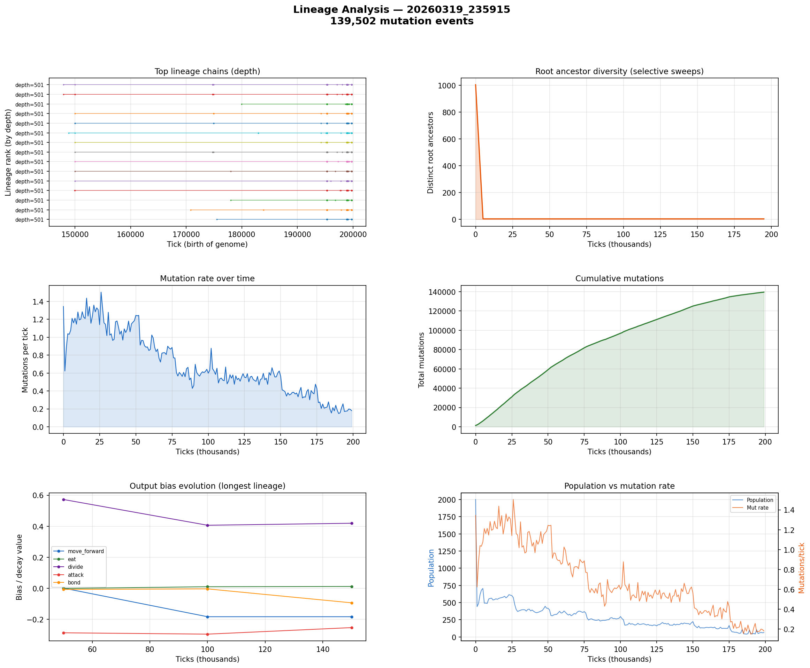

# Lineage Analysis

**Run:** `20260319_235915`  
**Mutation events:** 139,502  
**Tick range:** 0 - 199,761  

## Mutation Summary

| Metric | Value |
|--------|-------|
| Total mutation events | 139,502 |
| Unique parent genomes | 3,042 |
| Unique child genomes | 2,078 |
| Surviving genomes (latest snapshot) | 223 |
| Avg mutations/tick | 0.70 |

## Longest Surviving Lineages

| Rank | Depth | Root genome | Tip genome |
|------|-------|-------------|------------|
| 1 | 501 | 49903 | 49669 |
| 2 | 501 | 49984 | 49671 |
| 3 | 501 | 49903 | 49673 |
| 4 | 501 | 49782 | 49173 |
| 5 | 501 | 49984 | 49174 |
| 6 | 501 | 49772 | 49175 |
| 7 | 501 | 49984 | 49176 |
| 8 | 501 | 49984 | 49177 |
| 9 | 501 | 49984 | 49178 |
| 10 | 501 | 49772 | 49179 |

## Selective Sweep Indicators

- Initial root diversity: 1004
- Final root diversity: 4
- Minimum root diversity: 4 at tick ~5,000

A significant selective sweep is indicated: root diversity dropped by more than 50%, suggesting a dominant lineage displaced many competing lineages.

## Mutation Dynamics

| Metric | Value |
|--------|-------|
| Peak mutation rate | 1.50 per tick |
| Final mutation rate | 0.18 per tick |
| Total mutations | 139,502 |

## Figures

