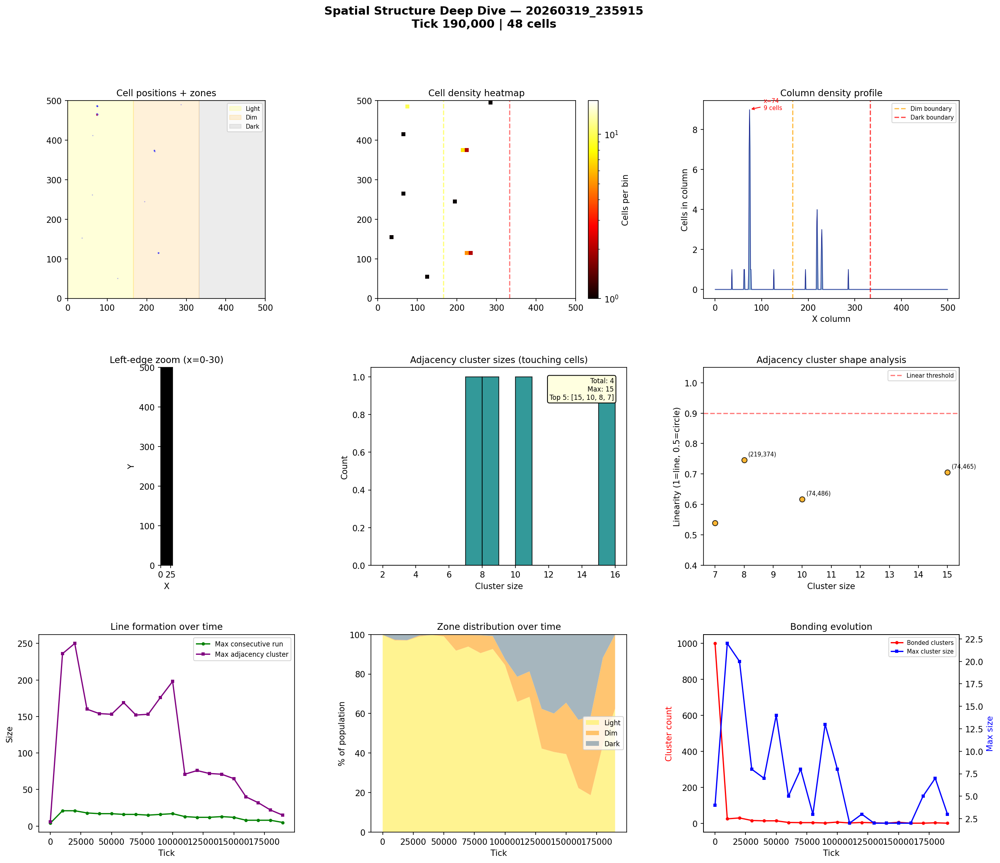
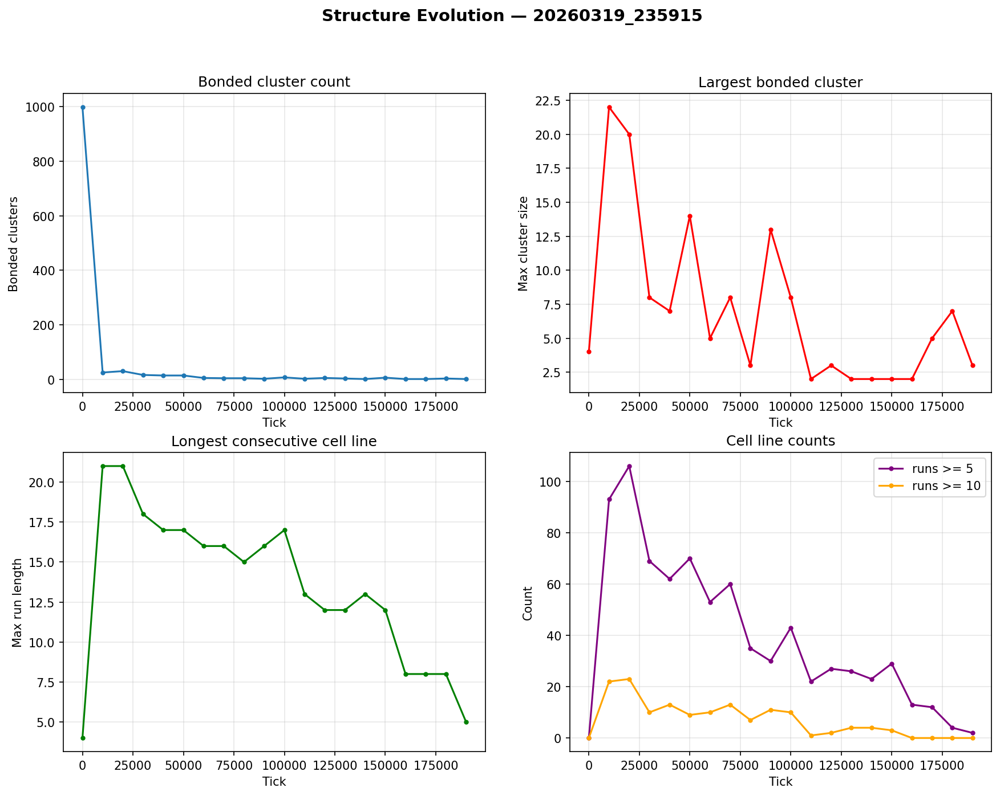

# Spatial Structure Analysis

**Run:** `20260319_235915`  
**Snapshot:** tick 190,000  
**Spatial snapshots analyzed:** 20  

## Population Distribution

| Zone | Cells | % |
|------|-------|---|
| Light (x < 166) | 30 | 62.5% |
| Dim (166-333) | 18 | 37.5% |
| Dark (x >= 333) | 0 | 0.0% |

Zone distribution evolved from 100% / 0% / 0% (light/dim/dark) at tick 0 to 62% / 38% / 0% by tick 190,000.

## Density Hotspots

- Densest column: x=74 (9 cells)
- Densest row: y=465 (4 cells)
- Top 5 columns by cell count: x=74 (9)

## Adjacency Clusters (touching cells)

Total clusters (2+ cells): 4  
Largest cluster: 15 cells  

| Rank | Size | Linearity | Shape | Center (x,y) |
|------|------|-----------|-------|--------------|
| 1 | 15 | 0.706 | elongated | (74, 465) |
| 2 | 10 | 0.617 | blob | (74, 486) |
| 3 | 8 | 0.746 | elongated | (219, 374) |
| 4 | 7 | 0.538 | blob | (229, 115) |

## Consecutive Cell Runs (axis-aligned lines)

| Threshold | Count |
|-----------|-------|
| >= 3 cells | 17 |
| >= 5 cells | 2 |
| >= 10 cells | 0 |
| Max length | 5 |

Top 10 longest runs:

| Rank | Length | Direction | Location |
|------|--------|-----------|----------|
| 1 | 5 | vertical | col x=73, y=463 |
| 2 | 5 | vertical | col x=74, y=463 |
| 3 | 4 | horizontal | row y=466, x=72 |
| 4 | 4 | horizontal | row y=486, x=73 |
| 5 | 4 | vertical | col x=74, y=485 |
| 6 | 4 | vertical | col x=219, y=372 |
| 7 | 3 | horizontal | row y=115, x=228 |
| 8 | 3 | horizontal | row y=116, x=228 |
| 9 | 3 | horizontal | row y=373, x=218 |
| 10 | 3 | horizontal | row y=463, x=73 |

## Bonded Clusters

- Total bond pairs: 4
- Bonded clusters: 1
- Max bonded cluster: 3

## Figures

