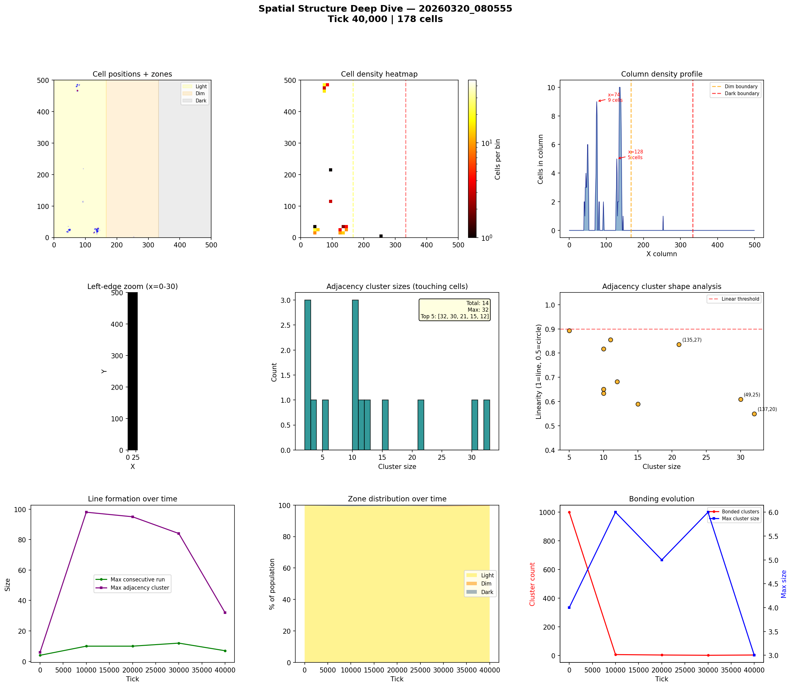
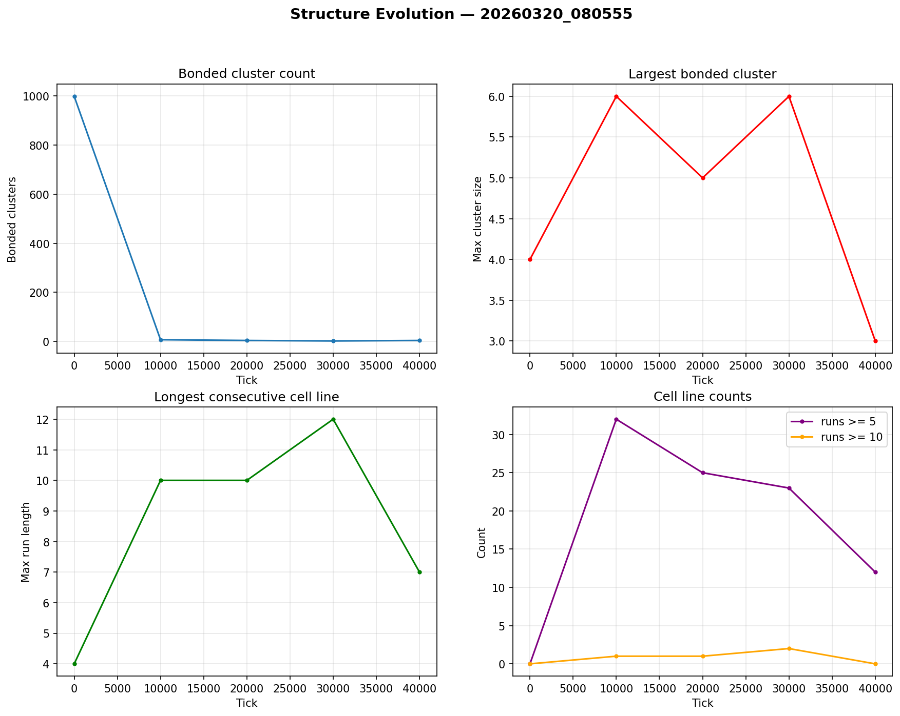

# Spatial Structure Analysis

**Run:** `20260320_080555`  
**Snapshot:** tick 40,000  
**Spatial snapshots analyzed:** 5  

## Population Distribution

| Zone | Cells | % |
|------|-------|---|
| Light (x < 166) | 177 | 99.4% |
| Dim (166-333) | 1 | 0.6% |
| Dark (x >= 333) | 0 | 0.0% |

Zone distribution evolved from 100% / 0% / 0% (light/dim/dark) at tick 0 to 99% / 1% / 0% by tick 40,000.

## Density Hotspots

- Densest column: x=135 (10 cells)
- Densest row: y=26 (14 cells)
- Top 5 columns by cell count: x=74 (9), x=128 (5)

## Adjacency Clusters (touching cells)

Total clusters (2+ cells): 14  
Largest cluster: 32 cells  

| Rank | Size | Linearity | Shape | Center (x,y) |
|------|------|-----------|-------|--------------|
| 1 | 32 | 0.550 | blob | (137, 20) |
| 2 | 30 | 0.609 | blob | (49, 25) |
| 3 | 21 | 0.835 | elongated | (135, 27) |
| 4 | 15 | 0.590 | blob | (74, 467) |
| 5 | 12 | 0.682 | blob | (140, 30) |
| 6 | 11 | 0.855 | elongated | (42, 19) |
| 7 | 10 | 0.651 | blob | (74, 486) |
| 8 | 10 | 0.818 | elongated | (127, 17) |
| 9 | 10 | 0.635 | blob | (72, 480) |
| 10 | 5 | 0.893 | elongated | (80, 485) |

## Consecutive Cell Runs (axis-aligned lines)

| Threshold | Count |
|-----------|-------|
| >= 3 cells | 56 |
| >= 5 cells | 12 |
| >= 10 cells | 0 |
| Max length | 7 |

Top 10 longest runs:

| Rank | Length | Direction | Location |
|------|--------|-----------|----------|
| 1 | 7 | horizontal | row y=25, x=46 |
| 2 | 7 | horizontal | row y=26, x=46 |
| 3 | 7 | vertical | col x=137, y=17 |
| 4 | 6 | horizontal | row y=20, x=135 |
| 5 | 6 | horizontal | row y=22, x=134 |
| 6 | 6 | horizontal | row y=26, x=134 |
| 7 | 6 | vertical | col x=49, y=22 |
| 8 | 6 | vertical | col x=138, y=18 |
| 9 | 5 | horizontal | row y=19, x=135 |
| 10 | 5 | horizontal | row y=28, x=131 |

## Bonded Clusters

- Total bond pairs: 7
- Bonded clusters: 4
- Max bonded cluster: 3

## Figures

