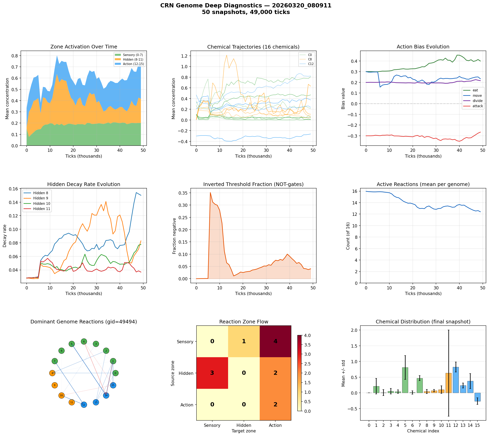

# CRN Genome Deep Analysis

**Run:** `20260320_080911`  
**Snapshots:** 50  
**Duration:** 49,000 ticks  
**Active genomes:** 110  

## Chemical Summary

| Zone | Chemicals | Mean | Description |
|------|-----------|------|-------------|
| Sensory | 0-7 | 0.201 | Environment inputs |
| Hidden | 8-11 | 0.214 | Internal memory/gates |
| Action | 12-15 | 0.293 | Action triggers |

## Action Biases (population-weighted)

| Action | Bias Value | Interpretation |
|--------|-----------|----------------|
| eat | +0.399 | strong positive |
| move | +0.233 | moderate positive |
| divide | +0.216 | moderate positive |
| attack | -0.266 | moderate negative |

## Hidden Decay Rates

Low decay = long memory. High decay = short-term reactivity.

| Chemical | Decay Rate | Memory Half-Life |
|----------|-----------|-----------------|
| Hidden 8 | 0.1501 | 4 ticks |
| Hidden 9 | 0.0829 | 8 ticks |
| Hidden 10 | 0.0775 | 8 ticks |
| Hidden 11 | 0.0368 | 18 ticks |

## Computational Sophistication

- **Active reactions:** 12.4 of 16
- **Inverted thresholds (NOT-gates):** 4.0%
- **Dominant genome:** gid=49494 (2 cells)

## Reaction Zone Flow (dominant genome)

| Source \ Target | Sensory | Hidden | Action |
|---------------|---------|--------|--------|
| Sensory | 0 | 1 | 4 |
| Hidden | 3 | 0 | 2 |
| Action | 0 | 0 | 2 |

## Key Findings

- Hidden chemicals are active — CRN is using internal state
- Using 12/16 reactions — complex network
- Sensory->Hidden->Action pathway exists (1+2 reactions)

## Figures

