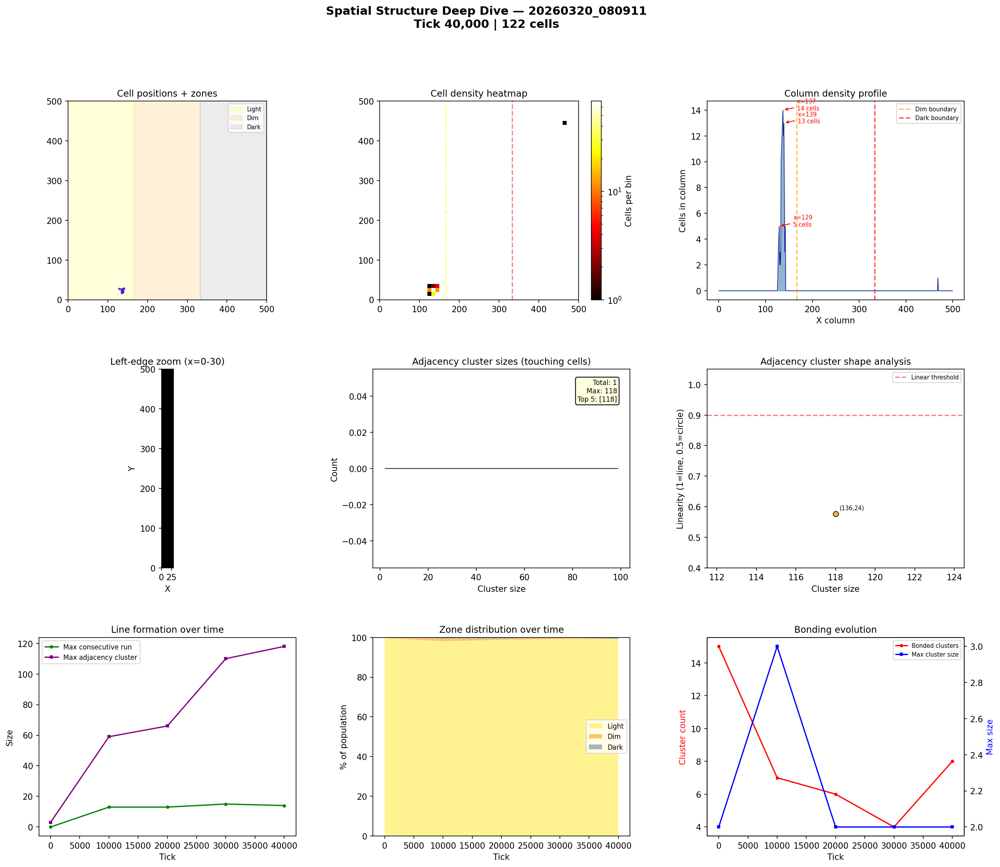
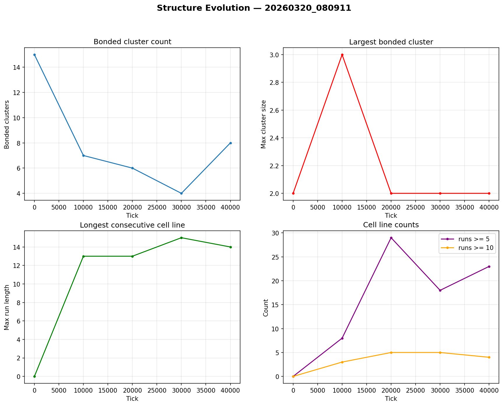

# Spatial Structure Analysis

**Run:** `20260320_080911`  
**Snapshot:** tick 40,000  
**Spatial snapshots analyzed:** 5  

## Population Distribution

| Zone | Cells | % |
|------|-------|---|
| Light (x < 166) | 121 | 99.2% |
| Dim (166-333) | 0 | 0.0% |
| Dark (x >= 333) | 1 | 0.8% |

Zone distribution evolved from 100% / 0% / 0% (light/dim/dark) at tick 0 to 99% / 0% / 1% by tick 40,000.

## Density Hotspots

- Densest column: x=137 (14 cells)
- Densest row: y=27 (14 cells)
- Top 5 columns by cell count: x=137 (14), x=139 (13), x=129 (5), x=142 (5)

## Adjacency Clusters (touching cells)

Total clusters (2+ cells): 1  
Largest cluster: 118 cells  

| Rank | Size | Linearity | Shape | Center (x,y) |
|------|------|-----------|-------|--------------|
| 1 | 118 | 0.576 | blob | (136, 24) |

## Consecutive Cell Runs (axis-aligned lines)

| Threshold | Count |
|-----------|-------|
| >= 3 cells | 35 |
| >= 5 cells | 23 |
| >= 10 cells | 4 |
| Max length | 14 |

Top 10 longest runs:

| Rank | Length | Direction | Location |
|------|--------|-----------|----------|
| 1 | 14 | vertical | col x=137, y=17 |
| 2 | 13 | vertical | col x=136, y=16 |
| 3 | 13 | vertical | col x=139, y=18 |
| 4 | 10 | horizontal | row y=27, x=131 |
| 5 | 9 | horizontal | row y=26, x=132 |
| 6 | 9 | vertical | col x=135, y=16 |
| 7 | 8 | horizontal | row y=20, x=133 |
| 8 | 8 | horizontal | row y=21, x=133 |
| 9 | 7 | horizontal | row y=19, x=133 |
| 10 | 7 | horizontal | row y=23, x=133 |

## Bonded Clusters

- Total bond pairs: 8
- Bonded clusters: 8
- Max bonded cluster: 2

## Figures

