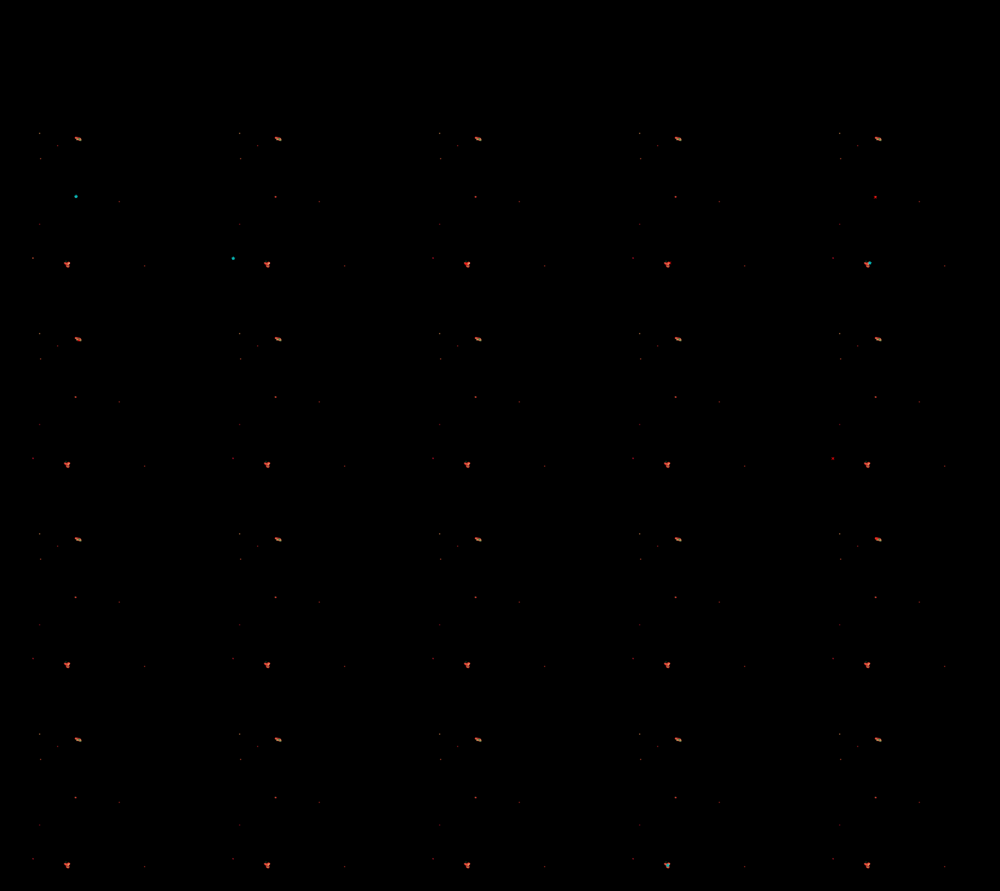
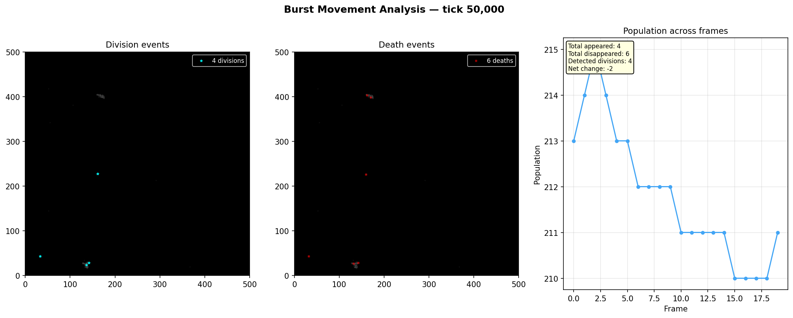
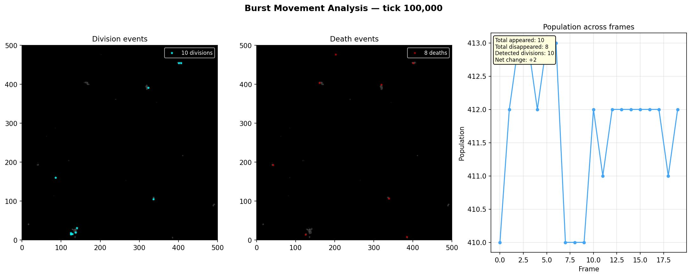
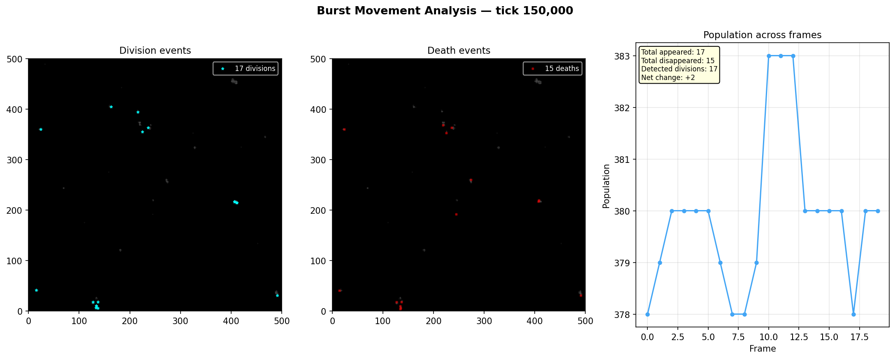
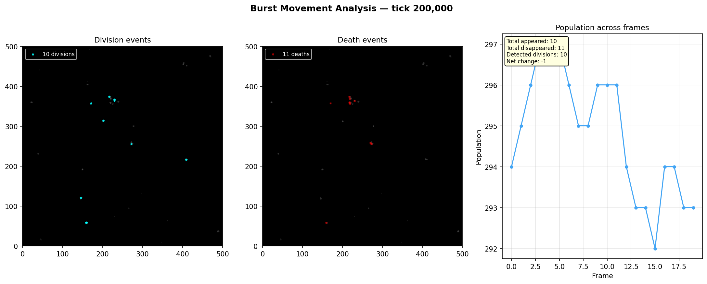

# Burst Snapshot Analysis

**Run:** `20260320_082655`  
**Bursts analyzed:** 4  

## Burst at tick 50,000

**Frames:** 20  

| Metric | Value |
|--------|-------|
| Avg population | 212 |
| Total cells appeared | 4 |
| Total cells disappeared | 6 |
| Detected divisions | 4 |
| Net population change | -2 |
| Avg turnover per frame | 0.3 |

### Frame-by-frame

| Pair | Pop A | Pop B | Appeared | Disappeared | Divisions |
|------|-------|-------|----------|-------------|-----------|
| 0->1 | 213 | 214 | 1 | 0 | 1 |
| 1->2 | 214 | 215 | 1 | 0 | 1 |
| 2->3 | 215 | 214 | 0 | 1 | 0 |
| 3->4 | 214 | 213 | 0 | 1 | 0 |
| 4->5 | 213 | 213 | 1 | 1 | 1 |
| 5->6 | 213 | 212 | 0 | 1 | 0 |
| 6->7 | 212 | 212 | 0 | 0 | 0 |
| 7->8 | 212 | 212 | 0 | 0 | 0 |
| 8->9 | 212 | 212 | 0 | 0 | 0 |
| 9->10 | 212 | 211 | 0 | 1 | 0 |
| 10->11 | 211 | 211 | 0 | 0 | 0 |
| 11->12 | 211 | 211 | 0 | 0 | 0 |
| 12->13 | 211 | 211 | 0 | 0 | 0 |
| 13->14 | 211 | 211 | 0 | 0 | 0 |
| 14->15 | 211 | 210 | 0 | 1 | 0 |
| 15->16 | 210 | 210 | 0 | 0 | 0 |
| 16->17 | 210 | 210 | 0 | 0 | 0 |
| 17->18 | 210 | 210 | 0 | 0 | 0 |
| 18->19 | 210 | 211 | 1 | 0 | 1 |

## Burst at tick 100,000

**Frames:** 20  

| Metric | Value |
|--------|-------|
| Avg population | 411 |
| Total cells appeared | 10 |
| Total cells disappeared | 8 |
| Detected divisions | 10 |
| Net population change | +2 |
| Avg turnover per frame | 0.5 |

### Frame-by-frame

| Pair | Pop A | Pop B | Appeared | Disappeared | Divisions |
|------|-------|-------|----------|-------------|-----------|
| 0->1 | 410 | 412 | 3 | 1 | 3 |
| 1->2 | 412 | 413 | 1 | 0 | 1 |
| 2->3 | 413 | 413 | 0 | 0 | 0 |
| 3->4 | 413 | 412 | 0 | 1 | 0 |
| 4->5 | 412 | 413 | 1 | 0 | 1 |
| 5->6 | 413 | 413 | 0 | 0 | 0 |
| 6->7 | 413 | 410 | 0 | 3 | 0 |
| 7->8 | 410 | 410 | 0 | 0 | 0 |
| 8->9 | 410 | 410 | 0 | 0 | 0 |
| 9->10 | 410 | 412 | 2 | 0 | 2 |
| 10->11 | 412 | 411 | 0 | 1 | 0 |
| 11->12 | 411 | 412 | 1 | 0 | 1 |
| 12->13 | 412 | 412 | 0 | 0 | 0 |
| 13->14 | 412 | 412 | 0 | 0 | 0 |
| 14->15 | 412 | 412 | 0 | 0 | 0 |
| 15->16 | 412 | 412 | 0 | 0 | 0 |
| 16->17 | 412 | 412 | 0 | 0 | 0 |
| 17->18 | 412 | 411 | 0 | 1 | 0 |
| 18->19 | 411 | 412 | 2 | 1 | 2 |

## Burst at tick 150,000

**Frames:** 20  

| Metric | Value |
|--------|-------|
| Avg population | 379 |
| Total cells appeared | 17 |
| Total cells disappeared | 15 |
| Detected divisions | 17 |
| Net population change | +2 |
| Avg turnover per frame | 0.8 |

### Frame-by-frame

| Pair | Pop A | Pop B | Appeared | Disappeared | Divisions |
|------|-------|-------|----------|-------------|-----------|
| 0->1 | 378 | 379 | 1 | 0 | 1 |
| 1->2 | 379 | 380 | 1 | 0 | 1 |
| 2->3 | 380 | 380 | 0 | 0 | 0 |
| 3->4 | 380 | 380 | 1 | 1 | 1 |
| 4->5 | 380 | 380 | 1 | 1 | 1 |
| 5->6 | 380 | 379 | 0 | 1 | 0 |
| 6->7 | 379 | 378 | 1 | 2 | 1 |
| 7->8 | 378 | 378 | 3 | 3 | 3 |
| 8->9 | 378 | 379 | 2 | 1 | 2 |
| 9->10 | 379 | 383 | 4 | 0 | 4 |
| 10->11 | 383 | 383 | 0 | 0 | 0 |
| 11->12 | 383 | 383 | 1 | 1 | 1 |
| 12->13 | 383 | 380 | 0 | 3 | 0 |
| 13->14 | 380 | 380 | 0 | 0 | 0 |
| 14->15 | 380 | 380 | 0 | 0 | 0 |
| 15->16 | 380 | 380 | 0 | 0 | 0 |
| 16->17 | 380 | 378 | 0 | 2 | 0 |
| 17->18 | 378 | 380 | 2 | 0 | 2 |
| 18->19 | 380 | 380 | 0 | 0 | 0 |

## Burst at tick 200,000

**Frames:** 20  

| Metric | Value |
|--------|-------|
| Avg population | 294 |
| Total cells appeared | 10 |
| Total cells disappeared | 11 |
| Detected divisions | 10 |
| Net population change | -1 |
| Avg turnover per frame | 0.6 |

### Frame-by-frame

| Pair | Pop A | Pop B | Appeared | Disappeared | Divisions |
|------|-------|-------|----------|-------------|-----------|
| 0->1 | 294 | 295 | 2 | 1 | 2 |
| 1->2 | 295 | 296 | 1 | 0 | 1 |
| 2->3 | 296 | 297 | 1 | 0 | 1 |
| 3->4 | 297 | 297 | 0 | 0 | 0 |
| 4->5 | 297 | 297 | 1 | 1 | 1 |
| 5->6 | 297 | 296 | 0 | 1 | 0 |
| 6->7 | 296 | 295 | 0 | 1 | 0 |
| 7->8 | 295 | 295 | 1 | 1 | 1 |
| 8->9 | 295 | 296 | 1 | 0 | 1 |
| 9->10 | 296 | 296 | 1 | 1 | 1 |
| 10->11 | 296 | 296 | 0 | 0 | 0 |
| 11->12 | 296 | 294 | 0 | 2 | 0 |
| 12->13 | 294 | 293 | 0 | 1 | 0 |
| 13->14 | 293 | 293 | 0 | 0 | 0 |
| 14->15 | 293 | 292 | 0 | 1 | 0 |
| 15->16 | 292 | 294 | 2 | 0 | 2 |
| 16->17 | 294 | 294 | 0 | 0 | 0 |
| 17->18 | 294 | 293 | 0 | 1 | 0 |
| 18->19 | 293 | 293 | 0 | 0 | 0 |

