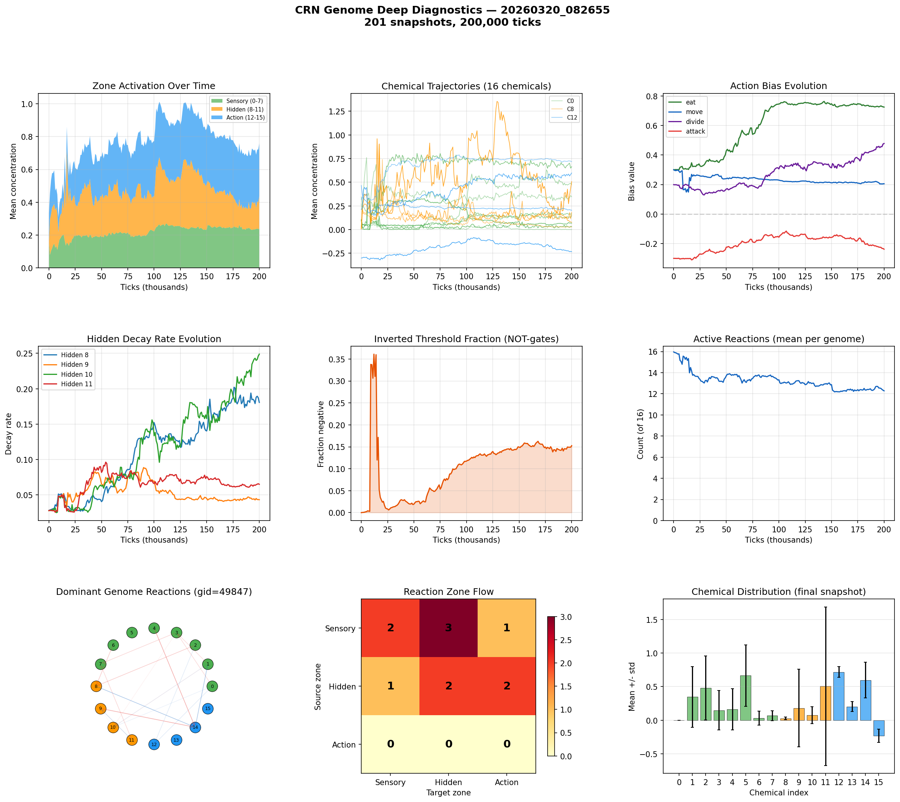

# CRN Genome Deep Analysis

**Run:** `20260320_082655`  
**Snapshots:** 201  
**Duration:** 200,000 ticks  
**Active genomes:** 272  

## Chemical Summary

| Zone | Chemicals | Mean | Description |
|------|-----------|------|-------------|
| Sensory | 0-7 | 0.238 | Environment inputs |
| Hidden | 8-11 | 0.199 | Internal memory/gates |
| Action | 12-15 | 0.322 | Action triggers |

## Action Biases (population-weighted)

| Action | Bias Value | Interpretation |
|--------|-----------|----------------|
| eat | +0.725 | strong positive |
| move | +0.205 | moderate positive |
| divide | +0.478 | strong positive |
| attack | -0.238 | moderate negative |

## Hidden Decay Rates

Low decay = long memory. High decay = short-term reactivity.

| Chemical | Decay Rate | Memory Half-Life |
|----------|-----------|-----------------|
| Hidden 8 | 0.1807 | 3 ticks |
| Hidden 9 | 0.0433 | 15 ticks |
| Hidden 10 | 0.2488 | 2 ticks |
| Hidden 11 | 0.0651 | 10 ticks |

## Computational Sophistication

- **Active reactions:** 12.3 of 16
- **Inverted thresholds (NOT-gates):** 15.3%
- **Dominant genome:** gid=49847 (4 cells)

## Reaction Zone Flow (dominant genome)

| Source \ Target | Sensory | Hidden | Action |
|---------------|---------|--------|--------|
| Sensory | 2 | 3 | 1 |
| Hidden | 1 | 2 | 2 |
| Action | 0 | 0 | 0 |

## Key Findings

- Hidden chemicals are active — CRN is using internal state
- 15% inverted thresholds indicate NOT-gate logic has evolved
- Using 12/16 reactions — complex network
- Sensory->Hidden->Action pathway exists (3+2 reactions)

## Figures

