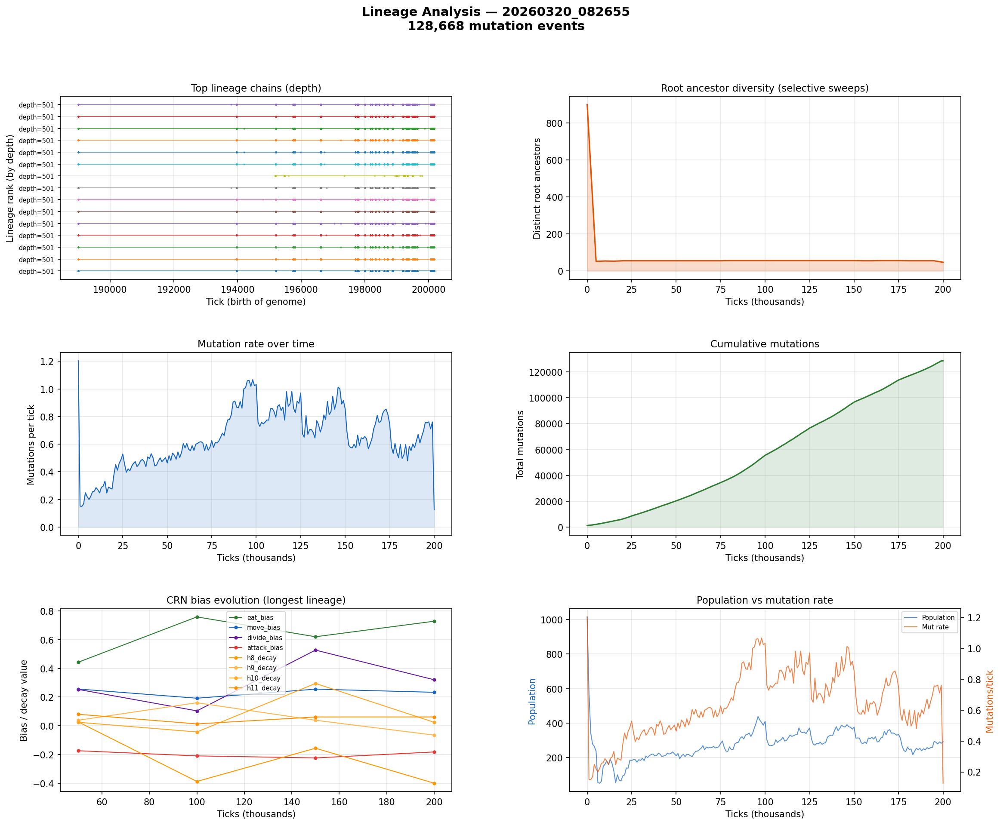

# Lineage Analysis

**Run:** `20260320_082655`  
**Mutation events:** 128,668  
**Tick range:** 0 - 200,195  

## Mutation Summary

| Metric | Value |
|--------|-------|
| Total mutation events | 128,668 |
| Unique parent genomes | 2,278 |
| Unique child genomes | 1,479 |
| Surviving genomes (latest snapshot) | 272 |
| Avg mutations/tick | 0.64 |

## Longest Surviving Lineages

| Rank | Depth | Root genome | Tip genome |
|------|-------|-------------|------------|
| 1 | 501 | 49766 | 49153 |
| 2 | 501 | 49278 | 49666 |
| 3 | 501 | 49402 | 49669 |
| 4 | 501 | 49365 | 49168 |
| 5 | 501 | 49891 | 49683 |
| 6 | 501 | 49944 | 49173 |
| 7 | 501 | 49916 | 49178 |
| 8 | 501 | 49916 | 49691 |
| 9 | 501 | 49388 | 49181 |
| 10 | 501 | 49889 | 49693 |

## Selective Sweep Indicators

- Initial root diversity: 899
- Final root diversity: 47
- Minimum root diversity: 47 at tick ~200,000

A significant selective sweep is indicated: root diversity dropped by more than 50%, suggesting a dominant lineage displaced many competing lineages.

## Mutation Dynamics

| Metric | Value |
|--------|-------|
| Peak mutation rate | 1.20 per tick |
| Final mutation rate | 0.13 per tick |
| Total mutations | 128,668 |

## Figures

