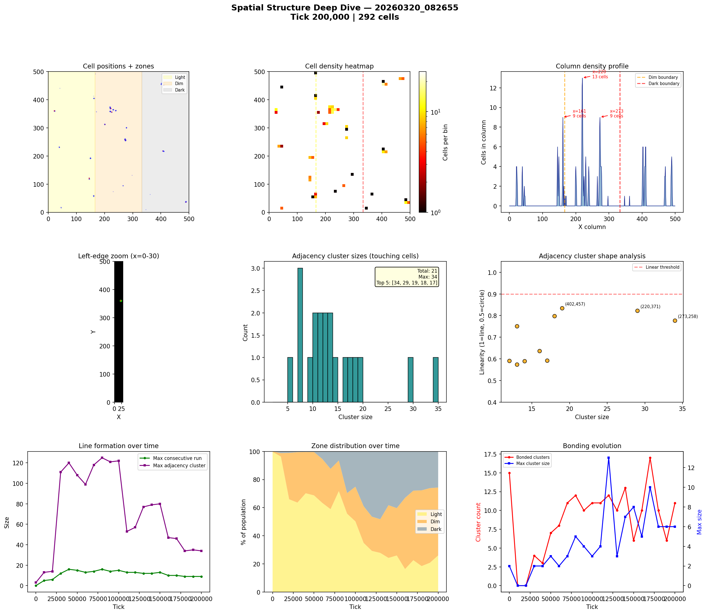
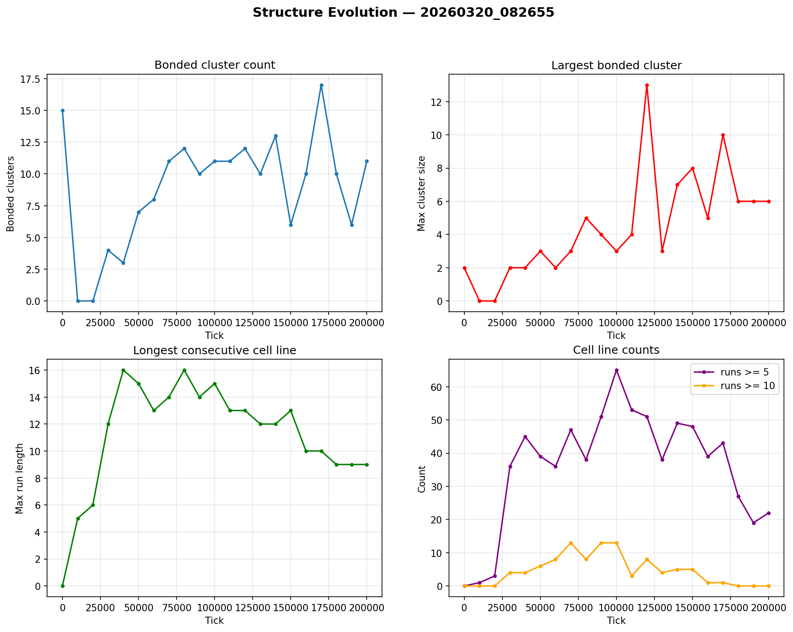

# Spatial Structure Analysis

**Run:** `20260320_082655`  
**Snapshot:** tick 200,000  
**Spatial snapshots analyzed:** 21  

## Population Distribution

| Zone | Cells | % |
|------|-------|---|
| Light (x < 166) | 76 | 26.0% |
| Dim (166-333) | 141 | 48.3% |
| Dark (x >= 333) | 75 | 25.7% |

Zone distribution evolved from 100% / 0% / 0% (light/dim/dark) at tick 0 to 26% / 48% / 26% by tick 200,000.

## Density Hotspots

- Densest column: x=220 (13 cells)
- Densest row: y=360 (10 cells)
- Top 5 columns by cell count: x=220 (13), x=161 (9), x=273 (9), x=145 (6), x=149 (5)

## Adjacency Clusters (touching cells)

Total clusters (2+ cells): 21  
Largest cluster: 34 cells  

| Rank | Size | Linearity | Shape | Center (x,y) |
|------|------|-----------|-------|--------------|
| 1 | 34 | 0.777 | elongated | (273, 258) |
| 2 | 29 | 0.822 | elongated | (220, 371) |
| 3 | 19 | 0.834 | elongated | (402, 457) |
| 4 | 18 | 0.799 | elongated | (409, 218) |
| 5 | 17 | 0.593 | blob | (489, 38) |
| 6 | 16 | 0.637 | blob | (220, 359) |
| 7 | 14 | 0.590 | blob | (22, 360) |
| 8 | 13 | 0.751 | elongated | (145, 120) |
| 9 | 13 | 0.575 | blob | (149, 192) |
| 10 | 12 | 0.592 | blob | (230, 365) |

## Consecutive Cell Runs (axis-aligned lines)

| Threshold | Count |
|-----------|-------|
| >= 3 cells | 115 |
| >= 5 cells | 22 |
| >= 10 cells | 0 |
| Max length | 9 |

Top 10 longest runs:

| Rank | Length | Direction | Location |
|------|--------|-----------|----------|
| 1 | 9 | vertical | col x=220, y=367 |
| 2 | 9 | vertical | col x=273, y=254 |
| 3 | 8 | vertical | col x=219, y=368 |
| 4 | 8 | vertical | col x=272, y=255 |
| 5 | 6 | horizontal | row y=217, x=407 |
| 6 | 6 | horizontal | row y=218, x=406 |
| 7 | 6 | horizontal | row y=359, x=217 |
| 8 | 6 | horizontal | row y=369, x=218 |
| 9 | 6 | vertical | col x=145, y=118 |
| 10 | 6 | vertical | col x=274, y=254 |

## Bonded Clusters

- Total bond pairs: 19
- Bonded clusters: 11
- Max bonded cluster: 6

## Figures

