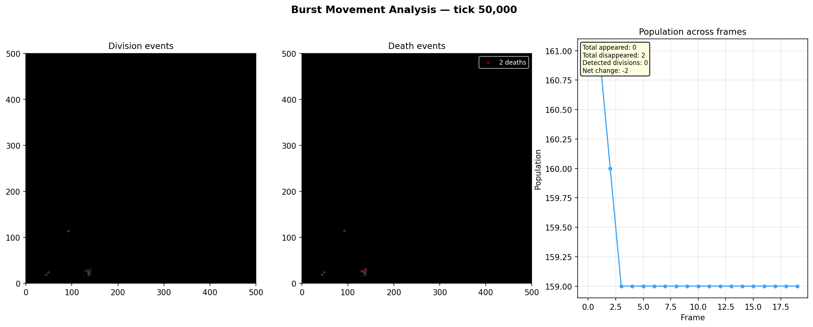
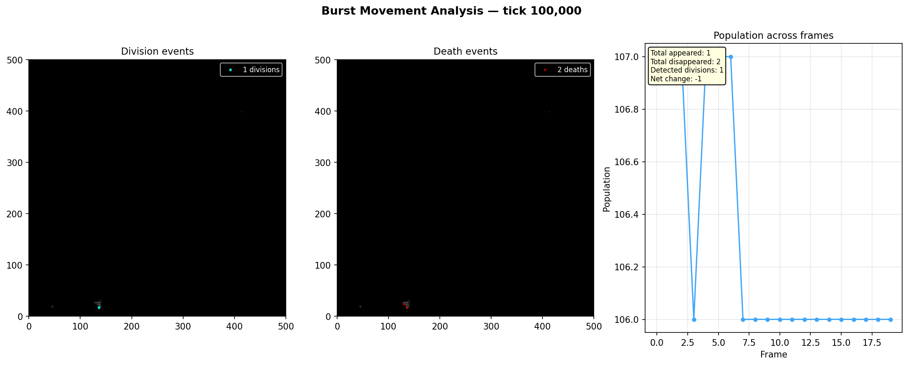
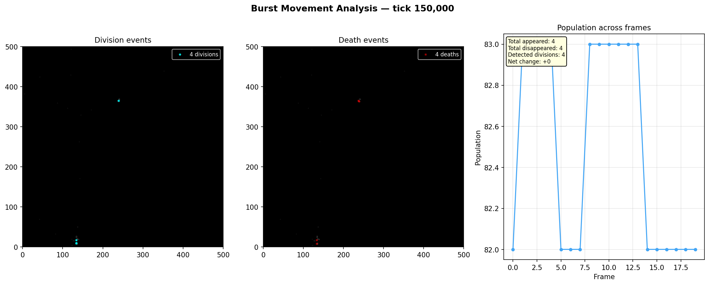

# Burst Snapshot Analysis

**Run:** `20260320_083624`  
**Bursts analyzed:** 3  

## Burst at tick 50,000

**Frames:** 20  

| Metric | Value |
|--------|-------|
| Avg population | 160 |
| Total cells appeared | 0 |
| Total cells disappeared | 2 |
| Detected divisions | 0 |
| Net population change | -2 |
| Avg turnover per frame | 0.1 |

### Frame-by-frame

| Pair | Pop A | Pop B | Appeared | Disappeared | Divisions |
|------|-------|-------|----------|-------------|-----------|
| 0->1 | 161 | 161 | 0 | 0 | 0 |
| 1->2 | 161 | 160 | 0 | 1 | 0 |
| 2->3 | 160 | 159 | 0 | 1 | 0 |
| 3->4 | 159 | 159 | 0 | 0 | 0 |
| 4->5 | 159 | 159 | 0 | 0 | 0 |
| 5->6 | 159 | 159 | 0 | 0 | 0 |
| 6->7 | 159 | 159 | 0 | 0 | 0 |
| 7->8 | 159 | 159 | 0 | 0 | 0 |
| 8->9 | 159 | 159 | 0 | 0 | 0 |
| 9->10 | 159 | 159 | 0 | 0 | 0 |
| 10->11 | 159 | 159 | 0 | 0 | 0 |
| 11->12 | 159 | 159 | 0 | 0 | 0 |
| 12->13 | 159 | 159 | 0 | 0 | 0 |
| 13->14 | 159 | 159 | 0 | 0 | 0 |
| 14->15 | 159 | 159 | 0 | 0 | 0 |
| 15->16 | 159 | 159 | 0 | 0 | 0 |
| 16->17 | 159 | 159 | 0 | 0 | 0 |
| 17->18 | 159 | 159 | 0 | 0 | 0 |
| 18->19 | 159 | 159 | 0 | 0 | 0 |

## Burst at tick 100,000

**Frames:** 20  

| Metric | Value |
|--------|-------|
| Avg population | 106 |
| Total cells appeared | 1 |
| Total cells disappeared | 2 |
| Detected divisions | 1 |
| Net population change | -1 |
| Avg turnover per frame | 0.1 |

### Frame-by-frame

| Pair | Pop A | Pop B | Appeared | Disappeared | Divisions |
|------|-------|-------|----------|-------------|-----------|
| 0->1 | 107 | 107 | 0 | 0 | 0 |
| 1->2 | 107 | 107 | 0 | 0 | 0 |
| 2->3 | 107 | 106 | 0 | 1 | 0 |
| 3->4 | 106 | 107 | 1 | 0 | 1 |
| 4->5 | 107 | 107 | 0 | 0 | 0 |
| 5->6 | 107 | 107 | 0 | 0 | 0 |
| 6->7 | 107 | 106 | 0 | 1 | 0 |
| 7->8 | 106 | 106 | 0 | 0 | 0 |
| 8->9 | 106 | 106 | 0 | 0 | 0 |
| 9->10 | 106 | 106 | 0 | 0 | 0 |
| 10->11 | 106 | 106 | 0 | 0 | 0 |
| 11->12 | 106 | 106 | 0 | 0 | 0 |
| 12->13 | 106 | 106 | 0 | 0 | 0 |
| 13->14 | 106 | 106 | 0 | 0 | 0 |
| 14->15 | 106 | 106 | 0 | 0 | 0 |
| 15->16 | 106 | 106 | 0 | 0 | 0 |
| 16->17 | 106 | 106 | 0 | 0 | 0 |
| 17->18 | 106 | 106 | 0 | 0 | 0 |
| 18->19 | 106 | 106 | 0 | 0 | 0 |

## Burst at tick 150,000

**Frames:** 20  

| Metric | Value |
|--------|-------|
| Avg population | 82 |
| Total cells appeared | 4 |
| Total cells disappeared | 4 |
| Detected divisions | 4 |
| Net population change | +0 |
| Avg turnover per frame | 0.2 |

### Frame-by-frame

| Pair | Pop A | Pop B | Appeared | Disappeared | Divisions |
|------|-------|-------|----------|-------------|-----------|
| 0->1 | 82 | 83 | 1 | 0 | 1 |
| 1->2 | 83 | 83 | 1 | 1 | 1 |
| 2->3 | 83 | 83 | 0 | 0 | 0 |
| 3->4 | 83 | 83 | 0 | 0 | 0 |
| 4->5 | 83 | 82 | 0 | 1 | 0 |
| 5->6 | 82 | 82 | 0 | 0 | 0 |
| 6->7 | 82 | 82 | 0 | 0 | 0 |
| 7->8 | 82 | 83 | 1 | 0 | 1 |
| 8->9 | 83 | 83 | 1 | 1 | 1 |
| 9->10 | 83 | 83 | 0 | 0 | 0 |
| 10->11 | 83 | 83 | 0 | 0 | 0 |
| 11->12 | 83 | 83 | 0 | 0 | 0 |
| 12->13 | 83 | 83 | 0 | 0 | 0 |
| 13->14 | 83 | 82 | 0 | 1 | 0 |
| 14->15 | 82 | 82 | 0 | 0 | 0 |
| 15->16 | 82 | 82 | 0 | 0 | 0 |
| 16->17 | 82 | 82 | 0 | 0 | 0 |
| 17->18 | 82 | 82 | 0 | 0 | 0 |
| 18->19 | 82 | 82 | 0 | 0 | 0 |

