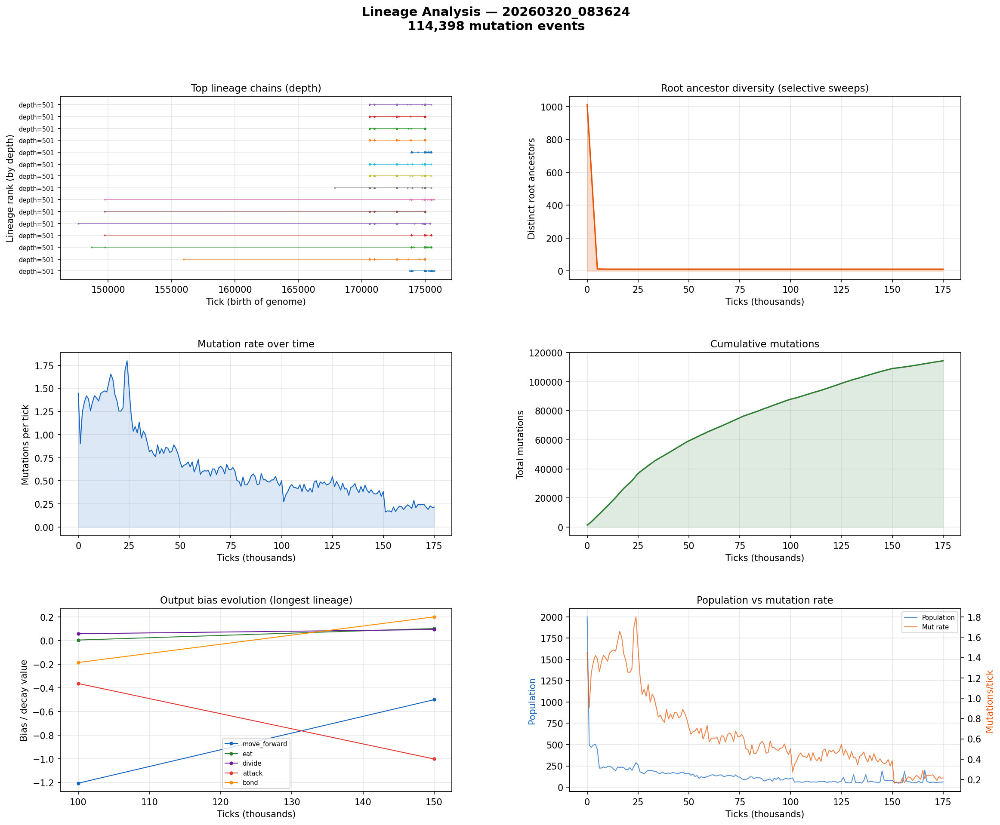

# Lineage Analysis

**Run:** `20260320_083624`  
**Mutation events:** 114,398  
**Tick range:** 0 - 175,706  

## Mutation Summary

| Metric | Value |
|--------|-------|
| Total mutation events | 114,398 |
| Unique parent genomes | 2,975 |
| Unique child genomes | 2,085 |
| Surviving genomes (latest snapshot) | 82 |
| Avg mutations/tick | 0.65 |

## Longest Surviving Lineages

| Rank | Depth | Root genome | Tip genome |
|------|-------|-------------|------------|
| 1 | 501 | 49757 | 49665 |
| 2 | 501 | 49999 | 49670 |
| 3 | 501 | 49757 | 49677 |
| 4 | 501 | 49840 | 49681 |
| 5 | 501 | 49997 | 49686 |
| 6 | 501 | 49815 | 49689 |
| 7 | 501 | 49840 | 49691 |
| 8 | 501 | 49997 | 49699 |
| 9 | 501 | 49815 | 49713 |
| 10 | 501 | 49761 | 49716 |

## Selective Sweep Indicators

- Initial root diversity: 1011
- Final root diversity: 11
- Minimum root diversity: 11 at tick ~10,000

A significant selective sweep is indicated: root diversity dropped by more than 50%, suggesting a dominant lineage displaced many competing lineages.

## Mutation Dynamics

| Metric | Value |
|--------|-------|
| Peak mutation rate | 1.80 per tick |
| Final mutation rate | 0.22 per tick |
| Total mutations | 114,398 |

## Figures

