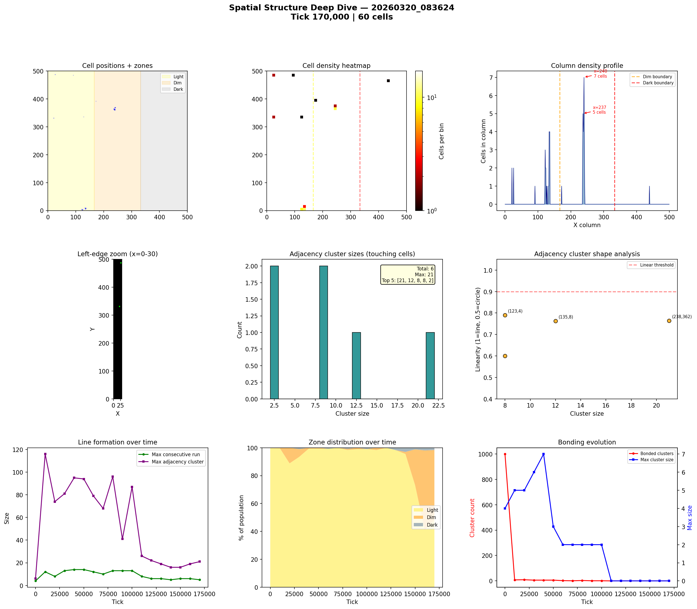
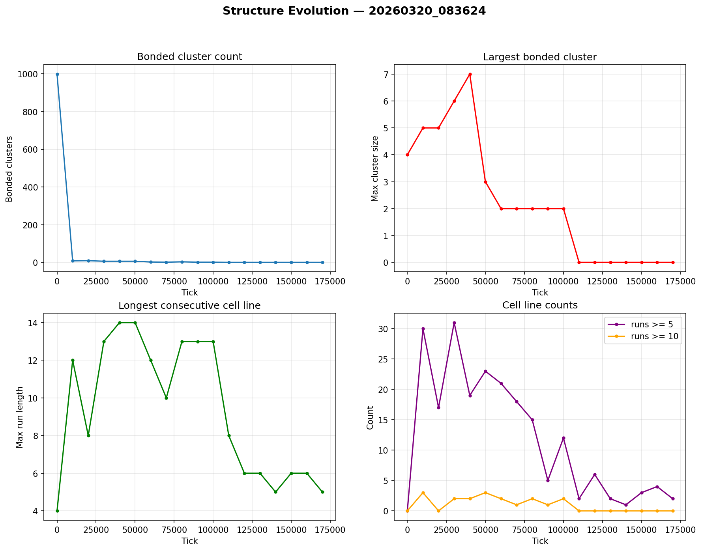

# Spatial Structure Analysis

**Run:** `20260320_083624`  
**Snapshot:** tick 170,000  
**Spatial snapshots analyzed:** 18  

## Population Distribution

| Zone | Cells | % |
|------|-------|---|
| Light (x < 166) | 29 | 48.3% |
| Dim (166-333) | 30 | 50.0% |
| Dark (x >= 333) | 1 | 1.7% |

Zone distribution evolved from 100% / 0% / 0% (light/dim/dark) at tick 0 to 48% / 50% / 2% by tick 170,000.

## Density Hotspots

- Densest column: x=240 (7 cells)
- Densest row: y=362 (5 cells)
- Top 5 columns by cell count: x=240 (7), x=237 (5)

## Adjacency Clusters (touching cells)

Total clusters (2+ cells): 6  
Largest cluster: 21 cells  

| Rank | Size | Linearity | Shape | Center (x,y) |
|------|------|-----------|-------|--------------|
| 1 | 21 | 0.764 | elongated | (238, 362) |
| 2 | 12 | 0.763 | elongated | (135, 8) |
| 3 | 8 | 0.790 | elongated | (123, 4) |
| 4 | 8 | 0.600 | blob | (240, 369) |

## Consecutive Cell Runs (axis-aligned lines)

| Threshold | Count |
|-----------|-------|
| >= 3 cells | 20 |
| >= 5 cells | 2 |
| >= 10 cells | 0 |
| Max length | 5 |

Top 10 longest runs:

| Rank | Length | Direction | Location |
|------|--------|-----------|----------|
| 1 | 5 | horizontal | row y=362, x=237 |
| 2 | 5 | vertical | col x=237, y=361 |
| 3 | 4 | horizontal | row y=7, x=133 |
| 4 | 4 | horizontal | row y=361, x=237 |
| 5 | 4 | horizontal | row y=364, x=236 |
| 6 | 4 | horizontal | row y=369, x=239 |
| 7 | 4 | vertical | col x=135, y=6 |
| 8 | 4 | vertical | col x=136, y=7 |
| 9 | 4 | vertical | col x=238, y=361 |
| 10 | 4 | vertical | col x=240, y=360 |

## Bonded Clusters

- Total bond pairs: 0
- Bonded clusters: 0
- Max bonded cluster: 0

## Figures

