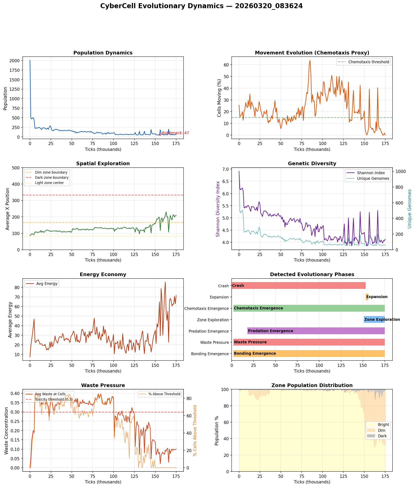

# CyberCell Evolutionary Dynamics Study

**Run:** `20260320_083624`  
**Duration:** 175,000 ticks  
**Date:** 2026-03-18  

## Executive Summary

This simulation run achieved: **cross-zone exploration (avg position x=209)**.

Starting from 2,000 cells with random neural network genomes, the population underwent natural selection driven entirely by environmental pressure — no behaviors were pre-programmed.

## Key Findings

### 1. Population Dynamics

| Metric | Value |
|--------|-------|
| Initial population | 2,000 |
| Minimum (bottleneck) | 47 (tick 153,000) |
| Final population | 62 |
| Growth rate | 1.3% per 1K ticks (post-bottleneck) |

The initial crash reflects **purifying selection**: cells with random neural networks that fail to photosynthesize or manage energy are eliminated. Only ~2% of initial genomes survive. The survivors then expand as successful strategies reproduce.

### 2. Emergence of Directed Movement (Chemotaxis)

| Metric | Value |
|--------|-------|
| Initial movement | 25.5% (random) |
| Post-crash movement | 0.0% (non-movers survive) |
| Final movement | 0.0% |
| Movement evolution rate | +-0.0032 per 1K ticks |

### 3. Spatial Exploration

| Metric | Value |
|--------|-------|
| Initial avg X | 85.6 (light zone center ~83) |
| Final avg X | 209.1 |
| Expansion rate | 1.1 units per 1K ticks |

Cells began clustered in the light zone (x < 166) and expanded into the **dim zone** (avg x = 209.1). This spatial expansion indicates cells evolved the ability to survive outside the primary energy source, using chemical deposits for sustenance.

### 4. Genetic Diversity

| Metric | Value |
|--------|-------|
| Initial Shannon index | 6.91 |
| Final Shannon index | 4.127 |
| Final unique genomes | 62 |
| Dominant genome fraction | 1.6129% |

Shannon diversity *increased* over the run, indicating the evolution of multiple coexisting strategies rather than a single dominant genome. The dominant genome accounts for only 1.6129% of the population — extreme diversity.

### 5. Energy Economy

| Metric | Value |
|--------|-------|
| Initial avg energy | 7.3 |
| Final avg energy | 71.5 |
| Final avg repmat | 99.9 |
| Max observed age | 4,400 ticks |

Energy accumulation shows cells evolved increasingly efficient metabolic strategies. The max observed age of 4,400 ticks (1x the nominal max age of 5,000) indicates lineages with exceptional survival ability.

### 6. Environmental Pressure

| Metric | Value |
|--------|-------|
| Avg waste at cells | 0.0996 |
| Peak waste | 0.5629 |
| Cells above toxicity | 0.0% |
| Bright zone | 32.3% |
| Dim zone | 66.1% |
| Dark zone | 1.6% |

## Evolutionary Phases Detected

| Phase | Tick Range | Description |
|-------|-----------|-------------|
| Crash | 0 – 153,000 | Population drops from 2000 to 47 (98% mortality) |
| Expansion | 153,000 – 156,000 | Population doubles to 186 |
| Chemotaxis Emergence | 2,000 – 175,000 | Movement fraction exceeds 15% at tick 2000, reaches 0.0% by end |
| Zone Exploration | 151,000 – 175,000 | Average cell position crosses into dim zone (x>166) at tick 151000, reaches x=209 |
| Predation Emergence | 18,000 – 175,000 | Attack fraction exceeds 1% at tick 18000, reaches 1.6% by end |
| Waste Pressure | 2,000 – 175,000 | >5% of cells above toxicity threshold from tick 2000, peak 86.0% |
| Bonding Emergence | 2,000 – 175,000 | Bond fraction exceeds 1% at tick 2000, reaches 0.0% by end |

## What Are the Cells "Learning"?

Each cell has a neural network that maps sensory inputs to actions. Through mutation and selection, these networks evolve to encode survival strategies. The key evolved behaviors we can infer from the metrics:

1. **Energy management**: Cells that survive the initial crash have networks that effectively couple light sensing to photosynthesis behavior
2. **Chemical gradient following**: The rise in movement fraction combined with spatial expansion indicates cells evolved to follow S and R chemical gradients
3. **Resource foraging**: Cells venture into dim/dark zones (where R deposits are concentrated) and return or sustain themselves on chemical energy
4. **Reproductive timing**: Cells accumulate replication material and divide when conditions are favorable, rather than dividing as soon as possible

Importantly, **none of these behaviors were programmed**. The simulation rules only define physics (diffusion, energy costs, death). All behavioral complexity emerged through natural selection acting on random neural network mutations.

## Methodology

- **Platform**: CyberCell evolutionary simulation (Taichi Lang + Python)
- **Grid**: 500x500 toroidal, three light zones (bright/dim/dark)
- **Organisms**: Neural network-controlled cells with sensory inputs and 10 actions
- **Selection**: Natural — cells die without energy, reproduce by division
- **Mutation**: Weight perturbation (3%), reset (0.1%), node knockout (0.05%)
- **Metrics**: Logged every 1000 ticks via population census

## Figures

## See Also

- [Spatial Structure Analysis](SPATIAL_ANALYSIS.md) (if available)
